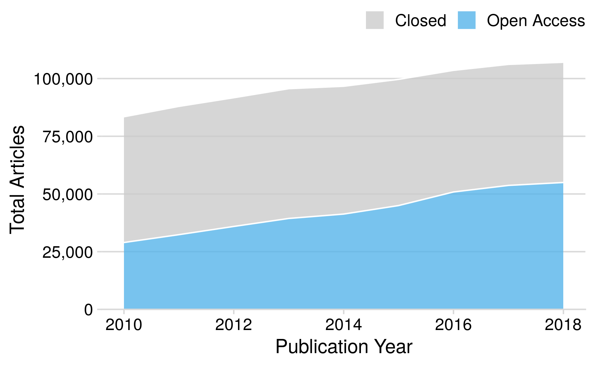
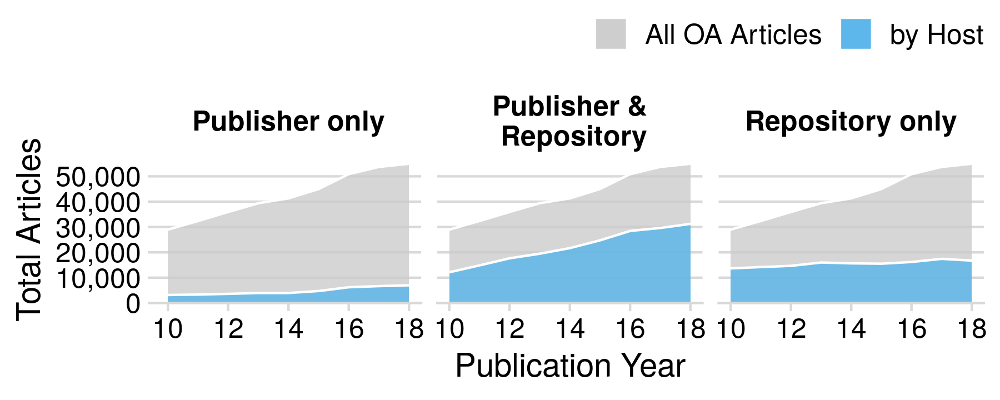
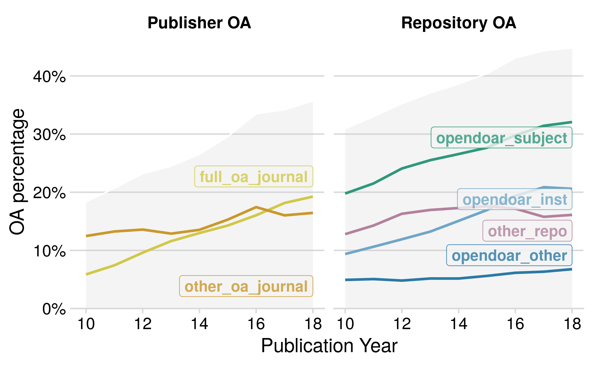

## Data

In this document we describe the analysis of our sample of publications from German research institutions. We work with the dataset `pubs_cat` generated in [data_gathering.Rmd](data_gathering.Rmd).

## Exlcude institutions from university sector which are not listed in official statistics

## Investigation of research questions

The goal is to answer the three research questions 

1) Has the OA fraction of the publication output of German universities and research institutions increased constantly over time?
2) Can we observe differences between the research sectors of the German science system? Are there obvious explanations for this (like different missions or subject profiles?
3) Which OA type is the most prevalent OA approach and can we identify different patterns of adoption to OA?

### OA fraction of the German publication output
 

 
 
First, we look at how the overall OA share developed over time. The following figure displays the number of publications associated with one of the German research institutions we considered and highlights they part that is freely accessible online according to Unpaywall over the considered time period from 2010 until 2018. The total number of articles over the whole period is 871922 with an overall OA share of 44 %.

 

Open access to journal articles from German research institutions according to Unpaywall. Blue area represents journal articles with at least one freely available full-text, grey area represents toll-access articles.

As can be seen, the total number of articles, as well as the part that is OA increases constantly over time. The number of articles that are not openly available, is quite stable with a slow increase from 54492 in 2010 to 56234 in 2013, and decreasing again continuously from that point onwards to 52103  publications in 2018. Since the number of OA articles increases continuously from 28975 publications in 2010 to 54976 in 2018, the relative proportion of OA articles rises significantly from 34.71 % in 2010 to 51.34 % in 2018.

### Differences between sectors

In order to investigate what role the different sectors play in OA publishing in Germany and how they contribute to the OA development/overall OA shares, we distplay the development over time of the number of OA articles for each sector in the following figure. Note that scales for the `y-axes` are not the same, since the total publication output varies significantly among sectors.

Open access to journal articles per sector according to Unpaywall. Blue area represents journal articles with at least one freely available full-text, grey area represents toll-access articles. Sectors are ordered by publication output with the highest output top left and lowest at the bottom. Note that scales for the `y-axes` are not the same, since the total publication output varies significantly among sectors.

In order to investigate the variability of OA publishing within the sectors, we now go one level deeper and examine OA shares of individual institutions, grouped by the sector they belong to. We only include institututions with a publication output of at least 100 publications in the observed time period of 9 years. Of the 444 institutions in total, 326 fulfill this condition. This means, that in the following institution specific analyses, 118 insitutions, or 4187 articles are not considered. Of the remaining institutions, we first calculate the individual OA shares.

The following figure displays scatterplots where the OA share of an institution over the whole time period is shown with respect to its publication output.

<!--html_preserve-->

<script type="application/json" data-for="htmlwidget-21f7339ea49da18f2a6f">{"x":{"data":[{"x":[4.41667378533392,2.94792361983173,3.63255851453267,3.41597441137657,3.75656004300668,4.45856231298199,4.23251329268606,3.25042000230889,4.43721132262458,2.44870631990508,3.91423734776774,2.02938377768521,2.63042787502502,2.86628733908419,2.49554433754645,4.24355888962248,4.4399166245769,4.27613998535014,4.4225734262956,3.97057930571485,4.21848298759364,2.8992731873176,2.44247976906445,4.19667350048806,2.16435285578444,3.43964842956347,4.38165648258579,4.3492969585537,4.29289817501803,4.19983742220816,4.39581546348354,2.72997428569956,3.23879856271392,4.66106456302324,4.04233920456355,2.13987908640124,4.18909710907142,3.0982975364947,3.94904829231566,4.13357084061404,3.5686709780099,4.43866890068674,4.43838410703471,4.30024756119408,4.65272003423804,3.61066016308988,3.57875378442643,4.12090281761453,3.88541776511094,3.58512218630682,3.29269900304393,4.05134549933654,3.91423734776774,4.42206429813628,3.41514035219587,3.4020893505721,3.67660216958202,4.59614607483444,3.49262072204319,3.86403618272577,3.89281782430958,4.0011710149414,3.10890312766731,4.07928980609866,4.25246466119599,2.61172330800734,4.49447462905475,2.61804809671209,3.74059951281116,3.56878821231535,3.21510858105309,3.83821922190763,4.27877645795564,3.46908529912312,3.50351831272407,3.53668467262093,2.82672252016899,3.96123119704466,4.13257984765974,4.05230909964732,3.58737417207307,4.03834193365361,3.32263271169222,4.19953578119834,2.39619934709574,4.34703713378495,3.85961857877218,4.36646031428435,2.73239375982297,2.35024801833416],"y":[0.477817791740097,0.2423900789177,0.538569098112328,0.51304681504221,0.426869854615519,0.452635240911463,0.428604882618114,0.320224719101124,0.483410070890887,0.153024911032028,0.395224171539961,0.168224299065421,0.257611241217799,0.272108843537415,0.329073482428115,0.457508133097426,0.424628681410466,0.389336016096579,0.502777882762009,0.411449973247726,0.470129398959971,0.243379571248424,0.324909747292419,0.500572227873856,0.26027397260274,0.416061046511628,0.46391196013289,0.487002818665832,0.511640939426359,0.458309663573818,0.402484122517887,0.288640595903166,0.366416618580496,0.522576984352153,0.374909288824383,0.318840579710145,0.467261904761905,0.30622009569378,0.382885415495333,0.377766340710242,0.364740820734341,0.397880399155073,0.521793002915452,0.399819675415748,0.520812476362099,0.375490196078431,0.196518069111052,0.405828917486752,0.336935294883479,0.306992461658435,0.18348623853211,0.363927143491781,0.458089668615984,0.414598153473589,0.279123414071511,0.293977812995246,0.395030532743736,0.47368154286728,0.556449018977163,0.336022975929978,0.498016126967874,0.398623715966889,0.252918287937743,0.395651087228193,0.424793111160814,0.222493887530562,0.495788361144028,0.24578313253012,0.317644920952208,0.304993252361673,0.271785496648385,0.68055152394775,0.401978843218778,0.384380305602716,0.429109159347553,0.335948852077884,0.351713859910581,0.486660835337853,0.476860722181282,0.373758865248227,0.493664339281096,0.343861576489975,0.329210275927688,0.455406771096513,0.14859437751004,0.479559253429278,0.449295385465598,0.417297436779632,0.216666666666667,0.254464285714286],"text":["n_total: 26102 oa_share: 0.47781779 INST_NAME: Albert-Ludwigs-Universität Freiburg im Breisgau","n_total:   887 oa_share: 0.24239008 INST_NAME: Bauhaus-Universität Weimar","n_total:  4291 oa_share: 0.53856910 INST_NAME: Bergische Universität Wuppertal","n_total:  2606 oa_share: 0.51304682 INST_NAME: Brandenburgische Technische Universität Cottbus-Senftenberg","n_total:  5709 oa_share: 0.42686985 INST_NAME: Carl von Ossietzky Universität Oldenburg","n_total: 28745 oa_share: 0.45263524 INST_NAME: Charité - Universitätsmedizin Berlin","n_total: 17081 oa_share: 0.42860488 INST_NAME: Christian-Albrechts-Universität zu Kiel","n_total:  1780 oa_share: 0.32022472 INST_NAME: Deutsche Sporthochschule Köln","n_total: 27366 oa_share: 0.48341007 INST_NAME: Eberhard Karls Universität Tübingen","n_total:   281 oa_share: 0.15302491 INST_NAME: EBS Universität für Wirtschaft und Recht","n_total:  8208 oa_share: 0.39522417 INST_NAME: Ernst-Moritz-Arndt-Universität Greifswald","n_total:   107 oa_share: 0.16822430 INST_NAME: ESCP Europe Wirtschaftshochschule Berlin e.V.","n_total:   427 oa_share: 0.25761124 INST_NAME: Europa-Universität Viadrina Frankfurt (Oder)","n_total:   735 oa_share: 0.27210884 INST_NAME: FernUniversität in Hagen","n_total:   313 oa_share: 0.32907348 INST_NAME: Frankfurt School of Finance & Management","n_total: 17521 oa_share: 0.45750813 INST_NAME: Freie Universität Berlin","n_total: 27537 oa_share: 0.42462868 INST_NAME: Friedrich-Alexander-Universität Erlangen-Nürnberg","n_total: 18886 oa_share: 0.38933602 INST_NAME: Friedrich-Schiller-Universität Jena","n_total: 26459 oa_share: 0.50277788 INST_NAME: Georg-August-Universität Göttingen","n_total:  9345 oa_share: 0.41144997 INST_NAME: Gottfried Wilhelm Leibniz Universität Hannover","n_total: 16538 oa_share: 0.47012940 INST_NAME: Heinrich-Heine-Universität Düsseldorf","n_total:   793 oa_share: 0.24337957 INST_NAME: Helmut-Schmidt-Universität/Universität der Bundeswehr Hamburg","n_total:   277 oa_share: 0.32490975 INST_NAME: Hertie School of Governance","n_total: 15728 oa_share: 0.50057223 INST_NAME: Humboldt-Universität zu Berlin","n_total:   146 oa_share: 0.26027397 INST_NAME: International Psychoanalytic University Berlin","n_total:  2752 oa_share: 0.41606105 INST_NAME: Jacobs University Bremen","n_total: 24080 oa_share: 0.46391196 INST_NAME: Johann Wolfgang Goethe-Universität, Frankfurt am Main","n_total: 22351 oa_share: 0.48700282 INST_NAME: Johannes Gutenberg-Universität Mainz","n_total: 19629 oa_share: 0.51164094 INST_NAME: Julius-Maximilians-Universität Würzburg","n_total: 15843 oa_share: 0.45830966 INST_NAME: Justus-Liebig-Universität Gießen","n_total: 24878 oa_share: 0.40248412 INST_NAME: Karlsruher Institut für Technologie","n_total:   537 oa_share: 0.28864060 INST_NAME: Katholische Universität Eichstätt - Ingolstadt","n_total:  1733 oa_share: 0.36641662 INST_NAME: Leuphana Universität Lüneburg","n_total: 45821 oa_share: 0.52257698 INST_NAME: Ludwig-Maximilians-Universität München","n_total: 11024 oa_share: 0.37490929 INST_NAME: Martin-Luther-Universität Halle-Wittenberg","n_total:   138 oa_share: 0.31884058 INST_NAME: Medizinische Hochschule Brandenburg Theodor Fontane","n_total: 15456 oa_share: 0.46726190 INST_NAME: Medizinische Hochschule Hannover (MHH)","n_total:  1254 oa_share: 0.30622010 INST_NAME: Otto-Friedrich-Universität Bamberg","n_total:  8893 oa_share: 0.38288542 INST_NAME: Otto-von-Guericke-Universität Magdeburg","n_total: 13601 oa_share: 0.37776634 INST_NAME: Philipps-Universität Marburg","n_total:  3704 oa_share: 0.36474082 INST_NAME: Private Universität Witten/Herdecke gGmbH","n_total: 27458 oa_share: 0.39788040 INST_NAME: Rheinisch-Westfälische Technische Hochschule Aachen","n_total: 27440 oa_share: 0.52179300 INST_NAME: Rheinische Friedrich-Wilhelms-Universität Bonn","n_total: 19964 oa_share: 0.39981968 INST_NAME: Ruhr-Universität Bochum","n_total: 44949 oa_share: 0.52081248 INST_NAME: Ruprecht-Karls-Universität Heidelberg","n_total:  4080 oa_share: 0.37549020 INST_NAME: Stiftung Tierärztliche Hochschule Hannover","n_total:  3791 oa_share: 0.19651807 INST_NAME: Technische Universität Bergakademie Freiberg","n_total: 13210 oa_share: 0.40582892 INST_NAME: Technische Universität Berlin","n_total:  7681 oa_share: 0.33693529 INST_NAME: Technische Universität Carolo-Wilhelmina zu Braunschweig","n_total:  3847 oa_share: 0.30699246 INST_NAME: Technische Universität Chemnitz","n_total:  1962 oa_share: 0.18348624 INST_NAME: Technische Universität Clausthal","n_total: 11255 oa_share: 0.36392714 INST_NAME: Technische Universität Darmstadt","n_total:  8208 oa_share: 0.45808967 INST_NAME: Technische Universität Dortmund","n_total: 26428 oa_share: 0.41459815 INST_NAME: Technische Universität Dresden","n_total:  2601 oa_share: 0.27912341 INST_NAME: Technische Universität Hamburg-Harburg","n_total:  2524 oa_share: 0.29397781 INST_NAME: Technische Universität Ilmenau","n_total:  4749 oa_share: 0.39503053 INST_NAME: Technische Universität Kaiserslautern","n_total: 39459 oa_share: 0.47368154 INST_NAME: Technische Universität München","n_total:  3109 oa_share: 0.55644902 INST_NAME: Universität Augsburg","n_total:  7312 oa_share: 0.33602298 INST_NAME: Universität Bayreuth","n_total:  7813 oa_share: 0.49801613 INST_NAME: Universität Bielefeld","n_total: 10027 oa_share: 0.39862372 INST_NAME: Universität Bremen","n_total:  1285 oa_share: 0.25291829 INST_NAME: Universität der Bundeswehr München","n_total: 12003 oa_share: 0.39565109 INST_NAME: Universität des Saarlandes","n_total: 17884 oa_share: 0.42479311 INST_NAME: Universität Duisburg-Essen","n_total:   409 oa_share: 0.22249389 INST_NAME: Universität Erfurt","n_total: 31223 oa_share: 0.49578836 INST_NAME: Universität Hamburg","n_total:   415 oa_share: 0.24578313 INST_NAME: Universität Hildesheim","n_total:  5503 oa_share: 0.31764492 INST_NAME: Universität Hohenheim","n_total:  3705 oa_share: 0.30499325 INST_NAME: Universität Kassel","n_total:  1641 oa_share: 0.27178550 INST_NAME: Universität Koblenz-Landau","n_total:  6890 oa_share: 0.68055152 INST_NAME: Universität Konstanz","n_total: 19001 oa_share: 0.40197884 INST_NAME: Universität Leipzig","n_total:  2945 oa_share: 0.38438031 INST_NAME: Universität Mannheim","n_total:  3188 oa_share: 0.42910916 INST_NAME: Universität Osnabrück","n_total:  3441 oa_share: 0.33594885 INST_NAME: Universität Paderborn","n_total:   671 oa_share: 0.35171386 INST_NAME: Universität Passau","n_total:  9146 oa_share: 0.48666084 INST_NAME: Universität Potsdam","n_total: 13570 oa_share: 0.47686072 INST_NAME: Universität Regensburg","n_total: 11280 oa_share: 0.37375887 INST_NAME: Universität Rostock","n_total:  3867 oa_share: 0.49366434 INST_NAME: Universität Siegen","n_total: 10923 oa_share: 0.34386158 INST_NAME: Universität Stuttgart","n_total:  2102 oa_share: 0.32921028 INST_NAME: Universität Trier","n_total: 15832 oa_share: 0.45540677 INST_NAME: Universität Ulm","n_total:   249 oa_share: 0.14859438 INST_NAME: Universität Vechta","n_total: 22235 oa_share: 0.47955925 INST_NAME: Universität zu Köln","n_total:  7238 oa_share: 0.44929539 INST_NAME: Universität zu Lübeck","n_total: 23252 oa_share: 0.41729744 INST_NAME: Westfälische Wilhelms-Universität Münster","n_total:   540 oa_share: 0.21666667 INST_NAME: WHU - Otto Beisheim School of Management","n_total:   224 oa_share: 0.25446429 INST_NAME: Zeppelin Universität - Hochschule zwischen Wirtschaft, Kultur und Politik"],"type":"scatter","mode":"markers","marker":{"autocolorscale":false,"color":"rgba(86,180,233,1)","opacity":0.7,"size":5.66929133858268,"symbol":"circle","line":{"width":1.88976377952756,"color":"rgba(86,180,233,1)"}},"hoveron":"points","showlegend":false,"xaxis":"x","yaxis":"y","hoverinfo":"text","frame":null},{"x":[3.67219025118825,3.91745299192966,4.088738365274,3.88098499048675,3.60777660374169,2.12710479836481,4.1727196613495,3.56749689110422,3.63265971329391,4.00608078271609,2.91328390176042,3.70061719568206,3.65734273681463,3.54307423503353,3.74036268949424,3.51917146382166,3.68511446904654,4.39581546348354,3.53402610605613,3.52179164963912],"y":[0.688576898532227,0.827548675776998,0.618896225646042,0.53334210180192,0.620774734764372,0.686567164179104,0.514377855415211,0.650785056848944,0.630475302889096,0.62735430430924,0.531135531135531,0.419605499103407,0.395993836671803,0.670962199312715,0.370363636363636,0.496217851739788,0.578979971092298,0.402484122517887,0.73187134502924,0.744360902255639],"text":["n_total:  4701 oa_share: 0.68857690 INST_NAME: Alfred-Wegener-Institut für Polar- und Meeresforschung","n_total:  8269 oa_share: 0.82754868 INST_NAME: Deutsches Elektronen-Synchrotron","n_total: 12267 oa_share: 0.61889623 INST_NAME: Deutsches Krebsforschungszentrum (DKFZ)","n_total:  7603 oa_share: 0.53334210 INST_NAME: Deutsches Zentrum für Luft- und Raumfahrt e.V. (DLR)","n_total:  4053 oa_share: 0.62077473 INST_NAME: Deutsches Zentrum für Neurodegenerative Erkrankungen e.V. (DZNE)","n_total:   134 oa_share: 0.68656716 INST_NAME: ExtreMe Matter Institute EMMI","n_total: 14884 oa_share: 0.51437786 INST_NAME: Forschungszentrum Jülich GmbH (FZJ)","n_total:  3694 oa_share: 0.65078506 INST_NAME: GEOMAR Helmholtz-Zentrum für Ozeanforschung Kiel","n_total:  4292 oa_share: 0.63047530 INST_NAME: GSI Helmholtzzentrum für Schwerionenforschung","n_total: 10141 oa_share: 0.62735430 INST_NAME: Helmholtz Zentrum München - Deutsches Forschungszentrum für Gesundheit und Umwelt (GmbH) HMGU","n_total:   819 oa_share: 0.53113553 INST_NAME: Helmholtz-Institut Jena","n_total:  5019 oa_share: 0.41960550 INST_NAME: Helmholtz-Zentrum Berlin für Materialien und Energie","n_total:  4543 oa_share: 0.39599384 INST_NAME: Helmholtz-Zentrum Dresden-Rossendorf (HZDR)","n_total:  3492 oa_share: 0.67096220 INST_NAME: Helmholtz-Zentrum für Infektionsforschung","n_total:  5500 oa_share: 0.37036364 INST_NAME: Helmholtz-Zentrum für Umweltforschung GmbH - UFZ","n_total:  3305 oa_share: 0.49621785 INST_NAME: Helmholtz-Zentrum Geesthacht Zentrum für Materialforschung und Küstenforschung","n_total:  4843 oa_share: 0.57897997 INST_NAME: Helmholtz-Zentrum Potsdam Deutsches GeoForschungsZentrum - GFZ","n_total: 24878 oa_share: 0.40248412 INST_NAME: Karlsruher Institut für Technologie","n_total:  3420 oa_share: 0.73187135 INST_NAME: Max-Delbrück-Centrum für Molekulare Medizin (MDC) Berlin-Buch","n_total:  3325 oa_share: 0.74436090 INST_NAME: Max-Planck-Institut für Plasmaphysik (IPP)"],"type":"scatter","mode":"markers","marker":{"autocolorscale":false,"color":"rgba(86,180,233,1)","opacity":0.7,"size":5.66929133858268,"symbol":"circle","line":{"width":1.88976377952756,"color":"rgba(86,180,233,1)"}},"hoveron":"points","showlegend":false,"xaxis":"x2","yaxis":"y","hoverinfo":"text","frame":null},{"x":[2.24797326636181,2.30102999566398,2.4814426285023,2.00432137378264,3.34262004255335,2.03342375548695,3.57112627708431,3.41178800454387,3.11226976841727,3.27415784926368,3.12385164096709,2.65127801399814,2.99607365448528,2.78031731214015,3.4029488293444,3.25503116334555,3.07554696139253,3.15167623084705,3.29247759366778,2.74350976472843,3.04960561259497,2.99255351783214,3.07151380509509,3.22762964957101,2.13672056715641,3.03462845662532,2.16731733474818,3.35218251811136,2.82994669594164,2.90955602924118,3.62838893005031,3.50460677064195,2.13987908640124,3.28802553538836,2.95375969173323,2.78461729263288,2.78604121024255,2.85369821177617,3,3.32118402730231,3.47538059314336,3.3014640731433,3.15289959639375,3.43536650661266,2.98811284026835,2.82672252016899,3.05269394192497,2.81157500587059,2.7160033436348,3.16196661636407,3.14550717140966,2.79379038469082,3.16226561429802,3.15533603746506,2.91381385238372,3.12090281761453,2.68752896121463,3.09131515969722,3.03702787975578,3.4519398693651,3.3914644118391,3.52179164963912,3.52840243795362,3.17782497186468,3.18695633546541,3.4379090355395,2.01703333929878,3.35926616460675,2.07188200730613,2.81690383937566,2.70329137811866,2.93500315145365,2.38738982633873,2.12385164096709,2.50379068305718],"y":[0.435028248587571,0.86,0.66006600660066,0.841584158415842,0.662426169922762,0.342592592592593,0.977986577181208,0.975203409531189,0.627799227799228,0.709574468085106,0.643609022556391,0.859375,0.584258324924319,0.656716417910448,0.786476868327402,0.636464702612562,0.339495798319328,0.594499294781382,0.538500764915859,0.664259927797834,0.655664585191793,0.440488301119023,0.752332485156913,0.304322084073416,0.605839416058394,0.749769159741459,0.231292517006803,0.584888888888889,0.733727810650888,0.671182266009852,0.917411764705882,0.513454317897372,0.579710144927536,0.958784131890778,0.723025583982202,0.648604269293924,0.788870703764321,0.735294117647059,0.644,0.503102625298329,0.835006693440428,0.583916083916084,0.336146272855134,0.383853211009174,0.648509763617677,0.767511177347243,0.744906997342781,0.671296296296296,0.692307692307692,0.756887052341598,0.566523605150215,0.773311897106109,0.800412938747419,0.703496503496504,0.5,0.738834216502649,0.741273100616016,0.628849270664506,0.73921028466483,0.946661956905687,0.81973203410475,0.744360902255639,0.322571090047393,0.551792828685259,0.759427828348505,0.96315213425757,0.451923076923077,0.754263226934849,0.457627118644068,0.649390243902439,0.8,0.632984901277584,0.266393442622951,0.24812030075188,0.536050156739812],"text":["n_total:   177 oa_share: 0.43502825 INST_NAME: Chemical Genomics Centre of the Max Planck Society","n_total:   200 oa_share: 0.86000000 INST_NAME: Ernst Strüngmann Institut (ESI)","n_total:   303 oa_share: 0.66006601 INST_NAME: Forschungszentrum caesar","n_total:   101 oa_share: 0.84158416 INST_NAME: Friedrich-Miescher-Laboratorium für biologische Arbeitsgruppen in der Max-Planck-Gesellschaft","n_total:  2201 oa_share: 0.66242617 INST_NAME: Fritz-Haber-Institut der Max-Planck-Gesellschaft","n_total:   108 oa_share: 0.34259259 INST_NAME: Max Planck Forschungsstelle für Enzymologie der Proteinfaltung","n_total:  3725 oa_share: 0.97798658 INST_NAME: Max-Planck-Institut für Astronomie","n_total:  2581 oa_share: 0.97520341 INST_NAME: Max-Planck-Institut für Astrophysik","n_total:  1295 oa_share: 0.62779923 INST_NAME: Max-Planck-Institut für Bildungsforschung","n_total:  1880 oa_share: 0.70957447 INST_NAME: Max-Planck-Institut für Biochemie","n_total:  1330 oa_share: 0.64360902 INST_NAME: Max-Planck-Institut für Biogeochemie","n_total:   448 oa_share: 0.85937500 INST_NAME: Max-Planck-Institut für Biologie des Alterns","n_total:   991 oa_share: 0.58425832 INST_NAME: Max-Planck-Institut für biologische Kybernetik","n_total:   603 oa_share: 0.65671642 INST_NAME: Max-Planck-Institut für Biophysik","n_total:  2529 oa_share: 0.78647687 INST_NAME: Max-Planck-Institut für biophysikalische Chemie (Karl-Friedrich-Bonhoeffer-Institut)","n_total:  1799 oa_share: 0.63646470 INST_NAME: Max-Planck-Institut für Chemie (Otto-Hahn-Institut)","n_total:  1190 oa_share: 0.33949580 INST_NAME: Max-Planck-Institut für Chemische Energiekonversion","n_total:  1418 oa_share: 0.59449929 INST_NAME: Max-Planck-Institut für chemische Ökologie","n_total:  1961 oa_share: 0.53850076 INST_NAME: Max-Planck-Institut für Chemische Physik fester Stoffe","n_total:   554 oa_share: 0.66425993 INST_NAME: Max-Planck-Institut für demografische Forschung","n_total:  1121 oa_share: 0.65566459 INST_NAME: Max-Planck-Institut für die Physik des Lichts","n_total:   983 oa_share: 0.44048830 INST_NAME: Max-Planck-Institut für Dynamik komplexer technischer Systeme","n_total:  1179 oa_share: 0.75233249 INST_NAME: Max-Planck-Institut für Dynamik und Selbstorganisation","n_total:  1689 oa_share: 0.30432208 INST_NAME: Max-Planck-Institut für Eisenforschung GmbH","n_total:   137 oa_share: 0.60583942 INST_NAME: Max-Planck-Institut für empirische Ästhetik","n_total:  1083 oa_share: 0.74976916 INST_NAME: Max-Planck-Institut für Entwicklungsbiologie","n_total:   147 oa_share: 0.23129252 INST_NAME: Max-Planck-Institut für ethnologische Forschung","n_total:  2250 oa_share: 0.58488889 INST_NAME: Max-Planck-Institut für evolutionäre Anthropologie","n_total:   676 oa_share: 0.73372781 INST_NAME: Max-Planck-Institut für Evolutionsbiologie","n_total:   812 oa_share: 0.67118227 INST_NAME: Max-Planck-Institut für experimentelle Medizin","n_total:  4250 oa_share: 0.91741176 INST_NAME: Max-Planck-Institut für extraterrestrische Physik (MPE)","n_total:  3196 oa_share: 0.51345432 INST_NAME: Max-Planck-Institut für Festkörperforschung (MPI-FKF)","n_total:   138 oa_share: 0.57971014 INST_NAME: Max-Planck-Institut für Gesellschaftsforschung","n_total:  1941 oa_share: 0.95878413 INST_NAME: Max-Planck-Institut für Gravitationsphysik (Albert-Einstein-Institut)","n_total:   899 oa_share: 0.72302558 INST_NAME: Max-Planck-Institut für Herz- und Lungenforschung (W. G. Kerckhoff-Institut)","n_total:   609 oa_share: 0.64860427 INST_NAME: Max-Planck-Institut für Hirnforschung","n_total:   611 oa_share: 0.78887070 INST_NAME: Max-Planck-Institut für Immunbiologie und Epigenetik","n_total:   714 oa_share: 0.73529412 INST_NAME: Max-Planck-Institut für Infektionsbiologie","n_total:  1000 oa_share: 0.64400000 INST_NAME: Max-Planck-Institut für Informatik","n_total:  2095 oa_share: 0.50310263 INST_NAME: Max-Planck-Institut für Intelligente Systeme","n_total:  2988 oa_share: 0.83500669 INST_NAME: Max-Planck-Institut für Kernphysik (MPIK)","n_total:  2002 oa_share: 0.58391608 INST_NAME: Max-Planck-Institut für Kognitions- und Neurowissenschaften","n_total:  1422 oa_share: 0.33614627 INST_NAME: Max-Planck-Institut für Kohlenforschung","n_total:  2725 oa_share: 0.38385321 INST_NAME: Max-Planck-Institut für Kolloid- und Grenzflächenforschung","n_total:   973 oa_share: 0.64850976 INST_NAME: Max-Planck-Institut für Marine Mikrobiologie","n_total:   671 oa_share: 0.76751118 INST_NAME: Max-Planck-Institut für Mathematik","n_total:  1129 oa_share: 0.74490700 INST_NAME: Max-Planck-Institut für Mathematik in den Naturwissenschaften (MIS)","n_total:   648 oa_share: 0.67129630 INST_NAME: Max-Planck-Institut für medizinische Forschung","n_total:   520 oa_share: 0.69230769 INST_NAME: Max-Planck-Institut für Menschheitsgeschichte","n_total:  1452 oa_share: 0.75688705 INST_NAME: Max-Planck-Institut für Meteorologie (MPI-M)","n_total:  1398 oa_share: 0.56652361 INST_NAME: Max-Planck-Institut für Mikrostrukturphysik","n_total:   622 oa_share: 0.77331190 INST_NAME: Max-Planck-Institut für molekulare Biomedizin","n_total:  1453 oa_share: 0.80041294 INST_NAME: Max-Planck-Institut für molekulare Genetik (MPIMG)","n_total:  1430 oa_share: 0.70349650 INST_NAME: Max-Planck-Institut für molekulare Pflanzenphysiologie (MPIMP)","n_total:   820 oa_share: 0.50000000 INST_NAME: Max-Planck-Institut für molekulare Physiologie","n_total:  1321 oa_share: 0.73883422 INST_NAME: Max-Planck-Institut für molekulare Zellbiologie und Genetik","n_total:   487 oa_share: 0.74127310 INST_NAME: Max-Planck-Institut für Neurobiologie","n_total:  1234 oa_share: 0.62884927 INST_NAME: Max-Planck-Institut für Ornithologie","n_total:  1089 oa_share: 0.73921028 INST_NAME: Max-Planck-Institut für Pflanzenzüchtungsforschung","n_total:  2831 oa_share: 0.94666196 INST_NAME: Max-Planck-Institut für Physik (Werner-Heisenberg-Institut)","n_total:  2463 oa_share: 0.81973203 INST_NAME: Max-Planck-Institut für Physik komplexer Systeme","n_total:  3325 oa_share: 0.74436090 INST_NAME: Max-Planck-Institut für Plasmaphysik (IPP)","n_total:  3376 oa_share: 0.32257109 INST_NAME: Max-Planck-Institut für Polymerforschung","n_total:  1506 oa_share: 0.55179283 INST_NAME: Max-Planck-Institut für Psychiatrie (Deutsche Forschungsanstalt für Psychiatrie)","n_total:  1538 oa_share: 0.75942783 INST_NAME: Max-Planck-Institut für Quantenoptik (MPQ)","n_total:  2741 oa_share: 0.96315213 INST_NAME: Max-Planck-Institut für Radioastronomie","n_total:   104 oa_share: 0.45192308 INST_NAME: Max-Planck-Institut für Softwaresysteme","n_total:  2287 oa_share: 0.75426323 INST_NAME: Max-Planck-Institut für Sonnensystemforschung","n_total:   118 oa_share: 0.45762712 INST_NAME: Max-Planck-Institut für Sozialrecht und Sozialpolitik","n_total:   656 oa_share: 0.64939024 INST_NAME: Max-Planck-Institut für Stoffwechselforschung","n_total:   505 oa_share: 0.80000000 INST_NAME: Max-Planck-Institut für Struktur und Dynamik der Materie","n_total:   861 oa_share: 0.63298490 INST_NAME: Max-Planck-Institut für terrestrische Mikrobiologie","n_total:   244 oa_share: 0.26639344 INST_NAME: Max-Planck-Institut für Wissenschaftsgeschichte","n_total:   133 oa_share: 0.24812030 INST_NAME: Max-Planck-Institut zur Erforschung multireligiöser und multiethnischer Gesellschaften","n_total:   319 oa_share: 0.53605016 INST_NAME: Max-Planck-Institut zur Erforschung von Gemeinschaftsgütern"],"type":"scatter","mode":"markers","marker":{"autocolorscale":false,"color":"rgba(86,180,233,1)","opacity":0.7,"size":5.66929133858268,"symbol":"circle","line":{"width":1.88976377952756,"color":"rgba(86,180,233,1)"}},"hoveron":"points","showlegend":false,"xaxis":"x3","yaxis":"y2","hoverinfo":"text","frame":null},{"x":[2.98227123303957,3.07518185461869,2.8767949762007,2.2405492482826,3.03941411917614,2.6730209071289,2.67394199863409,2.99651167215418,3.00086772153123,2.96894968098134,3.18667386749975,2.7419390777292,3.03382569395331,2.50785587169583,2.72181061521255,3.16046853111904,2.85369821177617,2.00432137378264,2.78390357927274,2.26481782300954,2.71264970162721,2.54282542695918,2.51454775266029,2.80617997398389,2.87563993700417,2.81954393554187,2.63346845557959,2.88705437805096,3.26316246496222,2.48713837547719,2.3541084391474,3.59095323518799,2.60959440922522,3.26599637049508,2.4814426285023,2.80208925788173,3.29181268746712,2.72591163229505,2.95616843047536,3.07261747654524,2.94051648493257,2.99387691494121,2.72263392253381,2.14301480025409,2.97726621242729,2.83821922190763,3.11092624226642,2.81954393554187,3.34262004255335,2.92941892571429,2.73639650227664,2.93701610746481,3.07224989761351,2.87563993700417,3.11693964655076,3.14705767102836,2.86746748785905,3.32980452216407,2.31597034545692,2.71432975974523,3.24846371755103,2.38381536598043,2.69722934275972,3.04688519083771,2.7419390777292,2.75434833571102,2.94250410616808],"y":[0.666666666666667,0.427249789739277,0.579017264276228,0.195402298850575,0.728767123287671,0.490445859872611,0.402542372881356,0.651209677419355,0.671656686626746,0.554242749731472,0.687703318152245,0.141304347826087,0.618871415356152,0.357142857142857,0.730550284629981,0.657221838286109,0.302521008403361,0.336633663366337,0.601973684210526,0.440217391304348,0.534883720930233,0.833810888252149,0.327217125382263,0.234375,0.692410119840213,0.325757575757576,0.272093023255814,0.412451361867704,0.943262411347518,0.517915309446254,0.225663716814159,0.406258014875609,0.393120393120393,0.462330623306233,0.458745874587459,0.271293375394322,0.115423901940756,0.306390977443609,0.564159292035398,0.61336717428088,0.595183486238532,0.476673427991886,0.232954545454545,0.20863309352518,0.454162276080084,0.48911465892598,0.545313710302091,0.228787878787879,0.186733303044071,0.687058823529412,0.348623853211009,0.526011560693642,0.368331922099915,0.450066577896138,0.423223834988541,0.413399857448325,0.493894165535957,0.597098736546561,0.507246376811594,0.374517374517374,0.33803611738149,0.351239669421488,0.234939759036145,0.597845601436266,0.443840579710145,0.612676056338028,0.400684931506849],"text":["n_total:   960 oa_share: 0.66666667 INST_NAME: Bernhard-Nocht-Institut für Tropenmedizin (BNI)","n_total:  1189 oa_share: 0.42724979 INST_NAME: Biodiversität und Klima Forschungszentrum (BiK-F)","n_total:   753 oa_share: 0.57901726 INST_NAME: Bremer Institut für Präventionsforschung und Sozialmedizin (BIPS)","n_total:   174 oa_share: 0.19540230 INST_NAME: Deutsche Forschungsanstalt für Lebensmittelchemie","n_total:  1095 oa_share: 0.72876712 INST_NAME: Deutsche Sammlung von Mikroorganismen und Zellkulturen GmbH (DSMZ)","n_total:   471 oa_share: 0.49044586 INST_NAME: Deutsches Diabetes-Zentrum (DDZ)","n_total:   472 oa_share: 0.40254237 INST_NAME: Deutsches Institut für Internationale Pädagogische Forschung","n_total:   992 oa_share: 0.65120968 INST_NAME: Deutsches Institut für Wirtschaftsforschung e.V. (DIW Berlin)","n_total:  1002 oa_share: 0.67165669 INST_NAME: Deutsches Primatenzentrum GmbH (DPZ)","n_total:   931 oa_share: 0.55424275 INST_NAME: Deutsches Rheuma-Forschungszentrum Berlin","n_total:  1537 oa_share: 0.68770332 INST_NAME: DIfE - Deutsches Institut für Ernährungsforschung","n_total:   552 oa_share: 0.14130435 INST_NAME: Ferdinand-Braun-Institut für Höchstfrequenztechnik (FBH)","n_total:  1081 oa_share: 0.61887142 INST_NAME: Forschungszentrum Borstel - Leibniz-Zentrum für Medizin und Biowissenschaften (FZB)","n_total:   322 oa_share: 0.35714286 INST_NAME: GESIS - Leibniz-Institut für Sozialwissenschaften","n_total:   527 oa_share: 0.73055028 INST_NAME: Heinrich-Pette-Institut für Experimentelle Virologie und Immunologie an der Universität Hamburg","n_total:  1447 oa_share: 0.65722184 INST_NAME: ifo Institut - Leibniz-Institut für Wirtschaftsforschung an der Universität München e.V.","n_total:   714 oa_share: 0.30252101 INST_NAME: INM - Leibniz-Institut für Neue Materialien gGmbH","n_total:   101 oa_share: 0.33663366 INST_NAME: Institut für Deutsche Sprache - IDS","n_total:   608 oa_share: 0.60197368 INST_NAME: Institut für Weltwirtschaft an der Universität Kiel (IfW)","n_total:   184 oa_share: 0.44021739 INST_NAME: Institut für Wirtschaftsforschung Halle - IWH","n_total:   516 oa_share: 0.53488372 INST_NAME: IUF - Leibniz-Institut für Umweltmedizinische Forschung  an der Heinrich-Heine-Universität Düsseldorf gGmbH","n_total:   349 oa_share: 0.83381089 INST_NAME: Kiepenheuer-Institut für Sonnenphysik (KIS)","n_total:   327 oa_share: 0.32721713 INST_NAME: Leibniz-Institut für Agrarentwicklung in Mittel- und Osteuropa","n_total:   640 oa_share: 0.23437500 INST_NAME: Leibniz-Institut für Agrartechnik Potsdam-Bornim e.V.","n_total:   751 oa_share: 0.69241012 INST_NAME: Leibniz-Institut für Altersforschung - Fritz-Lipmann-Institut e.V. (FLI)","n_total:   660 oa_share: 0.32575758 INST_NAME: Leibniz-Institut für Analytische Wissenschaften - ISAS - e.V.","n_total:   430 oa_share: 0.27209302 INST_NAME: Leibniz-Institut für Angewandte Geophysik","n_total:   771 oa_share: 0.41245136 INST_NAME: Leibniz-Institut für Arbeitsforschung an der TU Dortmund (IfADo)","n_total:  1833 oa_share: 0.94326241 INST_NAME: Leibniz-Institut für Astrophysik Potsdam","n_total:   307 oa_share: 0.51791531 INST_NAME: Leibniz-Institut für Atmosphärenphysik e.V. an der Universität Rostock (IAP)","n_total:   226 oa_share: 0.22566372 INST_NAME: Leibniz-Institut für die Pädagogik der Naturwissenschaften und Mathematik (IPN)","n_total:  3899 oa_share: 0.40625801 INST_NAME: Leibniz-Institut für Festkörper- und Werkstoffforschung Dresden","n_total:   407 oa_share: 0.39312039 INST_NAME: Leibniz-Institut für Gemüse- und Zierpflanzenbau Großbeeren/Erfurt e. V. (IGZ)","n_total:  1845 oa_share: 0.46233062 INST_NAME: Leibniz-Institut für Gewässerökologie und Binnenfischerei","n_total:   303 oa_share: 0.45874587 INST_NAME: Leibniz-Institut für Globale und Regionale Studien (GIGA)","n_total:   634 oa_share: 0.27129338 INST_NAME: Leibniz-Institut für innovative Mikroelektronik","n_total:  1958 oa_share: 0.11542390 INST_NAME: Leibniz-Institut für Katalyse e. V. an der Universität Rostock (LIKAT)","n_total:   532 oa_share: 0.30639098 INST_NAME: Leibniz-Institut für Kristallzüchtung (IKZ)","n_total:   904 oa_share: 0.56415929 INST_NAME: Leibniz-Institut für Molekulare Pharmakologie, Berlin (FMP)","n_total:  1182 oa_share: 0.61336717 INST_NAME: Leibniz-Institut für Naturstoff-Forschung und Infektionsbiologie e. V. Hans-Knöll-Institut (HKI)","n_total:   872 oa_share: 0.59518349 INST_NAME: Leibniz-Institut für Neurobiologie","n_total:   986 oa_share: 0.47667343 INST_NAME: Leibniz-Institut für Nutztierbiologie","n_total:   528 oa_share: 0.23295455 INST_NAME: Leibniz-Institut für Oberflächenmodifizierung (IOM)","n_total:   139 oa_share: 0.20863309 INST_NAME: Leibniz-Institut für ökologische Raumentwicklung e. V.","n_total:   949 oa_share: 0.45416228 INST_NAME: Leibniz-Institut für Ostseeforschung Warnemünde (IOW)","n_total:   689 oa_share: 0.48911466 INST_NAME: Leibniz-Institut für Pflanzenbiochemie","n_total:  1291 oa_share: 0.54531371 INST_NAME: Leibniz-Institut für Pflanzengenetik und Kulturpflanzenforschung (IPK)","n_total:   660 oa_share: 0.22878788 INST_NAME: Leibniz-Institut für Plasmaforschung und Technologie e.V.","n_total:  2201 oa_share: 0.18673330 INST_NAME: Leibniz-Institut für Polymerforschung Dresden e. V. (IPF)","n_total:   850 oa_share: 0.68705882 INST_NAME: Leibniz-Institut für Troposphärenforschung","n_total:   545 oa_share: 0.34862385 INST_NAME: Leibniz-Institut für Wissensmedien","n_total:   865 oa_share: 0.52601156 INST_NAME: Leibniz-Institut für Zoo- und Wildtierforschung","n_total:  1181 oa_share: 0.36833192 INST_NAME: Leibniz-Zentrum für Agrarlandschafts- und Landnutzungsforschung (ZALF) e.V.","n_total:   751 oa_share: 0.45006658 INST_NAME: Leibniz-Zentrum für Marine Tropenökologie (ZMT) GmbH","n_total:  1309 oa_share: 0.42322383 INST_NAME: Max-Born-Institut für Nichtlineare Optik und Kurzzeitspektroskopie (MBI)","n_total:  1403 oa_share: 0.41339986 INST_NAME: Museum für Naturkunde Leibniz-Institut für Evolutions- und Biodiversitätsforschung (MfN)","n_total:   737 oa_share: 0.49389417 INST_NAME: Paul-Drude-Institut für Festkörperelektronik (PDI)","n_total:  2137 oa_share: 0.59709874 INST_NAME: Potsdam-Institut für Klimafolgenforschung (PIK)","n_total:   207 oa_share: 0.50724638 INST_NAME: Rheinisch-Westfälisches Institut für Wirtschaftsforschung e.V.","n_total:   518 oa_share: 0.37451737 INST_NAME: Senckenberg am Meer Wilhelmshaven","n_total:  1772 oa_share: 0.33803612 INST_NAME: Senckenberg Forschungsinstitut und Naturmuseum Frankfurt","n_total:   242 oa_share: 0.35123967 INST_NAME: Senckenberg Museum für Naturkunde Görlitz","n_total:   498 oa_share: 0.23493976 INST_NAME: Senckenberg Naturhistorische Sammlungen Dresden","n_total:  1114 oa_share: 0.59784560 INST_NAME: Weierstraß-Institut für Angewandte Analysis und Stochastik Leibniz-Institut im Forschungsverbund Berlin e. V. (WIAS)","n_total:   552 oa_share: 0.44384058 INST_NAME: Wissenschaftszentrum Berlin für Sozialforschung (WZB)","n_total:   568 oa_share: 0.61267606 INST_NAME: Zentrum für Europäische Wirtschaftsforschung GmbH (ZEW)","n_total:   876 oa_share: 0.40068493 INST_NAME: Zoologisches Forschungsmuseum Alexander Koenig (ZFMK)"],"type":"scatter","mode":"markers","marker":{"autocolorscale":false,"color":"rgba(86,180,233,1)","opacity":0.7,"size":5.66929133858268,"symbol":"circle","line":{"width":1.88976377952756,"color":"rgba(86,180,233,1)"}},"hoveron":"points","showlegend":false,"xaxis":"x4","yaxis":"y2","hoverinfo":"text","frame":null},{"x":[2.52244423350632,2.79309160017658,2.55630250076729,2.22530928172586,2.41830129131975,3.01703333929878,2.60205999132796,3.50758603976301,2.51587384371168,3.1034616220947,2.85491302230786,2.13987908640124,2.38916608436453,3.45742769294648,2.60097289568675,2.33243845991561,3.22814360759774,3.09968064110925,2.66745295288995,2.13987908640124,2.91487181754005,2.91539983521227,3.44684771015581,3.44978684698577,2.76342799356294,2.85793526471943,2.65513843481138],"y":[0.267267267267267,0.28341384863124,0.347222222222222,0.238095238095238,0.458015267175573,0.277884615384615,0.2675,0.18272218769422,0.469512195121951,0.431048069345942,0.638268156424581,0.311594202898551,0.391836734693878,0.486571328915242,0.451127819548872,0.362790697674419,0.321111768184506,0.344992050874404,0.481720430107527,0.347826086956522,0.263990267639903,0.518833535844471,0.42601858470336,0.651047213347533,0.36551724137931,0.366158113730929,0.353982300884956],"text":["n_total:   333 oa_share: 0.26726727 INST_NAME: Bayerische Landesanstalt für Landwirtschaft","n_total:   621 oa_share: 0.28341385 INST_NAME: Bayerisches Landesamt für Gesundheit und Lebensmittelsicherheit","n_total:   360 oa_share: 0.34722222 INST_NAME: Bundesamt für Strahlenschutz","n_total:   168 oa_share: 0.23809524 INST_NAME: Bundesamt für Verbraucherschutz und Lebensmittelsicherheit (BVL)","n_total:   262 oa_share: 0.45801527 INST_NAME: Bundesanstalt für Arbeitsschutz und Arbeitsmedizin","n_total:  1040 oa_share: 0.27788462 INST_NAME: Bundesanstalt für Geowissenschaften und Rohstoffe (BGR)","n_total:   400 oa_share: 0.26750000 INST_NAME: Bundesanstalt für Gewässerkunde","n_total:  3218 oa_share: 0.18272219 INST_NAME: Bundesanstalt für Materialforschung und -prüfung","n_total:   328 oa_share: 0.46951220 INST_NAME: Bundesinstitut für Arzneimittel und Medizinprodukte","n_total:  1269 oa_share: 0.43104807 INST_NAME: Bundesinstitut für Risikobewertung (BfR)","n_total:   716 oa_share: 0.63826816 INST_NAME: Deutscher Wetterdienst","n_total:   138 oa_share: 0.31159420 INST_NAME: Deutsches Archäologisches Institut","n_total:   245 oa_share: 0.39183673 INST_NAME: Forstliche Versuchs- und Forschungsanstalt Baden-Württemberg (FVA)","n_total:  2867 oa_share: 0.48657133 INST_NAME: Friedrich-Loeffler-Institut, Bundesforschungsinstitut für Tiergesundheit","n_total:   399 oa_share: 0.45112782 INST_NAME: Institut für Arbeitsmarkt- und Berufsforschung (IAB) der Bundesagentur für Arbeit (BA)","n_total:   215 oa_share: 0.36279070 INST_NAME: Institut für Vogelforschung - Vogelwarte Helgoland","n_total:  1691 oa_share: 0.32111177 INST_NAME: Johann Heinrich von Thünen-Institut, Bundesinstitut für Ländliche Räume, Wald und Fischerei","n_total:  1258 oa_share: 0.34499205 INST_NAME: Julius Kühn-Institut, Bundesforschungsinstitut für Kulturpflanzen","n_total:   465 oa_share: 0.48172043 INST_NAME: Konrad-Zuse-Zentrum für Informationstechnik","n_total:   138 oa_share: 0.34782609 INST_NAME: Landesanstalt für Landwirtschaft und Gartenbau (LLG), Sachsen-Anhalt","n_total:   822 oa_share: 0.26399027 INST_NAME: Max Rubner-Institut, Bundesforschungsinstitut für Ernährung und Lebensmittel","n_total:   823 oa_share: 0.51883354 INST_NAME: Paul-Ehrlich-Institut - Bundesamt für Sera und Impfstoffe","n_total:  2798 oa_share: 0.42601858 INST_NAME: Physikalisch-Technische Bundesanstalt","n_total:  2817 oa_share: 0.65104721 INST_NAME: Robert Koch-Institut","n_total:   580 oa_share: 0.36551724 INST_NAME: Sanitätsakademie der Bundeswehr, Ernst-von-Bergmann Kaserne","n_total:   721 oa_share: 0.36615811 INST_NAME: Staatliche Naturwissenschaftlichen Sammlungen Bayerns (SNSB)","n_total:   452 oa_share: 0.35398230 INST_NAME: Umweltbundesamt"],"type":"scatter","mode":"markers","marker":{"autocolorscale":false,"color":"rgba(86,180,233,1)","opacity":0.7,"size":5.66929133858268,"symbol":"circle","line":{"width":1.88976377952756,"color":"rgba(86,180,233,1)"}},"hoveron":"points","showlegend":false,"xaxis":"x5","yaxis":"y3","hoverinfo":"text","frame":null},{"x":[2.21748394421391,2.64345267648619,2.54530711646582,2.2405492482826,2.66370092538965,2.78816837114117,2.6222140229663,2.53402610605613,2.50514997831991,2.65991620006985,2.11394335230684,2.54032947479087,2,2.2148438480477,2.49692964807321,2.41161970596323,2.06069784035361,2.73078227566639,2.20411998265593,2.43616264704076,2.89872518158949,2.70671778233676,2.19589965240923,2.04921802267018,2.36735592102602,2.04532297878666,2.0899051114394,2.20682587603185,2.35793484700045,3.05037975626146,2.51851393987789,2.63042787502502,2.55022835305509,2.23552844690755,2.58771096501891,2.55509444857832,2.83695673705955,2.18752072083646,2.03742649794062,2.73639650227664,2.25042000230889,2.1846914308176,2.3096301674259],"y":[0.139393939393939,0.159090909090909,0.393162393162393,0.488505747126437,0.127982646420824,0.241042345276873,0.176610978520286,0.0789473684210526,0.328125,0.153172866520788,0.253846153846154,0.368876080691643,0.17,0.170731707317073,0.299363057324841,0.162790697674419,0.539130434782609,0.135687732342007,0.18125,0.285714285714286,0.474747474747475,0.330058939096267,0.165605095541401,0.142857142857143,0.270386266094421,0.324324324324324,0.178861788617886,0.198757763975155,0.223684210526316,0.161175422974176,0.33030303030303,0.362997658079625,0.515492957746479,0.191860465116279,0.229974160206718,0.225626740947075,0.218340611353712,0.155844155844156,0.330275229357798,0.64954128440367,0.179775280898876,0.215686274509804,0.254901960784314],"text":["n_total:   165 oa_share: 0.13939394 INST_NAME: Fraunhofer Institut für Bauphysik","n_total:   440 oa_share: 0.15909091 INST_NAME: Fraunhofer Institut für Chemische Technologie","n_total:   351 oa_share: 0.39316239 INST_NAME: Fraunhofer MEVIS","n_total:   174 oa_share: 0.48850575 INST_NAME: Fraunhofer-Institut für Algorithmen und Wissenschaftliches Rechnen SCAI","n_total:   461 oa_share: 0.12798265 INST_NAME: Fraunhofer-Institut für Angewandte Festkörperphysik","n_total:   614 oa_share: 0.24104235 INST_NAME: Fraunhofer-Institut für Angewandte Optik und Feinmechanik","n_total:   419 oa_share: 0.17661098 INST_NAME: Fraunhofer-Institut für Angewandte Polymerforschung (IAP)","n_total:   342 oa_share: 0.07894737 INST_NAME: Fraunhofer-Institut für Betriebsfestigkeit und Systemzuverlässigkeit","n_total:   320 oa_share: 0.32812500 INST_NAME: Fraunhofer-Institut für Biomedizinische Technik St. Ingbert und Sulzbach","n_total:   457 oa_share: 0.15317287 INST_NAME: Fraunhofer-Institut für Fertigungstechnik und Angewandte Materialforschung","n_total:   130 oa_share: 0.25384615 INST_NAME: Fraunhofer-Institut für Graphische Datenverarbeitung","n_total:   347 oa_share: 0.36887608 INST_NAME: Fraunhofer-Institut für Grenzflächen- und Bioverfahrenstechnik","n_total:   100 oa_share: 0.17000000 INST_NAME: Fraunhofer-Institut für Hochfrequenzphysik und Radartechnik FHR","n_total:   164 oa_share: 0.17073171 INST_NAME: Fraunhofer-Institut für Holzforschung","n_total:   314 oa_share: 0.29936306 INST_NAME: Fraunhofer-Institut für Integrierte Schaltungen (IIS)","n_total:   258 oa_share: 0.16279070 INST_NAME: Fraunhofer-Institut für Integrierte Systeme und Bauelementetechnologie","n_total:   115 oa_share: 0.53913043 INST_NAME: Fraunhofer-Institut für Intelligente Analyse- und Informationssysteme","n_total:   538 oa_share: 0.13568773 INST_NAME: Fraunhofer-Institut für Keramische Technologien und Systeme","n_total:   160 oa_share: 0.18125000 INST_NAME: Fraunhofer-Institut für Kurzzeitdynamik, Ernst-Mach-Institut (EMI)","n_total:   273 oa_share: 0.28571429 INST_NAME: Fraunhofer-Institut für Lasertechnik (ILT)","n_total:   792 oa_share: 0.47474747 INST_NAME: Fraunhofer-Institut für Molekularbiologie und Angewandte Ökologie","n_total:   509 oa_share: 0.33005894 INST_NAME: Fraunhofer-Institut für Nachrichtentechnik Heinrich-Hertz-Institut","n_total:   157 oa_share: 0.16560510 INST_NAME: Fraunhofer-Institut für Optronik, Systemtechnik und Bildauswertung IOSB","n_total:   112 oa_share: 0.14285714 INST_NAME: Fraunhofer-Institut für Photonische Mikrosysteme","n_total:   233 oa_share: 0.27038627 INST_NAME: Fraunhofer-Institut für Physikalische Messtechnik","n_total:   111 oa_share: 0.32432432 INST_NAME: Fraunhofer-Institut für Produktionstechnik und Automatisierung","n_total:   123 oa_share: 0.17886179 INST_NAME: Fraunhofer-Institut für Produktionstechnologie","n_total:   161 oa_share: 0.19875776 INST_NAME: Fraunhofer-Institut für Schicht- und Oberflächentechnik (IST)","n_total:   228 oa_share: 0.22368421 INST_NAME: Fraunhofer-Institut für Silicatforschung (ISC)","n_total:  1123 oa_share: 0.16117542 INST_NAME: Fraunhofer-Institut für Solare Energiesysteme (ISE)","n_total:   330 oa_share: 0.33030303 INST_NAME: Fraunhofer-Institut für System- und Innovationsforschung","n_total:   427 oa_share: 0.36299766 INST_NAME: Fraunhofer-Institut für Techno- und Wirtschaftsmathematik","n_total:   355 oa_share: 0.51549296 INST_NAME: Fraunhofer-Institut für Toxikologie und Experimentelle Medizin","n_total:   172 oa_share: 0.19186047 INST_NAME: Fraunhofer-Institut für Umwelt-, Sicherheits- und Energietechnik","n_total:   387 oa_share: 0.22997416 INST_NAME: Fraunhofer-Institut für Verfahrenstechnik und Verpackung","n_total:   359 oa_share: 0.22562674 INST_NAME: Fraunhofer-Institut für Werkstoff- und Strahltechnik","n_total:   687 oa_share: 0.21834061 INST_NAME: Fraunhofer-Institut für Werkstoffmechanik","n_total:   154 oa_share: 0.15584416 INST_NAME: Fraunhofer-Institut für Werkzeugmaschinen und Umformtechnik","n_total:   109 oa_share: 0.33027523 INST_NAME: Fraunhofer-Institut für Windenergie und Energiesystemtechnik IWES","n_total:   545 oa_share: 0.64954128 INST_NAME: Fraunhofer-Institut für Zelltherapie und Immunologie","n_total:   178 oa_share: 0.17977528 INST_NAME: Fraunhofer-Institut für Zerstörungsfreie Prüfverfahren","n_total:   153 oa_share: 0.21568627 INST_NAME: Fraunhofer-Institut für Zuverlässigkeit und Mikrointegration","n_total:   204 oa_share: 0.25490196 INST_NAME: Fraunhofer-Instituts für Elektronische Nanosysteme ENAS"],"type":"scatter","mode":"markers","marker":{"autocolorscale":false,"color":"rgba(86,180,233,1)","opacity":0.7,"size":5.66929133858268,"symbol":"circle","line":{"width":1.88976377952756,"color":"rgba(86,180,233,1)"}},"hoveron":"points","showlegend":false,"xaxis":"x6","yaxis":"y3","hoverinfo":"text","frame":null},{"x":[2.02938377768521,2.06269619268949,2.09600860769377,2.12932102269805,2.16263343770233,2.1959458527066,2.22925826771088,2.26257068271516,2.29588309771944,2.32919551272372,2.362507927728,2.39582034273228,2.42913275773656,2.46244517274083,2.49575758774511,2.52907000274939,2.56238241775367,2.59569483275795,2.62900724776223,2.66231966276651,2.69563207777079,2.72894449277506,2.76225690777934,2.79556932278362,2.8288817377879,2.86219415279218,2.89550656779646,2.92881898280074,2.96213139780502,2.9954438128093,3.02875622781357,3.06206864281785,3.09538105782213,3.12869347282641,3.16200588783069,3.19531830283497,3.22863071783925,3.26194313284353,3.2952555478478,3.32856796285208,3.36188037785636,3.39519279286064,3.42850520786492,3.4618176228692,3.49513003787348,3.52844245287776,3.56175486788204,3.59506728288631,3.62837969789059,3.66169211289487,3.69500452789915,3.72831694290343,3.76162935790771,3.79494177291199,3.82825418791627,3.86156660292054,3.89487901792482,3.9281914329291,3.96150384793338,3.99481626293766,4.02812867794194,4.06144109294622,4.0947535079505,4.12806592295478,4.16137833795905,4.19469075296333,4.22800316796761,4.26131558297189,4.29462799797617,4.32794041298045,4.36125282798473,4.394565242989,4.42787765799328,4.46119007299756,4.49450248800184,4.52781490300612,4.5611273180104,4.59443973301468,4.62775214801896,4.66106456302324],"y":[0.198545580326667,0.202253202026441,0.205960823726215,0.209668445425989,0.213376067125763,0.217083688825537,0.220791310525311,0.224498932225085,0.22820655392486,0.231914175624634,0.235621797324408,0.239329419024182,0.243037040723956,0.24674466242373,0.250452284123504,0.254159905823278,0.257867527523052,0.261575149222826,0.2652827709226,0.268990392622375,0.272698014322149,0.276405636021923,0.280113257721697,0.283820879421471,0.287528501121245,0.291236122821019,0.294943744520793,0.298651366220567,0.302358987920341,0.306066609620116,0.30977423131989,0.313481853019664,0.317189474719438,0.320897096419212,0.324604718118986,0.32831233981876,0.332019961518534,0.335727583218308,0.339435204918082,0.343142826617856,0.346850448317631,0.350558070017405,0.354265691717179,0.357973313416953,0.361680935116727,0.365388556816501,0.369096178516275,0.372803800216049,0.376511421915823,0.380219043615597,0.383926665315371,0.387634287015146,0.39134190871492,0.395049530414694,0.398757152114468,0.402464773814242,0.406172395514016,0.40988001721379,0.413587638913564,0.417295260613338,0.421002882313112,0.424710504012887,0.428418125712661,0.432125747412435,0.435833369112209,0.439540990811983,0.443248612511757,0.446956234211531,0.450663855911305,0.454371477611079,0.458079099310853,0.461786721010627,0.465494342710402,0.469201964410176,0.47290958610995,0.476617207809724,0.480324829509498,0.484032451209272,0.487740072909046,0.49144769460882],"text":["n_total: 2.029384 oa_share: 0.1985456","n_total: 2.062696 oa_share: 0.2022532","n_total: 2.096009 oa_share: 0.2059608","n_total: 2.129321 oa_share: 0.2096684","n_total: 2.162633 oa_share: 0.2133761","n_total: 2.195946 oa_share: 0.2170837","n_total: 2.229258 oa_share: 0.2207913","n_total: 2.262571 oa_share: 0.2244989","n_total: 2.295883 oa_share: 0.2282066","n_total: 2.329196 oa_share: 0.2319142","n_total: 2.362508 oa_share: 0.2356218","n_total: 2.395820 oa_share: 0.2393294","n_total: 2.429133 oa_share: 0.2430370","n_total: 2.462445 oa_share: 0.2467447","n_total: 2.495758 oa_share: 0.2504523","n_total: 2.529070 oa_share: 0.2541599","n_total: 2.562382 oa_share: 0.2578675","n_total: 2.595695 oa_share: 0.2615751","n_total: 2.629007 oa_share: 0.2652828","n_total: 2.662320 oa_share: 0.2689904","n_total: 2.695632 oa_share: 0.2726980","n_total: 2.728944 oa_share: 0.2764056","n_total: 2.762257 oa_share: 0.2801133","n_total: 2.795569 oa_share: 0.2838209","n_total: 2.828882 oa_share: 0.2875285","n_total: 2.862194 oa_share: 0.2912361","n_total: 2.895507 oa_share: 0.2949437","n_total: 2.928819 oa_share: 0.2986514","n_total: 2.962131 oa_share: 0.3023590","n_total: 2.995444 oa_share: 0.3060666","n_total: 3.028756 oa_share: 0.3097742","n_total: 3.062069 oa_share: 0.3134819","n_total: 3.095381 oa_share: 0.3171895","n_total: 3.128693 oa_share: 0.3208971","n_total: 3.162006 oa_share: 0.3246047","n_total: 3.195318 oa_share: 0.3283123","n_total: 3.228631 oa_share: 0.3320200","n_total: 3.261943 oa_share: 0.3357276","n_total: 3.295256 oa_share: 0.3394352","n_total: 3.328568 oa_share: 0.3431428","n_total: 3.361880 oa_share: 0.3468504","n_total: 3.395193 oa_share: 0.3505581","n_total: 3.428505 oa_share: 0.3542657","n_total: 3.461818 oa_share: 0.3579733","n_total: 3.495130 oa_share: 0.3616809","n_total: 3.528442 oa_share: 0.3653886","n_total: 3.561755 oa_share: 0.3690962","n_total: 3.595067 oa_share: 0.3728038","n_total: 3.628380 oa_share: 0.3765114","n_total: 3.661692 oa_share: 0.3802190","n_total: 3.695005 oa_share: 0.3839267","n_total: 3.728317 oa_share: 0.3876343","n_total: 3.761629 oa_share: 0.3913419","n_total: 3.794942 oa_share: 0.3950495","n_total: 3.828254 oa_share: 0.3987572","n_total: 3.861567 oa_share: 0.4024648","n_total: 3.894879 oa_share: 0.4061724","n_total: 3.928191 oa_share: 0.4098800","n_total: 3.961504 oa_share: 0.4135876","n_total: 3.994816 oa_share: 0.4172953","n_total: 4.028129 oa_share: 0.4210029","n_total: 4.061441 oa_share: 0.4247105","n_total: 4.094754 oa_share: 0.4284181","n_total: 4.128066 oa_share: 0.4321257","n_total: 4.161378 oa_share: 0.4358334","n_total: 4.194691 oa_share: 0.4395410","n_total: 4.228003 oa_share: 0.4432486","n_total: 4.261316 oa_share: 0.4469562","n_total: 4.294628 oa_share: 0.4506639","n_total: 4.327940 oa_share: 0.4543715","n_total: 4.361253 oa_share: 0.4580791","n_total: 4.394565 oa_share: 0.4617867","n_total: 4.427878 oa_share: 0.4654943","n_total: 4.461190 oa_share: 0.4692020","n_total: 4.494502 oa_share: 0.4729096","n_total: 4.527815 oa_share: 0.4766172","n_total: 4.561127 oa_share: 0.4803248","n_total: 4.594440 oa_share: 0.4840325","n_total: 4.627752 oa_share: 0.4877401","n_total: 4.661065 oa_share: 0.4914477"],"type":"scatter","mode":"lines","name":"fitted values","line":{"width":3.77952755905512,"color":"rgba(153,153,153,0.6275)","dash":"solid"},"hoveron":"points","showlegend":false,"xaxis":"x","yaxis":"y","hoverinfo":"text","frame":null},{"x":[2.12710479836481,2.1558226548853,2.18454051140579,2.21325836792628,2.24197622444677,2.27069408096726,2.29941193748775,2.32812979400824,2.35684765052873,2.38556550704922,2.41428336356971,2.4430012200902,2.47171907661069,2.50043693313118,2.52915478965167,2.55787264617216,2.58659050269265,2.61530835921314,2.64402621573363,2.67274407225412,2.70146192877461,2.7301797852951,2.75889764181559,2.78761549833608,2.81633335485657,2.84505121137706,2.87376906789755,2.90248692441804,2.93120478093854,2.95992263745903,2.98864049397952,3.01735835050001,3.0460762070205,3.07479406354099,3.10351192006148,3.13222977658197,3.16094763310246,3.18966548962295,3.21838334614344,3.24710120266393,3.27581905918442,3.30453691570491,3.3332547722254,3.36197262874589,3.39069048526638,3.41940834178687,3.44812619830736,3.47684405482785,3.50556191134834,3.53427976786883,3.56299762438932,3.59171548090981,3.6204333374303,3.64915119395079,3.67786905047128,3.70658690699177,3.73530476351226,3.76402262003275,3.79274047655324,3.82145833307373,3.85017618959422,3.87889404611471,3.9076119026352,3.93632975915569,3.96504761567618,3.99376547219668,4.02248332871717,4.05120118523766,4.07991904175815,4.10863689827864,4.13735475479913,4.16607261131962,4.19479046784011,4.2235083243606,4.25222618088109,4.28094403740158,4.30966189392207,4.33837975044256,4.36709760696305,4.39581546348354],"y":[0.685924965673197,0.684052990494731,0.682181015316265,0.680309040137799,0.678437064959333,0.676565089780866,0.6746931146024,0.672821139423934,0.670949164245468,0.669077189067002,0.667205213888536,0.66533323871007,0.663461263531604,0.661589288353137,0.659717313174671,0.657845337996205,0.655973362817739,0.654101387639273,0.652229412460807,0.650357437282341,0.648485462103875,0.646613486925409,0.644741511746942,0.642869536568476,0.64099756139001,0.639125586211544,0.637253611033078,0.635381635854612,0.633509660676146,0.63163768549768,0.629765710319213,0.627893735140747,0.626021759962281,0.624149784783815,0.622277809605349,0.620405834426883,0.618533859248417,0.616661884069951,0.614789908891485,0.612917933713018,0.611045958534552,0.609173983356086,0.60730200817762,0.605430032999154,0.603558057820688,0.601686082642222,0.599814107463756,0.597942132285289,0.596070157106823,0.594198181928357,0.592326206749891,0.590454231571425,0.588582256392959,0.586710281214493,0.584838306036027,0.58296633085756,0.581094355679094,0.579222380500628,0.577350405322162,0.575478430143696,0.57360645496523,0.571734479786764,0.569862504608298,0.567990529429832,0.566118554251365,0.564246579072899,0.562374603894433,0.560502628715967,0.558630653537501,0.556758678359035,0.554886703180569,0.553014728002103,0.551142752823637,0.54927077764517,0.547398802466704,0.545526827288238,0.543654852109772,0.541782876931306,0.53991090175284,0.538038926574374],"text":["n_total: 2.127105 oa_share: 0.6859250","n_total: 2.155823 oa_share: 0.6840530","n_total: 2.184541 oa_share: 0.6821810","n_total: 2.213258 oa_share: 0.6803090","n_total: 2.241976 oa_share: 0.6784371","n_total: 2.270694 oa_share: 0.6765651","n_total: 2.299412 oa_share: 0.6746931","n_total: 2.328130 oa_share: 0.6728211","n_total: 2.356848 oa_share: 0.6709492","n_total: 2.385566 oa_share: 0.6690772","n_total: 2.414283 oa_share: 0.6672052","n_total: 2.443001 oa_share: 0.6653332","n_total: 2.471719 oa_share: 0.6634613","n_total: 2.500437 oa_share: 0.6615893","n_total: 2.529155 oa_share: 0.6597173","n_total: 2.557873 oa_share: 0.6578453","n_total: 2.586591 oa_share: 0.6559734","n_total: 2.615308 oa_share: 0.6541014","n_total: 2.644026 oa_share: 0.6522294","n_total: 2.672744 oa_share: 0.6503574","n_total: 2.701462 oa_share: 0.6484855","n_total: 2.730180 oa_share: 0.6466135","n_total: 2.758898 oa_share: 0.6447415","n_total: 2.787615 oa_share: 0.6428695","n_total: 2.816333 oa_share: 0.6409976","n_total: 2.845051 oa_share: 0.6391256","n_total: 2.873769 oa_share: 0.6372536","n_total: 2.902487 oa_share: 0.6353816","n_total: 2.931205 oa_share: 0.6335097","n_total: 2.959923 oa_share: 0.6316377","n_total: 2.988640 oa_share: 0.6297657","n_total: 3.017358 oa_share: 0.6278937","n_total: 3.046076 oa_share: 0.6260218","n_total: 3.074794 oa_share: 0.6241498","n_total: 3.103512 oa_share: 0.6222778","n_total: 3.132230 oa_share: 0.6204058","n_total: 3.160948 oa_share: 0.6185339","n_total: 3.189665 oa_share: 0.6166619","n_total: 3.218383 oa_share: 0.6147899","n_total: 3.247101 oa_share: 0.6129179","n_total: 3.275819 oa_share: 0.6110460","n_total: 3.304537 oa_share: 0.6091740","n_total: 3.333255 oa_share: 0.6073020","n_total: 3.361973 oa_share: 0.6054300","n_total: 3.390690 oa_share: 0.6035581","n_total: 3.419408 oa_share: 0.6016861","n_total: 3.448126 oa_share: 0.5998141","n_total: 3.476844 oa_share: 0.5979421","n_total: 3.505562 oa_share: 0.5960702","n_total: 3.534280 oa_share: 0.5941982","n_total: 3.562998 oa_share: 0.5923262","n_total: 3.591715 oa_share: 0.5904542","n_total: 3.620433 oa_share: 0.5885823","n_total: 3.649151 oa_share: 0.5867103","n_total: 3.677869 oa_share: 0.5848383","n_total: 3.706587 oa_share: 0.5829663","n_total: 3.735305 oa_share: 0.5810944","n_total: 3.764023 oa_share: 0.5792224","n_total: 3.792740 oa_share: 0.5773504","n_total: 3.821458 oa_share: 0.5754784","n_total: 3.850176 oa_share: 0.5736065","n_total: 3.878894 oa_share: 0.5717345","n_total: 3.907612 oa_share: 0.5698625","n_total: 3.936330 oa_share: 0.5679905","n_total: 3.965048 oa_share: 0.5661186","n_total: 3.993765 oa_share: 0.5642466","n_total: 4.022483 oa_share: 0.5623746","n_total: 4.051201 oa_share: 0.5605026","n_total: 4.079919 oa_share: 0.5586307","n_total: 4.108637 oa_share: 0.5567587","n_total: 4.137355 oa_share: 0.5548867","n_total: 4.166073 oa_share: 0.5530147","n_total: 4.194790 oa_share: 0.5511428","n_total: 4.223508 oa_share: 0.5492708","n_total: 4.252226 oa_share: 0.5473988","n_total: 4.280944 oa_share: 0.5455268","n_total: 4.309662 oa_share: 0.5436549","n_total: 4.338380 oa_share: 0.5417829","n_total: 4.367098 oa_share: 0.5399109","n_total: 4.395815 oa_share: 0.5380389"],"type":"scatter","mode":"lines","name":"fitted values","line":{"width":3.77952755905512,"color":"rgba(153,153,153,0.6275)","dash":"solid"},"hoveron":"points","showlegend":false,"xaxis":"x2","yaxis":"y","hoverinfo":"text","frame":null},{"x":[2.00432137378264,2.02487919095059,2.04543700811853,2.06599482528648,2.08655264245442,2.10711045962237,2.12766827679031,2.14822609395826,2.1687839111262,2.18934172829415,2.20989954546209,2.23045736263004,2.25101517979798,2.27157299696593,2.29213081413388,2.31268863130182,2.33324644846977,2.35380426563771,2.37436208280566,2.3949198999736,2.41547771714155,2.43603553430949,2.45659335147744,2.47715116864538,2.49770898581333,2.51826680298127,2.53882462014922,2.55938243731716,2.57994025448511,2.60049807165305,2.621055888821,2.64161370598894,2.66217152315689,2.68272934032483,2.70328715749278,2.72384497466072,2.74440279182867,2.76496060899661,2.78551842616456,2.8060762433325,2.82663406050045,2.84719187766839,2.86774969483634,2.88830751200429,2.90886532917223,2.92942314634018,2.94998096350812,2.97053878067607,2.99109659784401,3.01165441501196,3.0322122321799,3.05277004934785,3.07332786651579,3.09388568368374,3.11444350085168,3.13500131801963,3.15555913518757,3.17611695235552,3.19667476952346,3.21723258669141,3.23779040385935,3.2583482210273,3.27890603819524,3.29946385536319,3.32002167253113,3.34057948969908,3.36113730686702,3.38169512403497,3.40225294120291,3.42281075837086,3.44336857553881,3.46392639270675,3.4844842098747,3.50504202704264,3.52559984421059,3.54615766137853,3.56671547854648,3.58727329571442,3.60783111288237,3.62838893005031],"y":[0.512385601029433,0.515321335943,0.518257070856566,0.521192805770133,0.5241285406837,0.527064275597267,0.530000010510833,0.5329357454244,0.535871480337967,0.538807215251534,0.5417429501651,0.544678685078667,0.547614419992234,0.550550154905801,0.553485889819367,0.556421624732934,0.559357359646501,0.562293094560067,0.565228829473634,0.568164564387201,0.571100299300768,0.574036034214334,0.576971769127901,0.579907504041468,0.582843238955034,0.585778973868601,0.588714708782168,0.591650443695735,0.594586178609301,0.597521913522868,0.600457648436435,0.603393383350002,0.606329118263568,0.609264853177135,0.612200588090702,0.615136323004269,0.618072057917835,0.621007792831402,0.623943527744969,0.626879262658535,0.629814997572102,0.632750732485669,0.635686467399236,0.638622202312802,0.641557937226369,0.644493672139936,0.647429407053503,0.650365141967069,0.653300876880636,0.656236611794203,0.659172346707769,0.662108081621336,0.665043816534903,0.66797955144847,0.670915286362036,0.673851021275603,0.67678675618917,0.679722491102737,0.682658226016303,0.68559396092987,0.688529695843437,0.691465430757004,0.69440116567057,0.697336900584137,0.700272635497704,0.70320837041127,0.706144105324837,0.709079840238404,0.712015575151971,0.714951310065537,0.717887044979104,0.720822779892671,0.723758514806238,0.726694249719804,0.729629984633371,0.732565719546938,0.735501454460504,0.738437189374071,0.741372924287638,0.744308659201205],"text":["n_total: 2.004321 oa_share: 0.5123856","n_total: 2.024879 oa_share: 0.5153213","n_total: 2.045437 oa_share: 0.5182571","n_total: 2.065995 oa_share: 0.5211928","n_total: 2.086553 oa_share: 0.5241285","n_total: 2.107110 oa_share: 0.5270643","n_total: 2.127668 oa_share: 0.5300000","n_total: 2.148226 oa_share: 0.5329357","n_total: 2.168784 oa_share: 0.5358715","n_total: 2.189342 oa_share: 0.5388072","n_total: 2.209900 oa_share: 0.5417430","n_total: 2.230457 oa_share: 0.5446787","n_total: 2.251015 oa_share: 0.5476144","n_total: 2.271573 oa_share: 0.5505502","n_total: 2.292131 oa_share: 0.5534859","n_total: 2.312689 oa_share: 0.5564216","n_total: 2.333246 oa_share: 0.5593574","n_total: 2.353804 oa_share: 0.5622931","n_total: 2.374362 oa_share: 0.5652288","n_total: 2.394920 oa_share: 0.5681646","n_total: 2.415478 oa_share: 0.5711003","n_total: 2.436036 oa_share: 0.5740360","n_total: 2.456593 oa_share: 0.5769718","n_total: 2.477151 oa_share: 0.5799075","n_total: 2.497709 oa_share: 0.5828432","n_total: 2.518267 oa_share: 0.5857790","n_total: 2.538825 oa_share: 0.5887147","n_total: 2.559382 oa_share: 0.5916504","n_total: 2.579940 oa_share: 0.5945862","n_total: 2.600498 oa_share: 0.5975219","n_total: 2.621056 oa_share: 0.6004576","n_total: 2.641614 oa_share: 0.6033934","n_total: 2.662172 oa_share: 0.6063291","n_total: 2.682729 oa_share: 0.6092649","n_total: 2.703287 oa_share: 0.6122006","n_total: 2.723845 oa_share: 0.6151363","n_total: 2.744403 oa_share: 0.6180721","n_total: 2.764961 oa_share: 0.6210078","n_total: 2.785518 oa_share: 0.6239435","n_total: 2.806076 oa_share: 0.6268793","n_total: 2.826634 oa_share: 0.6298150","n_total: 2.847192 oa_share: 0.6327507","n_total: 2.867750 oa_share: 0.6356865","n_total: 2.888308 oa_share: 0.6386222","n_total: 2.908865 oa_share: 0.6415579","n_total: 2.929423 oa_share: 0.6444937","n_total: 2.949981 oa_share: 0.6474294","n_total: 2.970539 oa_share: 0.6503651","n_total: 2.991097 oa_share: 0.6533009","n_total: 3.011654 oa_share: 0.6562366","n_total: 3.032212 oa_share: 0.6591723","n_total: 3.052770 oa_share: 0.6621081","n_total: 3.073328 oa_share: 0.6650438","n_total: 3.093886 oa_share: 0.6679796","n_total: 3.114444 oa_share: 0.6709153","n_total: 3.135001 oa_share: 0.6738510","n_total: 3.155559 oa_share: 0.6767868","n_total: 3.176117 oa_share: 0.6797225","n_total: 3.196675 oa_share: 0.6826582","n_total: 3.217233 oa_share: 0.6855940","n_total: 3.237790 oa_share: 0.6885297","n_total: 3.258348 oa_share: 0.6914654","n_total: 3.278906 oa_share: 0.6944012","n_total: 3.299464 oa_share: 0.6973369","n_total: 3.320022 oa_share: 0.7002726","n_total: 3.340579 oa_share: 0.7032084","n_total: 3.361137 oa_share: 0.7061441","n_total: 3.381695 oa_share: 0.7090798","n_total: 3.402253 oa_share: 0.7120156","n_total: 3.422811 oa_share: 0.7149513","n_total: 3.443369 oa_share: 0.7178870","n_total: 3.463926 oa_share: 0.7208228","n_total: 3.484484 oa_share: 0.7237585","n_total: 3.505042 oa_share: 0.7266942","n_total: 3.525600 oa_share: 0.7296300","n_total: 3.546158 oa_share: 0.7325657","n_total: 3.566715 oa_share: 0.7355015","n_total: 3.587273 oa_share: 0.7384372","n_total: 3.607831 oa_share: 0.7413729","n_total: 3.628389 oa_share: 0.7443087"],"type":"scatter","mode":"lines","name":"fitted values","line":{"width":3.77952755905512,"color":"rgba(153,153,153,0.6275)","dash":"solid"},"hoveron":"points","showlegend":false,"xaxis":"x3","yaxis":"y2","hoverinfo":"text","frame":null},{"x":[2.00432137378264,2.02440532139537,2.04448926900809,2.06457321662082,2.08465716423355,2.10474111184627,2.124825059459,2.14490900707172,2.16499295468445,2.18507690229718,2.2051608499099,2.22524479752263,2.24532874513535,2.26541269274808,2.2854966403608,2.30558058797353,2.32566453558626,2.34574848319898,2.36583243081171,2.38591637842443,2.40600032603716,2.42608427364989,2.44616822126261,2.46625216887534,2.48633611648806,2.50642006410079,2.52650401171352,2.54658795932624,2.56667190693897,2.58675585455169,2.60683980216442,2.62692374977714,2.64700769738987,2.6670916450026,2.68717559261532,2.70725954022805,2.72734348784077,2.7474274354535,2.76751138306623,2.78759533067895,2.80767927829168,2.8277632259044,2.84784717351713,2.86793112112986,2.88801506874258,2.90809901635531,2.92818296396803,2.94826691158076,2.96835085919348,2.98843480680621,3.00851875441894,3.02860270203166,3.04868664964439,3.06877059725711,3.08885454486984,3.10893849248257,3.12902244009529,3.14910638770802,3.16919033532074,3.18927428293347,3.20935823054619,3.22944217815892,3.24952612577165,3.26961007338437,3.2896940209971,3.30977796860982,3.32986191622255,3.34994586383528,3.370029811448,3.39011375906073,3.41019770667345,3.43028165428618,3.4503656018989,3.47044954951163,3.49053349712436,3.51061744473708,3.53070139234981,3.55078533996253,3.57086928757526,3.59095323518799],"y":[0.324030392069745,0.327272088330765,0.330513784591785,0.333755480852804,0.336997177113824,0.340238873374844,0.343480569635863,0.346722265896883,0.349963962157903,0.353205658418922,0.356447354679942,0.359689050940962,0.362930747201982,0.366172443463001,0.369414139724021,0.372655835985041,0.37589753224606,0.37913922850708,0.3823809247681,0.385622621029119,0.388864317290139,0.392106013551159,0.395347709812178,0.398589406073198,0.401831102334218,0.405072798595238,0.408314494856257,0.411556191117277,0.414797887378297,0.418039583639316,0.421281279900336,0.424522976161356,0.427764672422375,0.431006368683395,0.434248064944415,0.437489761205434,0.440731457466454,0.443973153727474,0.447214849988494,0.450456546249513,0.453698242510533,0.456939938771553,0.460181635032572,0.463423331293592,0.466665027554612,0.469906723815631,0.473148420076651,0.476390116337671,0.479631812598691,0.48287350885971,0.48611520512073,0.48935690138175,0.492598597642769,0.495840293903789,0.499081990164809,0.502323686425828,0.505565382686848,0.508807078947868,0.512048775208888,0.515290471469907,0.518532167730927,0.521773863991947,0.525015560252966,0.528257256513986,0.531498952775006,0.534740649036025,0.537982345297045,0.541224041558065,0.544465737819084,0.547707434080104,0.550949130341124,0.554190826602144,0.557432522863163,0.560674219124183,0.563915915385203,0.567157611646222,0.570399307907242,0.573641004168262,0.576882700429281,0.580124396690301],"text":["n_total: 2.004321 oa_share: 0.3240304","n_total: 2.024405 oa_share: 0.3272721","n_total: 2.044489 oa_share: 0.3305138","n_total: 2.064573 oa_share: 0.3337555","n_total: 2.084657 oa_share: 0.3369972","n_total: 2.104741 oa_share: 0.3402389","n_total: 2.124825 oa_share: 0.3434806","n_total: 2.144909 oa_share: 0.3467223","n_total: 2.164993 oa_share: 0.3499640","n_total: 2.185077 oa_share: 0.3532057","n_total: 2.205161 oa_share: 0.3564474","n_total: 2.225245 oa_share: 0.3596891","n_total: 2.245329 oa_share: 0.3629307","n_total: 2.265413 oa_share: 0.3661724","n_total: 2.285497 oa_share: 0.3694141","n_total: 2.305581 oa_share: 0.3726558","n_total: 2.325665 oa_share: 0.3758975","n_total: 2.345748 oa_share: 0.3791392","n_total: 2.365832 oa_share: 0.3823809","n_total: 2.385916 oa_share: 0.3856226","n_total: 2.406000 oa_share: 0.3888643","n_total: 2.426084 oa_share: 0.3921060","n_total: 2.446168 oa_share: 0.3953477","n_total: 2.466252 oa_share: 0.3985894","n_total: 2.486336 oa_share: 0.4018311","n_total: 2.506420 oa_share: 0.4050728","n_total: 2.526504 oa_share: 0.4083145","n_total: 2.546588 oa_share: 0.4115562","n_total: 2.566672 oa_share: 0.4147979","n_total: 2.586756 oa_share: 0.4180396","n_total: 2.606840 oa_share: 0.4212813","n_total: 2.626924 oa_share: 0.4245230","n_total: 2.647008 oa_share: 0.4277647","n_total: 2.667092 oa_share: 0.4310064","n_total: 2.687176 oa_share: 0.4342481","n_total: 2.707260 oa_share: 0.4374898","n_total: 2.727343 oa_share: 0.4407315","n_total: 2.747427 oa_share: 0.4439732","n_total: 2.767511 oa_share: 0.4472148","n_total: 2.787595 oa_share: 0.4504565","n_total: 2.807679 oa_share: 0.4536982","n_total: 2.827763 oa_share: 0.4569399","n_total: 2.847847 oa_share: 0.4601816","n_total: 2.867931 oa_share: 0.4634233","n_total: 2.888015 oa_share: 0.4666650","n_total: 2.908099 oa_share: 0.4699067","n_total: 2.928183 oa_share: 0.4731484","n_total: 2.948267 oa_share: 0.4763901","n_total: 2.968351 oa_share: 0.4796318","n_total: 2.988435 oa_share: 0.4828735","n_total: 3.008519 oa_share: 0.4861152","n_total: 3.028603 oa_share: 0.4893569","n_total: 3.048687 oa_share: 0.4925986","n_total: 3.068771 oa_share: 0.4958403","n_total: 3.088855 oa_share: 0.4990820","n_total: 3.108938 oa_share: 0.5023237","n_total: 3.129022 oa_share: 0.5055654","n_total: 3.149106 oa_share: 0.5088071","n_total: 3.169190 oa_share: 0.5120488","n_total: 3.189274 oa_share: 0.5152905","n_total: 3.209358 oa_share: 0.5185322","n_total: 3.229442 oa_share: 0.5217739","n_total: 3.249526 oa_share: 0.5250156","n_total: 3.269610 oa_share: 0.5282573","n_total: 3.289694 oa_share: 0.5314990","n_total: 3.309778 oa_share: 0.5347406","n_total: 3.329862 oa_share: 0.5379823","n_total: 3.349946 oa_share: 0.5412240","n_total: 3.370030 oa_share: 0.5444657","n_total: 3.390114 oa_share: 0.5477074","n_total: 3.410198 oa_share: 0.5509491","n_total: 3.430282 oa_share: 0.5541908","n_total: 3.450366 oa_share: 0.5574325","n_total: 3.470450 oa_share: 0.5606742","n_total: 3.490533 oa_share: 0.5639159","n_total: 3.510617 oa_share: 0.5671576","n_total: 3.530701 oa_share: 0.5703993","n_total: 3.550785 oa_share: 0.5736410","n_total: 3.570869 oa_share: 0.5768827","n_total: 3.590953 oa_share: 0.5801244"],"type":"scatter","mode":"lines","name":"fitted values","line":{"width":3.77952755905512,"color":"rgba(153,153,153,0.6275)","dash":"solid"},"hoveron":"points","showlegend":false,"xaxis":"x4","yaxis":"y2","hoverinfo":"text","frame":null},{"x":[2.13987908640124,2.15719183264632,2.17450457889141,2.19181732513649,2.20913007138158,2.22644281762667,2.24375556387175,2.26106831011684,2.27838105636192,2.29569380260701,2.31300654885209,2.33031929509718,2.34763204134227,2.36494478758735,2.38225753383244,2.39957028007752,2.41688302632261,2.43419577256769,2.45150851881278,2.46882126505787,2.48613401130295,2.50344675754804,2.52075950379312,2.53807225003821,2.55538499628329,2.57269774252838,2.59001048877347,2.60732323501855,2.62463598126364,2.64194872750872,2.65926147375381,2.67657421999889,2.69388696624398,2.71119971248907,2.72851245873415,2.74582520497924,2.76313795122432,2.78045069746941,2.7977634437145,2.81507618995958,2.83238893620467,2.84970168244975,2.86701442869484,2.88432717493992,2.90163992118501,2.9189526674301,2.93626541367518,2.95357815992027,2.97089090616535,2.98820365241044,3.00551639865552,3.02282914490061,3.0401418911457,3.05745463739078,3.07476738363587,3.09208012988095,3.10939287612604,3.12670562237112,3.14401836861621,3.1613311148613,3.17864386110638,3.19595660735147,3.21326935359655,3.23058209984164,3.24789484608672,3.26520759233181,3.2825203385769,3.29983308482198,3.31714583106707,3.33445857731215,3.35177132355724,3.36908406980232,3.38639681604741,3.4037095622925,3.42102230853758,3.43833505478267,3.45564780102775,3.47296054727284,3.49027329351792,3.50758603976301],"y":[0.344757261476241,0.345749989186044,0.346742716895847,0.34773544460565,0.348728172315453,0.349720900025255,0.350713627735058,0.351706355444861,0.352699083154664,0.353691810864467,0.35468453857427,0.355677266284073,0.356669993993876,0.357662721703678,0.358655449413481,0.359648177123284,0.360640904833087,0.36163363254289,0.362626360252693,0.363619087962496,0.364611815672299,0.365604543382101,0.366597271091904,0.367589998801707,0.36858272651151,0.369575454221313,0.370568181931116,0.371560909640919,0.372553637350722,0.373546365060524,0.374539092770327,0.37553182048013,0.376524548189933,0.377517275899736,0.378510003609539,0.379502731319342,0.380495459029145,0.381488186738947,0.38248091444875,0.383473642158553,0.384466369868356,0.385459097578159,0.386451825287962,0.387444552997765,0.388437280707568,0.389430008417371,0.390422736127173,0.391415463836976,0.392408191546779,0.393400919256582,0.394393646966385,0.395386374676188,0.396379102385991,0.397371830095793,0.398364557805596,0.399357285515399,0.400350013225202,0.401342740935005,0.402335468644808,0.403328196354611,0.404320924064414,0.405313651774217,0.406306379484019,0.407299107193822,0.408291834903625,0.409284562613428,0.410277290323231,0.411270018033034,0.412262745742837,0.41325547345264,0.414248201162442,0.415240928872245,0.416233656582048,0.417226384291851,0.418219112001654,0.419211839711457,0.42020456742126,0.421197295131063,0.422190022840865,0.423182750550668],"text":["n_total: 2.139879 oa_share: 0.3447573","n_total: 2.157192 oa_share: 0.3457500","n_total: 2.174505 oa_share: 0.3467427","n_total: 2.191817 oa_share: 0.3477354","n_total: 2.209130 oa_share: 0.3487282","n_total: 2.226443 oa_share: 0.3497209","n_total: 2.243756 oa_share: 0.3507136","n_total: 2.261068 oa_share: 0.3517064","n_total: 2.278381 oa_share: 0.3526991","n_total: 2.295694 oa_share: 0.3536918","n_total: 2.313007 oa_share: 0.3546845","n_total: 2.330319 oa_share: 0.3556773","n_total: 2.347632 oa_share: 0.3566700","n_total: 2.364945 oa_share: 0.3576627","n_total: 2.382258 oa_share: 0.3586554","n_total: 2.399570 oa_share: 0.3596482","n_total: 2.416883 oa_share: 0.3606409","n_total: 2.434196 oa_share: 0.3616336","n_total: 2.451509 oa_share: 0.3626264","n_total: 2.468821 oa_share: 0.3636191","n_total: 2.486134 oa_share: 0.3646118","n_total: 2.503447 oa_share: 0.3656045","n_total: 2.520760 oa_share: 0.3665973","n_total: 2.538072 oa_share: 0.3675900","n_total: 2.555385 oa_share: 0.3685827","n_total: 2.572698 oa_share: 0.3695755","n_total: 2.590010 oa_share: 0.3705682","n_total: 2.607323 oa_share: 0.3715609","n_total: 2.624636 oa_share: 0.3725536","n_total: 2.641949 oa_share: 0.3735464","n_total: 2.659261 oa_share: 0.3745391","n_total: 2.676574 oa_share: 0.3755318","n_total: 2.693887 oa_share: 0.3765245","n_total: 2.711200 oa_share: 0.3775173","n_total: 2.728512 oa_share: 0.3785100","n_total: 2.745825 oa_share: 0.3795027","n_total: 2.763138 oa_share: 0.3804955","n_total: 2.780451 oa_share: 0.3814882","n_total: 2.797763 oa_share: 0.3824809","n_total: 2.815076 oa_share: 0.3834736","n_total: 2.832389 oa_share: 0.3844664","n_total: 2.849702 oa_share: 0.3854591","n_total: 2.867014 oa_share: 0.3864518","n_total: 2.884327 oa_share: 0.3874446","n_total: 2.901640 oa_share: 0.3884373","n_total: 2.918953 oa_share: 0.3894300","n_total: 2.936265 oa_share: 0.3904227","n_total: 2.953578 oa_share: 0.3914155","n_total: 2.970891 oa_share: 0.3924082","n_total: 2.988204 oa_share: 0.3934009","n_total: 3.005516 oa_share: 0.3943936","n_total: 3.022829 oa_share: 0.3953864","n_total: 3.040142 oa_share: 0.3963791","n_total: 3.057455 oa_share: 0.3973718","n_total: 3.074767 oa_share: 0.3983646","n_total: 3.092080 oa_share: 0.3993573","n_total: 3.109393 oa_share: 0.4003500","n_total: 3.126706 oa_share: 0.4013427","n_total: 3.144018 oa_share: 0.4023355","n_total: 3.161331 oa_share: 0.4033282","n_total: 3.178644 oa_share: 0.4043209","n_total: 3.195957 oa_share: 0.4053137","n_total: 3.213269 oa_share: 0.4063064","n_total: 3.230582 oa_share: 0.4072991","n_total: 3.247895 oa_share: 0.4082918","n_total: 3.265208 oa_share: 0.4092846","n_total: 3.282520 oa_share: 0.4102773","n_total: 3.299833 oa_share: 0.4112700","n_total: 3.317146 oa_share: 0.4122627","n_total: 3.334459 oa_share: 0.4132555","n_total: 3.351771 oa_share: 0.4142482","n_total: 3.369084 oa_share: 0.4152409","n_total: 3.386397 oa_share: 0.4162337","n_total: 3.403710 oa_share: 0.4172264","n_total: 3.421022 oa_share: 0.4182191","n_total: 3.438335 oa_share: 0.4192118","n_total: 3.455648 oa_share: 0.4202046","n_total: 3.472961 oa_share: 0.4211973","n_total: 3.490273 oa_share: 0.4221900","n_total: 3.507586 oa_share: 0.4231828"],"type":"scatter","mode":"lines","name":"fitted values","line":{"width":3.77952755905512,"color":"rgba(153,153,153,0.6275)","dash":"solid"},"hoveron":"points","showlegend":false,"xaxis":"x5","yaxis":"y3","hoverinfo":"text","frame":null},{"x":[2,2.01329594628179,2.02659189256358,2.03988783884537,2.05318378512716,2.06647973140895,2.07977567769074,2.09307162397253,2.10636757025432,2.11966351653612,2.13295946281791,2.1462554090997,2.15955135538149,2.17284730166328,2.18614324794507,2.19943919422686,2.21273514050865,2.22603108679044,2.23932703307223,2.25262297935402,2.26591892563581,2.2792148719176,2.29251081819939,2.30580676448118,2.31910271076297,2.33239865704477,2.34569460332656,2.35899054960835,2.37228649589014,2.38558244217193,2.39887838845372,2.41217433473551,2.4254702810173,2.43876622729909,2.45206217358088,2.46535811986267,2.47865406614446,2.49195001242625,2.50524595870804,2.51854190498983,2.53183785127162,2.54513379755341,2.55842974383521,2.571725690117,2.58502163639879,2.59831758268058,2.61161352896237,2.62490947524416,2.63820542152595,2.65150136780774,2.66479731408953,2.67809326037132,2.69138920665311,2.7046851529349,2.71798109921669,2.73127704549848,2.74457299178027,2.75786893806206,2.77116488434386,2.78446083062565,2.79775677690744,2.81105272318923,2.82434866947102,2.83764461575281,2.8509405620346,2.86423650831639,2.87753245459818,2.89082840087997,2.90412434716176,2.91742029344355,2.93071623972534,2.94401218600713,2.95730813228892,2.97060407857071,2.9839000248525,2.9971959711343,3.01049191741609,3.02378786369788,3.03708380997967,3.05037975626146],"y":[0.23595663968132,0.236714456106615,0.237472272531909,0.238230088957204,0.238987905382499,0.239745721807794,0.240503538233089,0.241261354658384,0.242019171083678,0.242776987508973,0.243534803934268,0.244292620359563,0.245050436784858,0.245808253210153,0.246566069635447,0.247323886060742,0.248081702486037,0.248839518911332,0.249597335336627,0.250355151761921,0.251112968187216,0.251870784612511,0.252628601037806,0.253386417463101,0.254144233888396,0.254902050313691,0.255659866738985,0.25641768316428,0.257175499589575,0.25793331601487,0.258691132440165,0.259448948865459,0.260206765290754,0.260964581716049,0.261722398141344,0.262480214566639,0.263238030991934,0.263995847417228,0.264753663842523,0.265511480267818,0.266269296693113,0.267027113118408,0.267784929543703,0.268542745968997,0.269300562394292,0.270058378819587,0.270816195244882,0.271574011670177,0.272331828095472,0.273089644520766,0.273847460946061,0.274605277371356,0.275363093796651,0.276120910221946,0.27687872664724,0.277636543072535,0.27839435949783,0.279152175923125,0.27990999234842,0.280667808773715,0.281425625199009,0.282183441624304,0.282941258049599,0.283699074474894,0.284456890900189,0.285214707325484,0.285972523750778,0.286730340176073,0.287488156601368,0.288245973026663,0.289003789451958,0.289761605877253,0.290519422302547,0.291277238727842,0.292035055153137,0.292792871578432,0.293550688003727,0.294308504429022,0.295066320854316,0.295824137279611],"text":["n_total: 2.000000 oa_share: 0.2359566","n_total: 2.013296 oa_share: 0.2367145","n_total: 2.026592 oa_share: 0.2374723","n_total: 2.039888 oa_share: 0.2382301","n_total: 2.053184 oa_share: 0.2389879","n_total: 2.066480 oa_share: 0.2397457","n_total: 2.079776 oa_share: 0.2405035","n_total: 2.093072 oa_share: 0.2412614","n_total: 2.106368 oa_share: 0.2420192","n_total: 2.119664 oa_share: 0.2427770","n_total: 2.132959 oa_share: 0.2435348","n_total: 2.146255 oa_share: 0.2442926","n_total: 2.159551 oa_share: 0.2450504","n_total: 2.172847 oa_share: 0.2458083","n_total: 2.186143 oa_share: 0.2465661","n_total: 2.199439 oa_share: 0.2473239","n_total: 2.212735 oa_share: 0.2480817","n_total: 2.226031 oa_share: 0.2488395","n_total: 2.239327 oa_share: 0.2495973","n_total: 2.252623 oa_share: 0.2503552","n_total: 2.265919 oa_share: 0.2511130","n_total: 2.279215 oa_share: 0.2518708","n_total: 2.292511 oa_share: 0.2526286","n_total: 2.305807 oa_share: 0.2533864","n_total: 2.319103 oa_share: 0.2541442","n_total: 2.332399 oa_share: 0.2549021","n_total: 2.345695 oa_share: 0.2556599","n_total: 2.358991 oa_share: 0.2564177","n_total: 2.372286 oa_share: 0.2571755","n_total: 2.385582 oa_share: 0.2579333","n_total: 2.398878 oa_share: 0.2586911","n_total: 2.412174 oa_share: 0.2594489","n_total: 2.425470 oa_share: 0.2602068","n_total: 2.438766 oa_share: 0.2609646","n_total: 2.452062 oa_share: 0.2617224","n_total: 2.465358 oa_share: 0.2624802","n_total: 2.478654 oa_share: 0.2632380","n_total: 2.491950 oa_share: 0.2639958","n_total: 2.505246 oa_share: 0.2647537","n_total: 2.518542 oa_share: 0.2655115","n_total: 2.531838 oa_share: 0.2662693","n_total: 2.545134 oa_share: 0.2670271","n_total: 2.558430 oa_share: 0.2677849","n_total: 2.571726 oa_share: 0.2685427","n_total: 2.585022 oa_share: 0.2693006","n_total: 2.598318 oa_share: 0.2700584","n_total: 2.611614 oa_share: 0.2708162","n_total: 2.624909 oa_share: 0.2715740","n_total: 2.638205 oa_share: 0.2723318","n_total: 2.651501 oa_share: 0.2730896","n_total: 2.664797 oa_share: 0.2738475","n_total: 2.678093 oa_share: 0.2746053","n_total: 2.691389 oa_share: 0.2753631","n_total: 2.704685 oa_share: 0.2761209","n_total: 2.717981 oa_share: 0.2768787","n_total: 2.731277 oa_share: 0.2776365","n_total: 2.744573 oa_share: 0.2783944","n_total: 2.757869 oa_share: 0.2791522","n_total: 2.771165 oa_share: 0.2799100","n_total: 2.784461 oa_share: 0.2806678","n_total: 2.797757 oa_share: 0.2814256","n_total: 2.811053 oa_share: 0.2821834","n_total: 2.824349 oa_share: 0.2829413","n_total: 2.837645 oa_share: 0.2836991","n_total: 2.850941 oa_share: 0.2844569","n_total: 2.864237 oa_share: 0.2852147","n_total: 2.877532 oa_share: 0.2859725","n_total: 2.890828 oa_share: 0.2867303","n_total: 2.904124 oa_share: 0.2874882","n_total: 2.917420 oa_share: 0.2882460","n_total: 2.930716 oa_share: 0.2890038","n_total: 2.944012 oa_share: 0.2897616","n_total: 2.957308 oa_share: 0.2905194","n_total: 2.970604 oa_share: 0.2912772","n_total: 2.983900 oa_share: 0.2920351","n_total: 2.997196 oa_share: 0.2927929","n_total: 3.010492 oa_share: 0.2935507","n_total: 3.023788 oa_share: 0.2943085","n_total: 3.037084 oa_share: 0.2950663","n_total: 3.050380 oa_share: 0.2958241"],"type":"scatter","mode":"lines","name":"fitted values","line":{"width":3.77952755905512,"color":"rgba(153,153,153,0.6275)","dash":"solid"},"hoveron":"points","showlegend":false,"xaxis":"x6","yaxis":"y3","hoverinfo":"text","frame":null},{"x":[2.02938377768521,2.06269619268949,2.09600860769377,2.12932102269805,2.16263343770233,2.1959458527066,2.22925826771088,2.26257068271516,2.29588309771944,2.32919551272372,2.362507927728,2.39582034273228,2.42913275773656,2.46244517274083,2.49575758774511,2.52907000274939,2.56238241775367,2.59569483275795,2.62900724776223,2.66231966276651,2.69563207777079,2.72894449277506,2.76225690777934,2.79556932278362,2.8288817377879,2.86219415279218,2.89550656779646,2.92881898280074,2.96213139780502,2.9954438128093,3.02875622781357,3.06206864281785,3.09538105782213,3.12869347282641,3.16200588783069,3.19531830283497,3.22863071783925,3.26194313284353,3.2952555478478,3.32856796285208,3.36188037785636,3.39519279286064,3.42850520786492,3.4618176228692,3.49513003787348,3.52844245287776,3.56175486788204,3.59506728288631,3.62837969789059,3.66169211289487,3.69500452789915,3.72831694290343,3.76162935790771,3.79494177291199,3.82825418791627,3.86156660292054,3.89487901792482,3.9281914329291,3.96150384793338,3.99481626293766,4.02812867794194,4.06144109294622,4.0947535079505,4.12806592295478,4.16137833795905,4.19469075296333,4.22800316796761,4.26131558297189,4.29462799797617,4.32794041298045,4.36125282798473,4.394565242989,4.42787765799328,4.46119007299756,4.49450248800184,4.52781490300612,4.5611273180104,4.59443973301468,4.62775214801896,4.66106456302324,4.66106456302324,4.66106456302324,4.62775214801896,4.59443973301468,4.5611273180104,4.52781490300612,4.49450248800184,4.46119007299756,4.42787765799328,4.394565242989,4.36125282798473,4.32794041298045,4.29462799797617,4.26131558297189,4.22800316796761,4.19469075296333,4.16137833795905,4.12806592295478,4.0947535079505,4.06144109294622,4.02812867794194,3.99481626293766,3.96150384793338,3.9281914329291,3.89487901792482,3.86156660292054,3.82825418791627,3.79494177291199,3.76162935790771,3.72831694290343,3.69500452789915,3.66169211289487,3.62837969789059,3.59506728288631,3.56175486788204,3.52844245287776,3.49513003787348,3.4618176228692,3.42850520786492,3.39519279286064,3.36188037785636,3.32856796285208,3.2952555478478,3.26194313284353,3.22863071783925,3.19531830283497,3.16200588783069,3.12869347282641,3.09538105782213,3.06206864281785,3.02875622781357,2.9954438128093,2.96213139780502,2.92881898280074,2.89550656779646,2.86219415279218,2.8288817377879,2.79556932278362,2.76225690777934,2.72894449277506,2.69563207777079,2.66231966276651,2.62900724776223,2.59569483275795,2.56238241775367,2.52907000274939,2.49575758774511,2.46244517274083,2.42913275773656,2.39582034273228,2.362507927728,2.32919551272372,2.29588309771944,2.26257068271516,2.22925826771088,2.1959458527066,2.16263343770233,2.12932102269805,2.09600860769377,2.06269619268949,2.02938377768521,2.02938377768521],"y":[0.159462988315886,0.163842342651646,0.168219681878091,0.172594896788842,0.176967870527163,0.181338477943035,0.18570658488911,0.190072047449357,0.194434711093652,0.198794409750898,0.203150964792624,0.20750418391831,0.211853859932997,0.216199769407057,0.220541671207365,0.224879304888546,0.22921238893257,0.23354061882474,0.237863664954254,0.242181170328051,0.246492748087855,0.250797978822273,0.255096407668981,0.259387541206521,0.263670844141713,0.267945735807476,0.272211586497653,0.276467713680956,0.280713378156047,0.284947780234971,0.289170056073345,0.293379274303425,0.297574433170779,0.301754458426255,0.305918202280983,0.31006444379047,0.314191891089703,0.31829918594741,0.322384911134399,0.326447601095321,0.330485756360631,0.334497862020388,0.338482410390782,0.342437927731053,0.346363004517199,0.35025632837007,0.354116718308418,0.357943158610003,0.361734830284844,0.365491138062708,0.369211730922663,0.372896514563062,0.37654565479787,0.380159571597859,0.383738924269046,0.387284588962675,0.390797630244287,0.39427926875317,0.397730847043057,0.401153795537998,0.404549600221292,0.407919773270349,0.411265827423378,0.41458925446768,0.417891507908334,0.421173989625682,0.424438040161167,0.427684932174648,0.430915866578273,0.434131970856737,0.437334299117037,0.440523833460615,0.443701486327901,0.446868103523331,0.450024467683813,0.453171302002857,0.456309274065341,0.459438999683732,0.46256104665608,0.465675938389719,0.465675938389719,0.517219450827922,0.512919099162012,0.508625902734812,0.504340384953655,0.50006311361659,0.495794704536087,0.49153582529702,0.487287199092902,0.483049608560639,0.47882389950467,0.474610984365422,0.470411845244337,0.466227536248414,0.462059184862347,0.457907991998284,0.453775230316084,0.44966224035719,0.445570424001943,0.441501234755424,0.437456164404933,0.433436725688678,0.429444430784072,0.42548076567441,0.421547160783745,0.417644958665809,0.413775379959889,0.409939489231528,0.40613816263197,0.402372059467229,0.39864159970808,0.394946949168487,0.391288013546802,0.387664441822096,0.384075638724133,0.380520785262932,0.376998865716254,0.373508699102853,0.370048973043575,0.366618278014422,0.36321514027463,0.359838052140392,0.356485498701765,0.353155980489206,0.349848031947366,0.34656023584705,0.343291233956989,0.340039734412168,0.336804516268096,0.333584431735902,0.330378406566434,0.32718543900526,0.324004597684636,0.320835018760178,0.317675902543934,0.314526509834563,0.311386158100777,0.308254217636421,0.305130107774413,0.302013293221572,0.298903280556442,0.295799614916698,0.292701876890947,0.289609679620912,0.286522666113534,0.283440506758011,0.280362897039644,0.277289555440403,0.274220221514914,0.271154654130053,0.268092629856192,0.26503394149837,0.261978396756067,0.258925817000814,0.255876036161513,0.252828899708039,0.249784263724363,0.246741994063136,0.243701965574339,0.240664061401236,0.237628172337448,0.159462988315886],"text":["n_total: 2.029384 oa_share: 0.1985456","n_total: 2.062696 oa_share: 0.2022532","n_total: 2.096009 oa_share: 0.2059608","n_total: 2.129321 oa_share: 0.2096684","n_total: 2.162633 oa_share: 0.2133761","n_total: 2.195946 oa_share: 0.2170837","n_total: 2.229258 oa_share: 0.2207913","n_total: 2.262571 oa_share: 0.2244989","n_total: 2.295883 oa_share: 0.2282066","n_total: 2.329196 oa_share: 0.2319142","n_total: 2.362508 oa_share: 0.2356218","n_total: 2.395820 oa_share: 0.2393294","n_total: 2.429133 oa_share: 0.2430370","n_total: 2.462445 oa_share: 0.2467447","n_total: 2.495758 oa_share: 0.2504523","n_total: 2.529070 oa_share: 0.2541599","n_total: 2.562382 oa_share: 0.2578675","n_total: 2.595695 oa_share: 0.2615751","n_total: 2.629007 oa_share: 0.2652828","n_total: 2.662320 oa_share: 0.2689904","n_total: 2.695632 oa_share: 0.2726980","n_total: 2.728944 oa_share: 0.2764056","n_total: 2.762257 oa_share: 0.2801133","n_total: 2.795569 oa_share: 0.2838209","n_total: 2.828882 oa_share: 0.2875285","n_total: 2.862194 oa_share: 0.2912361","n_total: 2.895507 oa_share: 0.2949437","n_total: 2.928819 oa_share: 0.2986514","n_total: 2.962131 oa_share: 0.3023590","n_total: 2.995444 oa_share: 0.3060666","n_total: 3.028756 oa_share: 0.3097742","n_total: 3.062069 oa_share: 0.3134819","n_total: 3.095381 oa_share: 0.3171895","n_total: 3.128693 oa_share: 0.3208971","n_total: 3.162006 oa_share: 0.3246047","n_total: 3.195318 oa_share: 0.3283123","n_total: 3.228631 oa_share: 0.3320200","n_total: 3.261943 oa_share: 0.3357276","n_total: 3.295256 oa_share: 0.3394352","n_total: 3.328568 oa_share: 0.3431428","n_total: 3.361880 oa_share: 0.3468504","n_total: 3.395193 oa_share: 0.3505581","n_total: 3.428505 oa_share: 0.3542657","n_total: 3.461818 oa_share: 0.3579733","n_total: 3.495130 oa_share: 0.3616809","n_total: 3.528442 oa_share: 0.3653886","n_total: 3.561755 oa_share: 0.3690962","n_total: 3.595067 oa_share: 0.3728038","n_total: 3.628380 oa_share: 0.3765114","n_total: 3.661692 oa_share: 0.3802190","n_total: 3.695005 oa_share: 0.3839267","n_total: 3.728317 oa_share: 0.3876343","n_total: 3.761629 oa_share: 0.3913419","n_total: 3.794942 oa_share: 0.3950495","n_total: 3.828254 oa_share: 0.3987572","n_total: 3.861567 oa_share: 0.4024648","n_total: 3.894879 oa_share: 0.4061724","n_total: 3.928191 oa_share: 0.4098800","n_total: 3.961504 oa_share: 0.4135876","n_total: 3.994816 oa_share: 0.4172953","n_total: 4.028129 oa_share: 0.4210029","n_total: 4.061441 oa_share: 0.4247105","n_total: 4.094754 oa_share: 0.4284181","n_total: 4.128066 oa_share: 0.4321257","n_total: 4.161378 oa_share: 0.4358334","n_total: 4.194691 oa_share: 0.4395410","n_total: 4.228003 oa_share: 0.4432486","n_total: 4.261316 oa_share: 0.4469562","n_total: 4.294628 oa_share: 0.4506639","n_total: 4.327940 oa_share: 0.4543715","n_total: 4.361253 oa_share: 0.4580791","n_total: 4.394565 oa_share: 0.4617867","n_total: 4.427878 oa_share: 0.4654943","n_total: 4.461190 oa_share: 0.4692020","n_total: 4.494502 oa_share: 0.4729096","n_total: 4.527815 oa_share: 0.4766172","n_total: 4.561127 oa_share: 0.4803248","n_total: 4.594440 oa_share: 0.4840325","n_total: 4.627752 oa_share: 0.4877401","n_total: 4.661065 oa_share: 0.4914477","n_total: 4.661065 oa_share: 0.4914477","n_total: 4.661065 oa_share: 0.4914477","n_total: 4.627752 oa_share: 0.4877401","n_total: 4.594440 oa_share: 0.4840325","n_total: 4.561127 oa_share: 0.4803248","n_total: 4.527815 oa_share: 0.4766172","n_total: 4.494502 oa_share: 0.4729096","n_total: 4.461190 oa_share: 0.4692020","n_total: 4.427878 oa_share: 0.4654943","n_total: 4.394565 oa_share: 0.4617867","n_total: 4.361253 oa_share: 0.4580791","n_total: 4.327940 oa_share: 0.4543715","n_total: 4.294628 oa_share: 0.4506639","n_total: 4.261316 oa_share: 0.4469562","n_total: 4.228003 oa_share: 0.4432486","n_total: 4.194691 oa_share: 0.4395410","n_total: 4.161378 oa_share: 0.4358334","n_total: 4.128066 oa_share: 0.4321257","n_total: 4.094754 oa_share: 0.4284181","n_total: 4.061441 oa_share: 0.4247105","n_total: 4.028129 oa_share: 0.4210029","n_total: 3.994816 oa_share: 0.4172953","n_total: 3.961504 oa_share: 0.4135876","n_total: 3.928191 oa_share: 0.4098800","n_total: 3.894879 oa_share: 0.4061724","n_total: 3.861567 oa_share: 0.4024648","n_total: 3.828254 oa_share: 0.3987572","n_total: 3.794942 oa_share: 0.3950495","n_total: 3.761629 oa_share: 0.3913419","n_total: 3.728317 oa_share: 0.3876343","n_total: 3.695005 oa_share: 0.3839267","n_total: 3.661692 oa_share: 0.3802190","n_total: 3.628380 oa_share: 0.3765114","n_total: 3.595067 oa_share: 0.3728038","n_total: 3.561755 oa_share: 0.3690962","n_total: 3.528442 oa_share: 0.3653886","n_total: 3.495130 oa_share: 0.3616809","n_total: 3.461818 oa_share: 0.3579733","n_total: 3.428505 oa_share: 0.3542657","n_total: 3.395193 oa_share: 0.3505581","n_total: 3.361880 oa_share: 0.3468504","n_total: 3.328568 oa_share: 0.3431428","n_total: 3.295256 oa_share: 0.3394352","n_total: 3.261943 oa_share: 0.3357276","n_total: 3.228631 oa_share: 0.3320200","n_total: 3.195318 oa_share: 0.3283123","n_total: 3.162006 oa_share: 0.3246047","n_total: 3.128693 oa_share: 0.3208971","n_total: 3.095381 oa_share: 0.3171895","n_total: 3.062069 oa_share: 0.3134819","n_total: 3.028756 oa_share: 0.3097742","n_total: 2.995444 oa_share: 0.3060666","n_total: 2.962131 oa_share: 0.3023590","n_total: 2.928819 oa_share: 0.2986514","n_total: 2.895507 oa_share: 0.2949437","n_total: 2.862194 oa_share: 0.2912361","n_total: 2.828882 oa_share: 0.2875285","n_total: 2.795569 oa_share: 0.2838209","n_total: 2.762257 oa_share: 0.2801133","n_total: 2.728944 oa_share: 0.2764056","n_total: 2.695632 oa_share: 0.2726980","n_total: 2.662320 oa_share: 0.2689904","n_total: 2.629007 oa_share: 0.2652828","n_total: 2.595695 oa_share: 0.2615751","n_total: 2.562382 oa_share: 0.2578675","n_total: 2.529070 oa_share: 0.2541599","n_total: 2.495758 oa_share: 0.2504523","n_total: 2.462445 oa_share: 0.2467447","n_total: 2.429133 oa_share: 0.2430370","n_total: 2.395820 oa_share: 0.2393294","n_total: 2.362508 oa_share: 0.2356218","n_total: 2.329196 oa_share: 0.2319142","n_total: 2.295883 oa_share: 0.2282066","n_total: 2.262571 oa_share: 0.2244989","n_total: 2.229258 oa_share: 0.2207913","n_total: 2.195946 oa_share: 0.2170837","n_total: 2.162633 oa_share: 0.2133761","n_total: 2.129321 oa_share: 0.2096684","n_total: 2.096009 oa_share: 0.2059608","n_total: 2.062696 oa_share: 0.2022532","n_total: 2.029384 oa_share: 0.1985456","n_total: 2.029384 oa_share: 0.1985456"],"type":"scatter","mode":"lines","line":{"width":3.77952755905512,"color":"rgba(153,153,153,0.251)","dash":"solid"},"fill":"toself","fillcolor":"rgba(153,153,153,0.4)","hoveron":"points","hoverinfo":"x+y","showlegend":false,"xaxis":"x","yaxis":"y","frame":null},{"x":[2.12710479836481,2.1558226548853,2.18454051140579,2.21325836792628,2.24197622444677,2.27069408096726,2.29941193748775,2.32812979400824,2.35684765052873,2.38556550704922,2.41428336356971,2.4430012200902,2.47171907661069,2.50043693313118,2.52915478965167,2.55787264617216,2.58659050269265,2.61530835921314,2.64402621573363,2.67274407225412,2.70146192877461,2.7301797852951,2.75889764181559,2.78761549833608,2.81633335485657,2.84505121137706,2.87376906789755,2.90248692441804,2.93120478093854,2.95992263745903,2.98864049397952,3.01735835050001,3.0460762070205,3.07479406354099,3.10351192006148,3.13222977658197,3.16094763310246,3.18966548962295,3.21838334614344,3.24710120266393,3.27581905918442,3.30453691570491,3.3332547722254,3.36197262874589,3.39069048526638,3.41940834178687,3.44812619830736,3.47684405482785,3.50556191134834,3.53427976786883,3.56299762438932,3.59171548090981,3.6204333374303,3.64915119395079,3.67786905047128,3.70658690699177,3.73530476351226,3.76402262003275,3.79274047655324,3.82145833307373,3.85017618959422,3.87889404611471,3.9076119026352,3.93632975915569,3.96504761567618,3.99376547219668,4.02248332871717,4.05120118523766,4.07991904175815,4.10863689827864,4.13735475479913,4.16607261131962,4.19479046784011,4.2235083243606,4.25222618088109,4.28094403740158,4.30966189392207,4.33837975044256,4.36709760696305,4.39581546348354,4.39581546348354,4.36709760696305,4.33837975044256,4.30966189392207,4.28094403740158,4.25222618088109,4.2235083243606,4.19479046784011,4.16607261131962,4.13735475479913,4.10863689827864,4.07991904175815,4.05120118523766,4.02248332871717,3.99376547219668,3.96504761567618,3.93632975915569,3.9076119026352,3.87889404611471,3.85017618959422,3.82145833307373,3.79274047655324,3.76402262003275,3.73530476351226,3.70658690699177,3.67786905047128,3.64915119395079,3.6204333374303,3.59171548090981,3.56299762438932,3.53427976786883,3.50556191134834,3.47684405482785,3.44812619830736,3.41940834178687,3.39069048526638,3.36197262874589,3.3332547722254,3.30453691570491,3.27581905918442,3.24710120266393,3.21838334614344,3.18966548962295,3.16094763310246,3.13222977658197,3.10351192006148,3.07479406354099,3.0460762070205,3.01735835050001,2.98864049397952,2.95992263745903,2.93120478093854,2.90248692441804,2.87376906789755,2.84505121137706,2.81633335485657,2.78761549833608,2.75889764181559,2.7301797852951,2.70146192877461,2.67274407225412,2.64402621573363,2.61530835921314,2.58659050269265,2.55787264617216,2.52915478965167,2.50043693313118,2.47171907661069,2.4430012200902,2.41428336356971,2.38556550704922,2.35684765052873,2.32812979400824,2.29941193748775,2.27069408096726,2.24197622444677,2.21325836792628,2.18454051140579,2.1558226548853,2.12710479836481,2.12710479836481],"y":[0.480826985211874,0.482508894044655,0.484184849326865,0.485854525180735,0.48751757214644,0.489173615074204,0.490822250794119,0.492463045536995,0.494095532076048,0.495719206555196,0.497333524965187,0.498937899223536,0.50053169280834,0.50211421588927,0.503684719891394,0.505242391418776,0.506786345455023,0.508315617746895,0.509829156264746,0.511325811619851,0.512804326303551,0.514263322596696,0.515701288980283,0.517116564859807,0.518507323397287,0.519871552227251,0.52120703181766,0.522511311226151,0.523781680999456,0.525015142974147,0.526208376766744,0.527357702799737,0.528459041809761,0.529507870941141,0.530499176763274,0.531427405889529,0.532286414349138,0.533069417505125,0.533768943153046,0.534376791500498,0.534884007016974,0.535280868616316,0.535556906177664,0.535700952809583,0.535701243164799,0.535545568020214,0.535221493631021,0.534716650420096,0.53401908894126,0.53311769181941,0.532002619394103,0.530665755933942,0.529101115224544,0.527305161919939,0.525277010296563,0.523018475099511,0.520533967818114,0.517830251902434,0.514916087532806,0.511801807040018,0.508498864547416,0.505019398746567,0.501375838355321,0.49758056863767,0.493645666830475,0.489582705937702,0.48540262067952,0.481115626274853,0.476731179661326,0.472257973072845,0.467703951018269,0.463076343185702,0.458381707334523,0.453625977655082,0.44881451529012,0.443952158698345,0.439043272309836,0.434091792502786,0.429101270354648,0.424074910920852,0.652002942227895,0.650720533151032,0.649473961359826,0.648266431909708,0.647101495878131,0.645983089643288,0.644915577635259,0.64390379831275,0.642953112818504,0.642069455342869,0.641259383645224,0.640530127413676,0.639889631157081,0.639346587109347,0.638910452208096,0.638591441672256,0.638400490221993,0.638349170861275,0.638449560826961,0.638714045383043,0.639155053247374,0.639784723111518,0.640614509098822,0.641654743540075,0.64291418661561,0.644399601775491,0.646115400509047,0.648063397561374,0.650242707208908,0.652649794105679,0.655278672037304,0.658121225272386,0.661167614150483,0.66440672129649,0.667826597264229,0.671414872476577,0.675159113188725,0.679047110177576,0.683067098095856,0.68720791005213,0.691459075925539,0.695810874629923,0.700254350634776,0.704781304147695,0.709384262964237,0.714056442447424,0.718791698626489,0.723584478114802,0.728429767481757,0.733323043871683,0.738260228021212,0.743237640352836,0.748251960483072,0.753300190248496,0.758379620195837,0.763487799382733,0.768622508277146,0.773781734513602,0.778963651254121,0.784166597904198,0.78938906294483,0.794629668656868,0.799887157531651,0.805160380180456,0.810448284573635,0.815749906457948,0.821064360817005,0.826390834254867,0.831728578196604,0.837076902811885,0.842435171578808,0.847802796414888,0.853179233310873,0.858563978410682,0.863956564487529,0.869356557772225,0.874763555094862,0.880177181305664,0.885597086944807,0.89102294613452,0.480826985211874],"text":["n_total: 2.127105 oa_share: 0.6859250","n_total: 2.155823 oa_share: 0.6840530","n_total: 2.184541 oa_share: 0.6821810","n_total: 2.213258 oa_share: 0.6803090","n_total: 2.241976 oa_share: 0.6784371","n_total: 2.270694 oa_share: 0.6765651","n_total: 2.299412 oa_share: 0.6746931","n_total: 2.328130 oa_share: 0.6728211","n_total: 2.356848 oa_share: 0.6709492","n_total: 2.385566 oa_share: 0.6690772","n_total: 2.414283 oa_share: 0.6672052","n_total: 2.443001 oa_share: 0.6653332","n_total: 2.471719 oa_share: 0.6634613","n_total: 2.500437 oa_share: 0.6615893","n_total: 2.529155 oa_share: 0.6597173","n_total: 2.557873 oa_share: 0.6578453","n_total: 2.586591 oa_share: 0.6559734","n_total: 2.615308 oa_share: 0.6541014","n_total: 2.644026 oa_share: 0.6522294","n_total: 2.672744 oa_share: 0.6503574","n_total: 2.701462 oa_share: 0.6484855","n_total: 2.730180 oa_share: 0.6466135","n_total: 2.758898 oa_share: 0.6447415","n_total: 2.787615 oa_share: 0.6428695","n_total: 2.816333 oa_share: 0.6409976","n_total: 2.845051 oa_share: 0.6391256","n_total: 2.873769 oa_share: 0.6372536","n_total: 2.902487 oa_share: 0.6353816","n_total: 2.931205 oa_share: 0.6335097","n_total: 2.959923 oa_share: 0.6316377","n_total: 2.988640 oa_share: 0.6297657","n_total: 3.017358 oa_share: 0.6278937","n_total: 3.046076 oa_share: 0.6260218","n_total: 3.074794 oa_share: 0.6241498","n_total: 3.103512 oa_share: 0.6222778","n_total: 3.132230 oa_share: 0.6204058","n_total: 3.160948 oa_share: 0.6185339","n_total: 3.189665 oa_share: 0.6166619","n_total: 3.218383 oa_share: 0.6147899","n_total: 3.247101 oa_share: 0.6129179","n_total: 3.275819 oa_share: 0.6110460","n_total: 3.304537 oa_share: 0.6091740","n_total: 3.333255 oa_share: 0.6073020","n_total: 3.361973 oa_share: 0.6054300","n_total: 3.390690 oa_share: 0.6035581","n_total: 3.419408 oa_share: 0.6016861","n_total: 3.448126 oa_share: 0.5998141","n_total: 3.476844 oa_share: 0.5979421","n_total: 3.505562 oa_share: 0.5960702","n_total: 3.534280 oa_share: 0.5941982","n_total: 3.562998 oa_share: 0.5923262","n_total: 3.591715 oa_share: 0.5904542","n_total: 3.620433 oa_share: 0.5885823","n_total: 3.649151 oa_share: 0.5867103","n_total: 3.677869 oa_share: 0.5848383","n_total: 3.706587 oa_share: 0.5829663","n_total: 3.735305 oa_share: 0.5810944","n_total: 3.764023 oa_share: 0.5792224","n_total: 3.792740 oa_share: 0.5773504","n_total: 3.821458 oa_share: 0.5754784","n_total: 3.850176 oa_share: 0.5736065","n_total: 3.878894 oa_share: 0.5717345","n_total: 3.907612 oa_share: 0.5698625","n_total: 3.936330 oa_share: 0.5679905","n_total: 3.965048 oa_share: 0.5661186","n_total: 3.993765 oa_share: 0.5642466","n_total: 4.022483 oa_share: 0.5623746","n_total: 4.051201 oa_share: 0.5605026","n_total: 4.079919 oa_share: 0.5586307","n_total: 4.108637 oa_share: 0.5567587","n_total: 4.137355 oa_share: 0.5548867","n_total: 4.166073 oa_share: 0.5530147","n_total: 4.194790 oa_share: 0.5511428","n_total: 4.223508 oa_share: 0.5492708","n_total: 4.252226 oa_share: 0.5473988","n_total: 4.280944 oa_share: 0.5455268","n_total: 4.309662 oa_share: 0.5436549","n_total: 4.338380 oa_share: 0.5417829","n_total: 4.367098 oa_share: 0.5399109","n_total: 4.395815 oa_share: 0.5380389","n_total: 4.395815 oa_share: 0.5380389","n_total: 4.367098 oa_share: 0.5399109","n_total: 4.338380 oa_share: 0.5417829","n_total: 4.309662 oa_share: 0.5436549","n_total: 4.280944 oa_share: 0.5455268","n_total: 4.252226 oa_share: 0.5473988","n_total: 4.223508 oa_share: 0.5492708","n_total: 4.194790 oa_share: 0.5511428","n_total: 4.166073 oa_share: 0.5530147","n_total: 4.137355 oa_share: 0.5548867","n_total: 4.108637 oa_share: 0.5567587","n_total: 4.079919 oa_share: 0.5586307","n_total: 4.051201 oa_share: 0.5605026","n_total: 4.022483 oa_share: 0.5623746","n_total: 3.993765 oa_share: 0.5642466","n_total: 3.965048 oa_share: 0.5661186","n_total: 3.936330 oa_share: 0.5679905","n_total: 3.907612 oa_share: 0.5698625","n_total: 3.878894 oa_share: 0.5717345","n_total: 3.850176 oa_share: 0.5736065","n_total: 3.821458 oa_share: 0.5754784","n_total: 3.792740 oa_share: 0.5773504","n_total: 3.764023 oa_share: 0.5792224","n_total: 3.735305 oa_share: 0.5810944","n_total: 3.706587 oa_share: 0.5829663","n_total: 3.677869 oa_share: 0.5848383","n_total: 3.649151 oa_share: 0.5867103","n_total: 3.620433 oa_share: 0.5885823","n_total: 3.591715 oa_share: 0.5904542","n_total: 3.562998 oa_share: 0.5923262","n_total: 3.534280 oa_share: 0.5941982","n_total: 3.505562 oa_share: 0.5960702","n_total: 3.476844 oa_share: 0.5979421","n_total: 3.448126 oa_share: 0.5998141","n_total: 3.419408 oa_share: 0.6016861","n_total: 3.390690 oa_share: 0.6035581","n_total: 3.361973 oa_share: 0.6054300","n_total: 3.333255 oa_share: 0.6073020","n_total: 3.304537 oa_share: 0.6091740","n_total: 3.275819 oa_share: 0.6110460","n_total: 3.247101 oa_share: 0.6129179","n_total: 3.218383 oa_share: 0.6147899","n_total: 3.189665 oa_share: 0.6166619","n_total: 3.160948 oa_share: 0.6185339","n_total: 3.132230 oa_share: 0.6204058","n_total: 3.103512 oa_share: 0.6222778","n_total: 3.074794 oa_share: 0.6241498","n_total: 3.046076 oa_share: 0.6260218","n_total: 3.017358 oa_share: 0.6278937","n_total: 2.988640 oa_share: 0.6297657","n_total: 2.959923 oa_share: 0.6316377","n_total: 2.931205 oa_share: 0.6335097","n_total: 2.902487 oa_share: 0.6353816","n_total: 2.873769 oa_share: 0.6372536","n_total: 2.845051 oa_share: 0.6391256","n_total: 2.816333 oa_share: 0.6409976","n_total: 2.787615 oa_share: 0.6428695","n_total: 2.758898 oa_share: 0.6447415","n_total: 2.730180 oa_share: 0.6466135","n_total: 2.701462 oa_share: 0.6484855","n_total: 2.672744 oa_share: 0.6503574","n_total: 2.644026 oa_share: 0.6522294","n_total: 2.615308 oa_share: 0.6541014","n_total: 2.586591 oa_share: 0.6559734","n_total: 2.557873 oa_share: 0.6578453","n_total: 2.529155 oa_share: 0.6597173","n_total: 2.500437 oa_share: 0.6615893","n_total: 2.471719 oa_share: 0.6634613","n_total: 2.443001 oa_share: 0.6653332","n_total: 2.414283 oa_share: 0.6672052","n_total: 2.385566 oa_share: 0.6690772","n_total: 2.356848 oa_share: 0.6709492","n_total: 2.328130 oa_share: 0.6728211","n_total: 2.299412 oa_share: 0.6746931","n_total: 2.270694 oa_share: 0.6765651","n_total: 2.241976 oa_share: 0.6784371","n_total: 2.213258 oa_share: 0.6803090","n_total: 2.184541 oa_share: 0.6821810","n_total: 2.155823 oa_share: 0.6840530","n_total: 2.127105 oa_share: 0.6859250","n_total: 2.127105 oa_share: 0.6859250"],"type":"scatter","mode":"lines","line":{"width":3.77952755905512,"color":"rgba(153,153,153,0.251)","dash":"solid"},"fill":"toself","fillcolor":"rgba(153,153,153,0.4)","hoveron":"points","hoverinfo":"x+y","showlegend":false,"xaxis":"x2","yaxis":"y","frame":null},{"x":[2.00432137378264,2.02487919095059,2.04543700811853,2.06599482528648,2.08655264245442,2.10711045962237,2.12766827679031,2.14822609395826,2.1687839111262,2.18934172829415,2.20989954546209,2.23045736263004,2.25101517979798,2.27157299696593,2.29213081413388,2.31268863130182,2.33324644846977,2.35380426563771,2.37436208280566,2.3949198999736,2.41547771714155,2.43603553430949,2.45659335147744,2.47715116864538,2.49770898581333,2.51826680298127,2.53882462014922,2.55938243731716,2.57994025448511,2.60049807165305,2.621055888821,2.64161370598894,2.66217152315689,2.68272934032483,2.70328715749278,2.72384497466072,2.74440279182867,2.76496060899661,2.78551842616456,2.8060762433325,2.82663406050045,2.84719187766839,2.86774969483634,2.88830751200429,2.90886532917223,2.92942314634018,2.94998096350812,2.97053878067607,2.99109659784401,3.01165441501196,3.0322122321799,3.05277004934785,3.07332786651579,3.09388568368374,3.11444350085168,3.13500131801963,3.15555913518757,3.17611695235552,3.19667476952346,3.21723258669141,3.23779040385935,3.2583482210273,3.27890603819524,3.29946385536319,3.32002167253113,3.34057948969908,3.36113730686702,3.38169512403497,3.40225294120291,3.42281075837086,3.44336857553881,3.46392639270675,3.4844842098747,3.50504202704264,3.52559984421059,3.54615766137853,3.56671547854648,3.58727329571442,3.60783111288237,3.62838893005031,3.62838893005031,3.60783111288237,3.58727329571442,3.56671547854648,3.54615766137853,3.52559984421059,3.50504202704264,3.4844842098747,3.46392639270675,3.44336857553881,3.42281075837086,3.40225294120291,3.38169512403497,3.36113730686702,3.34057948969908,3.32002167253113,3.29946385536319,3.27890603819524,3.2583482210273,3.23779040385935,3.21723258669141,3.19667476952346,3.17611695235552,3.15555913518757,3.13500131801963,3.11444350085168,3.09388568368374,3.07332786651579,3.05277004934785,3.0322122321799,3.01165441501196,2.99109659784401,2.97053878067607,2.94998096350812,2.92942314634018,2.90886532917223,2.88830751200429,2.86774969483634,2.84719187766839,2.82663406050045,2.8060762433325,2.78551842616456,2.76496060899661,2.74440279182867,2.72384497466072,2.70328715749278,2.68272934032483,2.66217152315689,2.64161370598894,2.621055888821,2.60049807165305,2.57994025448511,2.55938243731716,2.53882462014922,2.51826680298127,2.49770898581333,2.47715116864538,2.45659335147744,2.43603553430949,2.41547771714155,2.3949198999736,2.37436208280566,2.35380426563771,2.33324644846977,2.31268863130182,2.29213081413388,2.27157299696593,2.25101517979798,2.23045736263004,2.20989954546209,2.18934172829415,2.1687839111262,2.14822609395826,2.12766827679031,2.10711045962237,2.08655264245442,2.06599482528648,2.04543700811853,2.02487919095059,2.00432137378264,2.00432137378264],"y":[0.416157958319579,0.420823974294275,0.425483546965805,0.430136310388887,0.434781871990427,0.439419810275598,0.444049672315324,0.448670970994103,0.453283181995401,0.45788574050028,0.462478037573334,0.467059416208701,0.471629167007848,0.476186523460318,0.480730656798757,0.485260670400713,0.489775593712265,0.494274375672937,0.498755877628305,0.503218865726844,0.507662002811994,0.512083839840135,0.516482806881679,0.520857203797214,0.525205190725471,0.529524778576554,0.533813819794252,0.538069999736801,0.542290829127013,0.546473638139872,0.550615572826092,0.554713594708499,0.558764484525034,0.562764851213201,0.56671114731511,0.570599692002681,0.574426702846162,0.57818833723983,0.581880744022893,0.585500125267732,0.589042807449065,0.592505320286058,0.595884480535897,0.599177477026809,0.60238195240185,0.605496076566366,0.608518606836419,0.611448930357854,0.614287085499152,0.6170337605029,0.619690269505026,0.622258507839624,0.624740890085449,0.627140275381655,0.629459885044498,0.631703217458558,0.63387396468981,0.635975934422237,0.638012979819221,0.639988938903109,0.641907584141048,0.64377258218844,0.645587463198383,0.647355598750673,0.649080187262073,0.65076424567634,0.652410606262022,0.654021917435964,0.655600647654272,0.657149091550266,0.658669377636756,0.660163477019029,0.661633212680383,0.663080269001675,0.664506201260093,0.665912444921019,0.667300324592064,0.668671062551873,0.670025786800031,0.671365538599977,0.817251779802432,0.812720061775245,0.808203316196269,0.803702584328945,0.799218994172856,0.794753768006649,0.790308230437933,0.785883816932092,0.781482082766312,0.777104712321452,0.772753528580808,0.768430502649669,0.764137763040843,0.759877604387652,0.755652495146201,0.751465083733334,0.747318202417601,0.743214868142758,0.739158279325567,0.735151807545826,0.731198982956632,0.727303472213386,0.723469047783236,0.719699547688529,0.715998825092649,0.712370687679575,0.708818827515284,0.705346742984357,0.701957655403048,0.698654423910513,0.695439463085506,0.69231466826212,0.689281353576284,0.686340207270586,0.683491267713506,0.680733922050888,0.678066927598796,0.675488454262574,0.67299614468528,0.67058718769514,0.668258400049338,0.666006311467045,0.663827248422974,0.661717412989509,0.659672954005856,0.657690028866293,0.655764855141069,0.653893752002103,0.652073171991504,0.650299724046778,0.648570188905864,0.646881528091589,0.645230887654668,0.643615597770083,0.642033169160649,0.640481287184598,0.638957804285722,0.637460731374123,0.635988228588533,0.634538595789541,0.633110263047558,0.631701781318964,0.630311813447198,0.628939125580736,0.627582579065154,0.626241122839977,0.624913786351283,0.62359967297662,0.622297953948633,0.621007862756866,0.619728690002787,0.618459778680533,0.617200519854697,0.615950348706343,0.614708740918936,0.613475209376973,0.612249301151379,0.611030594747328,0.609818697591724,0.608613243739287,0.416157958319579],"text":["n_total: 2.004321 oa_share: 0.5123856","n_total: 2.024879 oa_share: 0.5153213","n_total: 2.045437 oa_share: 0.5182571","n_total: 2.065995 oa_share: 0.5211928","n_total: 2.086553 oa_share: 0.5241285","n_total: 2.107110 oa_share: 0.5270643","n_total: 2.127668 oa_share: 0.5300000","n_total: 2.148226 oa_share: 0.5329357","n_total: 2.168784 oa_share: 0.5358715","n_total: 2.189342 oa_share: 0.5388072","n_total: 2.209900 oa_share: 0.5417430","n_total: 2.230457 oa_share: 0.5446787","n_total: 2.251015 oa_share: 0.5476144","n_total: 2.271573 oa_share: 0.5505502","n_total: 2.292131 oa_share: 0.5534859","n_total: 2.312689 oa_share: 0.5564216","n_total: 2.333246 oa_share: 0.5593574","n_total: 2.353804 oa_share: 0.5622931","n_total: 2.374362 oa_share: 0.5652288","n_total: 2.394920 oa_share: 0.5681646","n_total: 2.415478 oa_share: 0.5711003","n_total: 2.436036 oa_share: 0.5740360","n_total: 2.456593 oa_share: 0.5769718","n_total: 2.477151 oa_share: 0.5799075","n_total: 2.497709 oa_share: 0.5828432","n_total: 2.518267 oa_share: 0.5857790","n_total: 2.538825 oa_share: 0.5887147","n_total: 2.559382 oa_share: 0.5916504","n_total: 2.579940 oa_share: 0.5945862","n_total: 2.600498 oa_share: 0.5975219","n_total: 2.621056 oa_share: 0.6004576","n_total: 2.641614 oa_share: 0.6033934","n_total: 2.662172 oa_share: 0.6063291","n_total: 2.682729 oa_share: 0.6092649","n_total: 2.703287 oa_share: 0.6122006","n_total: 2.723845 oa_share: 0.6151363","n_total: 2.744403 oa_share: 0.6180721","n_total: 2.764961 oa_share: 0.6210078","n_total: 2.785518 oa_share: 0.6239435","n_total: 2.806076 oa_share: 0.6268793","n_total: 2.826634 oa_share: 0.6298150","n_total: 2.847192 oa_share: 0.6327507","n_total: 2.867750 oa_share: 0.6356865","n_total: 2.888308 oa_share: 0.6386222","n_total: 2.908865 oa_share: 0.6415579","n_total: 2.929423 oa_share: 0.6444937","n_total: 2.949981 oa_share: 0.6474294","n_total: 2.970539 oa_share: 0.6503651","n_total: 2.991097 oa_share: 0.6533009","n_total: 3.011654 oa_share: 0.6562366","n_total: 3.032212 oa_share: 0.6591723","n_total: 3.052770 oa_share: 0.6621081","n_total: 3.073328 oa_share: 0.6650438","n_total: 3.093886 oa_share: 0.6679796","n_total: 3.114444 oa_share: 0.6709153","n_total: 3.135001 oa_share: 0.6738510","n_total: 3.155559 oa_share: 0.6767868","n_total: 3.176117 oa_share: 0.6797225","n_total: 3.196675 oa_share: 0.6826582","n_total: 3.217233 oa_share: 0.6855940","n_total: 3.237790 oa_share: 0.6885297","n_total: 3.258348 oa_share: 0.6914654","n_total: 3.278906 oa_share: 0.6944012","n_total: 3.299464 oa_share: 0.6973369","n_total: 3.320022 oa_share: 0.7002726","n_total: 3.340579 oa_share: 0.7032084","n_total: 3.361137 oa_share: 0.7061441","n_total: 3.381695 oa_share: 0.7090798","n_total: 3.402253 oa_share: 0.7120156","n_total: 3.422811 oa_share: 0.7149513","n_total: 3.443369 oa_share: 0.7178870","n_total: 3.463926 oa_share: 0.7208228","n_total: 3.484484 oa_share: 0.7237585","n_total: 3.505042 oa_share: 0.7266942","n_total: 3.525600 oa_share: 0.7296300","n_total: 3.546158 oa_share: 0.7325657","n_total: 3.566715 oa_share: 0.7355015","n_total: 3.587273 oa_share: 0.7384372","n_total: 3.607831 oa_share: 0.7413729","n_total: 3.628389 oa_share: 0.7443087","n_total: 3.628389 oa_share: 0.7443087","n_total: 3.607831 oa_share: 0.7413729","n_total: 3.587273 oa_share: 0.7384372","n_total: 3.566715 oa_share: 0.7355015","n_total: 3.546158 oa_share: 0.7325657","n_total: 3.525600 oa_share: 0.7296300","n_total: 3.505042 oa_share: 0.7266942","n_total: 3.484484 oa_share: 0.7237585","n_total: 3.463926 oa_share: 0.7208228","n_total: 3.443369 oa_share: 0.7178870","n_total: 3.422811 oa_share: 0.7149513","n_total: 3.402253 oa_share: 0.7120156","n_total: 3.381695 oa_share: 0.7090798","n_total: 3.361137 oa_share: 0.7061441","n_total: 3.340579 oa_share: 0.7032084","n_total: 3.320022 oa_share: 0.7002726","n_total: 3.299464 oa_share: 0.6973369","n_total: 3.278906 oa_share: 0.6944012","n_total: 3.258348 oa_share: 0.6914654","n_total: 3.237790 oa_share: 0.6885297","n_total: 3.217233 oa_share: 0.6855940","n_total: 3.196675 oa_share: 0.6826582","n_total: 3.176117 oa_share: 0.6797225","n_total: 3.155559 oa_share: 0.6767868","n_total: 3.135001 oa_share: 0.6738510","n_total: 3.114444 oa_share: 0.6709153","n_total: 3.093886 oa_share: 0.6679796","n_total: 3.073328 oa_share: 0.6650438","n_total: 3.052770 oa_share: 0.6621081","n_total: 3.032212 oa_share: 0.6591723","n_total: 3.011654 oa_share: 0.6562366","n_total: 2.991097 oa_share: 0.6533009","n_total: 2.970539 oa_share: 0.6503651","n_total: 2.949981 oa_share: 0.6474294","n_total: 2.929423 oa_share: 0.6444937","n_total: 2.908865 oa_share: 0.6415579","n_total: 2.888308 oa_share: 0.6386222","n_total: 2.867750 oa_share: 0.6356865","n_total: 2.847192 oa_share: 0.6327507","n_total: 2.826634 oa_share: 0.6298150","n_total: 2.806076 oa_share: 0.6268793","n_total: 2.785518 oa_share: 0.6239435","n_total: 2.764961 oa_share: 0.6210078","n_total: 2.744403 oa_share: 0.6180721","n_total: 2.723845 oa_share: 0.6151363","n_total: 2.703287 oa_share: 0.6122006","n_total: 2.682729 oa_share: 0.6092649","n_total: 2.662172 oa_share: 0.6063291","n_total: 2.641614 oa_share: 0.6033934","n_total: 2.621056 oa_share: 0.6004576","n_total: 2.600498 oa_share: 0.5975219","n_total: 2.579940 oa_share: 0.5945862","n_total: 2.559382 oa_share: 0.5916504","n_total: 2.538825 oa_share: 0.5887147","n_total: 2.518267 oa_share: 0.5857790","n_total: 2.497709 oa_share: 0.5828432","n_total: 2.477151 oa_share: 0.5799075","n_total: 2.456593 oa_share: 0.5769718","n_total: 2.436036 oa_share: 0.5740360","n_total: 2.415478 oa_share: 0.5711003","n_total: 2.394920 oa_share: 0.5681646","n_total: 2.374362 oa_share: 0.5652288","n_total: 2.353804 oa_share: 0.5622931","n_total: 2.333246 oa_share: 0.5593574","n_total: 2.312689 oa_share: 0.5564216","n_total: 2.292131 oa_share: 0.5534859","n_total: 2.271573 oa_share: 0.5505502","n_total: 2.251015 oa_share: 0.5476144","n_total: 2.230457 oa_share: 0.5446787","n_total: 2.209900 oa_share: 0.5417430","n_total: 2.189342 oa_share: 0.5388072","n_total: 2.168784 oa_share: 0.5358715","n_total: 2.148226 oa_share: 0.5329357","n_total: 2.127668 oa_share: 0.5300000","n_total: 2.107110 oa_share: 0.5270643","n_total: 2.086553 oa_share: 0.5241285","n_total: 2.065995 oa_share: 0.5211928","n_total: 2.045437 oa_share: 0.5182571","n_total: 2.024879 oa_share: 0.5153213","n_total: 2.004321 oa_share: 0.5123856","n_total: 2.004321 oa_share: 0.5123856"],"type":"scatter","mode":"lines","line":{"width":3.77952755905512,"color":"rgba(153,153,153,0.251)","dash":"solid"},"fill":"toself","fillcolor":"rgba(153,153,153,0.4)","hoveron":"points","hoverinfo":"x+y","showlegend":false,"xaxis":"x3","yaxis":"y2","frame":null},{"x":[2.00432137378264,2.02440532139537,2.04448926900809,2.06457321662082,2.08465716423355,2.10474111184627,2.124825059459,2.14490900707172,2.16499295468445,2.18507690229718,2.2051608499099,2.22524479752263,2.24532874513535,2.26541269274808,2.2854966403608,2.30558058797353,2.32566453558626,2.34574848319898,2.36583243081171,2.38591637842443,2.40600032603716,2.42608427364989,2.44616822126261,2.46625216887534,2.48633611648806,2.50642006410079,2.52650401171352,2.54658795932624,2.56667190693897,2.58675585455169,2.60683980216442,2.62692374977714,2.64700769738987,2.6670916450026,2.68717559261532,2.70725954022805,2.72734348784077,2.7474274354535,2.76751138306623,2.78759533067895,2.80767927829168,2.8277632259044,2.84784717351713,2.86793112112986,2.88801506874258,2.90809901635531,2.92818296396803,2.94826691158076,2.96835085919348,2.98843480680621,3.00851875441894,3.02860270203166,3.04868664964439,3.06877059725711,3.08885454486984,3.10893849248257,3.12902244009529,3.14910638770802,3.16919033532074,3.18927428293347,3.20935823054619,3.22944217815892,3.24952612577165,3.26961007338437,3.2896940209971,3.30977796860982,3.32986191622255,3.34994586383528,3.370029811448,3.39011375906073,3.41019770667345,3.43028165428618,3.4503656018989,3.47044954951163,3.49053349712436,3.51061744473708,3.53070139234981,3.55078533996253,3.57086928757526,3.59095323518799,3.59095323518799,3.57086928757526,3.55078533996253,3.53070139234981,3.51061744473708,3.49053349712436,3.47044954951163,3.4503656018989,3.43028165428618,3.41019770667345,3.39011375906073,3.370029811448,3.34994586383528,3.32986191622255,3.30977796860982,3.2896940209971,3.26961007338437,3.24952612577165,3.22944217815892,3.20935823054619,3.18927428293347,3.16919033532074,3.14910638770802,3.12902244009529,3.10893849248257,3.08885454486984,3.06877059725711,3.04868664964439,3.02860270203166,3.00851875441894,2.98843480680621,2.96835085919348,2.94826691158076,2.92818296396803,2.90809901635531,2.88801506874258,2.86793112112986,2.84784717351713,2.8277632259044,2.80767927829168,2.78759533067895,2.76751138306623,2.7474274354535,2.72734348784077,2.70725954022805,2.68717559261532,2.6670916450026,2.64700769738987,2.62692374977714,2.60683980216442,2.58675585455169,2.56667190693897,2.54658795932624,2.52650401171352,2.50642006410079,2.48633611648806,2.46625216887534,2.44616822126261,2.42608427364989,2.40600032603716,2.38591637842443,2.36583243081171,2.34574848319898,2.32566453558626,2.30558058797353,2.2854966403608,2.26541269274808,2.24532874513535,2.22524479752263,2.2051608499099,2.18507690229718,2.16499295468445,2.14490900707172,2.124825059459,2.10474111184627,2.08465716423355,2.06457321662082,2.04448926900809,2.02440532139537,2.00432137378264,2.00432137378264],"y":[0.204037061595171,0.209825027073031,0.215605358939517,0.221377539859943,0.227141006573364,0.232895144923008,0.238639284265186,0.244372691171253,0.250094562325089,0.255804016505027,0.261500085523919,0.267181703984316,0.272847697687461,0.278496770515362,0.284127489585125,0.289738268454904,0.295327348142867,0.300892775706729,0.306432380125296,0.311943745230219,0.317424179463236,0.322870682291958,0.328279907220151,0.333648121495649,0.338971162875539,0.344244394185598,0.349462656946097,0.354620226069758,0.359710768607315,0.364727310744687,0.369662218731016,0.374507201060695,0.379253340860098,0.383891168704219,0.388410786487707,0.39280205180268,0.397054828760478,0.401159304721788,0.405106362882555,0.408887988972074,0.412497678557939,0.415930802789394,0.419184888257958,0.422259773304663,0.425157618401289,0.427882769086904,0.430441491182498,0.432841614317444,0.435092127721623,0.437202771206387,0.439183656299536,0.441044940959707,0.442796569441167,0.444448078984867,0.446008468106634,0.447486117359049,0.448888751993454,0.450223436175637,0.451496589597792,0.452714018932198,0.453880958227661,0.455002113854831,0.456081710870975,0.457123538679389,0.458130994622741,0.459107124709837,0.46005466107202,0.460976056016635,0.461873512722849,0.462749012735635,0.463604340476766,0.464441105022294,0.465260759405043,0.466064617695966,0.466853870105187,0.467629596326007,0.468392777325472,0.469144305764985,0.469884995214877,0.470615588308422,0.68963320507218,0.683880405643686,0.678137702571538,0.672405838489012,0.666685626966438,0.660977960665219,0.6552838205524,0.649604286321283,0.643940548181993,0.638293920205481,0.632665855424573,0.62705796291532,0.621472027099495,0.61591002952207,0.610374173362214,0.60486691092727,0.599390974348583,0.593949409634958,0.588545614129063,0.583183377234193,0.577866924007617,0.572600960819983,0.567390721720098,0.562242013380242,0.557161255492608,0.552155512222984,0.547232508822712,0.542400625844372,0.537668861803792,0.533046753941924,0.528544246513033,0.524171497475758,0.519938618357898,0.515855348970804,0.511930678544359,0.508172436707935,0.504586889282521,0.501178381807187,0.497949074753711,0.494898806463127,0.492025103526952,0.489323337094433,0.48678700273316,0.48440808617243,0.482177470608189,0.480085343401122,0.478121568662572,0.476276003984653,0.474538751262017,0.472900341069656,0.471351856533946,0.469885006149278,0.468492156164796,0.467166332766418,0.465901203004877,0.464691041792897,0.463530690650748,0.462415512404206,0.46134134481036,0.460304455117042,0.459301496828019,0.458329469410904,0.457385681307431,0.456467716349254,0.455573403515177,0.454700789862916,0.45384811641064,0.453013796716503,0.452196397897608,0.451394623835965,0.450607300332818,0.449833361990716,0.449071840622513,0.448321855006541,0.44758260182668,0.446853347654284,0.446133421845666,0.445422210244053,0.444719149588499,0.444023722544319,0.204037061595171],"text":["n_total: 2.004321 oa_share: 0.3240304","n_total: 2.024405 oa_share: 0.3272721","n_total: 2.044489 oa_share: 0.3305138","n_total: 2.064573 oa_share: 0.3337555","n_total: 2.084657 oa_share: 0.3369972","n_total: 2.104741 oa_share: 0.3402389","n_total: 2.124825 oa_share: 0.3434806","n_total: 2.144909 oa_share: 0.3467223","n_total: 2.164993 oa_share: 0.3499640","n_total: 2.185077 oa_share: 0.3532057","n_total: 2.205161 oa_share: 0.3564474","n_total: 2.225245 oa_share: 0.3596891","n_total: 2.245329 oa_share: 0.3629307","n_total: 2.265413 oa_share: 0.3661724","n_total: 2.285497 oa_share: 0.3694141","n_total: 2.305581 oa_share: 0.3726558","n_total: 2.325665 oa_share: 0.3758975","n_total: 2.345748 oa_share: 0.3791392","n_total: 2.365832 oa_share: 0.3823809","n_total: 2.385916 oa_share: 0.3856226","n_total: 2.406000 oa_share: 0.3888643","n_total: 2.426084 oa_share: 0.3921060","n_total: 2.446168 oa_share: 0.3953477","n_total: 2.466252 oa_share: 0.3985894","n_total: 2.486336 oa_share: 0.4018311","n_total: 2.506420 oa_share: 0.4050728","n_total: 2.526504 oa_share: 0.4083145","n_total: 2.546588 oa_share: 0.4115562","n_total: 2.566672 oa_share: 0.4147979","n_total: 2.586756 oa_share: 0.4180396","n_total: 2.606840 oa_share: 0.4212813","n_total: 2.626924 oa_share: 0.4245230","n_total: 2.647008 oa_share: 0.4277647","n_total: 2.667092 oa_share: 0.4310064","n_total: 2.687176 oa_share: 0.4342481","n_total: 2.707260 oa_share: 0.4374898","n_total: 2.727343 oa_share: 0.4407315","n_total: 2.747427 oa_share: 0.4439732","n_total: 2.767511 oa_share: 0.4472148","n_total: 2.787595 oa_share: 0.4504565","n_total: 2.807679 oa_share: 0.4536982","n_total: 2.827763 oa_share: 0.4569399","n_total: 2.847847 oa_share: 0.4601816","n_total: 2.867931 oa_share: 0.4634233","n_total: 2.888015 oa_share: 0.4666650","n_total: 2.908099 oa_share: 0.4699067","n_total: 2.928183 oa_share: 0.4731484","n_total: 2.948267 oa_share: 0.4763901","n_total: 2.968351 oa_share: 0.4796318","n_total: 2.988435 oa_share: 0.4828735","n_total: 3.008519 oa_share: 0.4861152","n_total: 3.028603 oa_share: 0.4893569","n_total: 3.048687 oa_share: 0.4925986","n_total: 3.068771 oa_share: 0.4958403","n_total: 3.088855 oa_share: 0.4990820","n_total: 3.108938 oa_share: 0.5023237","n_total: 3.129022 oa_share: 0.5055654","n_total: 3.149106 oa_share: 0.5088071","n_total: 3.169190 oa_share: 0.5120488","n_total: 3.189274 oa_share: 0.5152905","n_total: 3.209358 oa_share: 0.5185322","n_total: 3.229442 oa_share: 0.5217739","n_total: 3.249526 oa_share: 0.5250156","n_total: 3.269610 oa_share: 0.5282573","n_total: 3.289694 oa_share: 0.5314990","n_total: 3.309778 oa_share: 0.5347406","n_total: 3.329862 oa_share: 0.5379823","n_total: 3.349946 oa_share: 0.5412240","n_total: 3.370030 oa_share: 0.5444657","n_total: 3.390114 oa_share: 0.5477074","n_total: 3.410198 oa_share: 0.5509491","n_total: 3.430282 oa_share: 0.5541908","n_total: 3.450366 oa_share: 0.5574325","n_total: 3.470450 oa_share: 0.5606742","n_total: 3.490533 oa_share: 0.5639159","n_total: 3.510617 oa_share: 0.5671576","n_total: 3.530701 oa_share: 0.5703993","n_total: 3.550785 oa_share: 0.5736410","n_total: 3.570869 oa_share: 0.5768827","n_total: 3.590953 oa_share: 0.5801244","n_total: 3.590953 oa_share: 0.5801244","n_total: 3.570869 oa_share: 0.5768827","n_total: 3.550785 oa_share: 0.5736410","n_total: 3.530701 oa_share: 0.5703993","n_total: 3.510617 oa_share: 0.5671576","n_total: 3.490533 oa_share: 0.5639159","n_total: 3.470450 oa_share: 0.5606742","n_total: 3.450366 oa_share: 0.5574325","n_total: 3.430282 oa_share: 0.5541908","n_total: 3.410198 oa_share: 0.5509491","n_total: 3.390114 oa_share: 0.5477074","n_total: 3.370030 oa_share: 0.5444657","n_total: 3.349946 oa_share: 0.5412240","n_total: 3.329862 oa_share: 0.5379823","n_total: 3.309778 oa_share: 0.5347406","n_total: 3.289694 oa_share: 0.5314990","n_total: 3.269610 oa_share: 0.5282573","n_total: 3.249526 oa_share: 0.5250156","n_total: 3.229442 oa_share: 0.5217739","n_total: 3.209358 oa_share: 0.5185322","n_total: 3.189274 oa_share: 0.5152905","n_total: 3.169190 oa_share: 0.5120488","n_total: 3.149106 oa_share: 0.5088071","n_total: 3.129022 oa_share: 0.5055654","n_total: 3.108938 oa_share: 0.5023237","n_total: 3.088855 oa_share: 0.4990820","n_total: 3.068771 oa_share: 0.4958403","n_total: 3.048687 oa_share: 0.4925986","n_total: 3.028603 oa_share: 0.4893569","n_total: 3.008519 oa_share: 0.4861152","n_total: 2.988435 oa_share: 0.4828735","n_total: 2.968351 oa_share: 0.4796318","n_total: 2.948267 oa_share: 0.4763901","n_total: 2.928183 oa_share: 0.4731484","n_total: 2.908099 oa_share: 0.4699067","n_total: 2.888015 oa_share: 0.4666650","n_total: 2.867931 oa_share: 0.4634233","n_total: 2.847847 oa_share: 0.4601816","n_total: 2.827763 oa_share: 0.4569399","n_total: 2.807679 oa_share: 0.4536982","n_total: 2.787595 oa_share: 0.4504565","n_total: 2.767511 oa_share: 0.4472148","n_total: 2.747427 oa_share: 0.4439732","n_total: 2.727343 oa_share: 0.4407315","n_total: 2.707260 oa_share: 0.4374898","n_total: 2.687176 oa_share: 0.4342481","n_total: 2.667092 oa_share: 0.4310064","n_total: 2.647008 oa_share: 0.4277647","n_total: 2.626924 oa_share: 0.4245230","n_total: 2.606840 oa_share: 0.4212813","n_total: 2.586756 oa_share: 0.4180396","n_total: 2.566672 oa_share: 0.4147979","n_total: 2.546588 oa_share: 0.4115562","n_total: 2.526504 oa_share: 0.4083145","n_total: 2.506420 oa_share: 0.4050728","n_total: 2.486336 oa_share: 0.4018311","n_total: 2.466252 oa_share: 0.3985894","n_total: 2.446168 oa_share: 0.3953477","n_total: 2.426084 oa_share: 0.3921060","n_total: 2.406000 oa_share: 0.3888643","n_total: 2.385916 oa_share: 0.3856226","n_total: 2.365832 oa_share: 0.3823809","n_total: 2.345748 oa_share: 0.3791392","n_total: 2.325665 oa_share: 0.3758975","n_total: 2.305581 oa_share: 0.3726558","n_total: 2.285497 oa_share: 0.3694141","n_total: 2.265413 oa_share: 0.3661724","n_total: 2.245329 oa_share: 0.3629307","n_total: 2.225245 oa_share: 0.3596891","n_total: 2.205161 oa_share: 0.3564474","n_total: 2.185077 oa_share: 0.3532057","n_total: 2.164993 oa_share: 0.3499640","n_total: 2.144909 oa_share: 0.3467223","n_total: 2.124825 oa_share: 0.3434806","n_total: 2.104741 oa_share: 0.3402389","n_total: 2.084657 oa_share: 0.3369972","n_total: 2.064573 oa_share: 0.3337555","n_total: 2.044489 oa_share: 0.3305138","n_total: 2.024405 oa_share: 0.3272721","n_total: 2.004321 oa_share: 0.3240304","n_total: 2.004321 oa_share: 0.3240304"],"type":"scatter","mode":"lines","line":{"width":3.77952755905512,"color":"rgba(153,153,153,0.251)","dash":"solid"},"fill":"toself","fillcolor":"rgba(153,153,153,0.4)","hoveron":"points","hoverinfo":"x+y","showlegend":false,"xaxis":"x4","yaxis":"y2","frame":null},{"x":[2.13987908640124,2.15719183264632,2.17450457889141,2.19181732513649,2.20913007138158,2.22644281762667,2.24375556387175,2.26106831011684,2.27838105636192,2.29569380260701,2.31300654885209,2.33031929509718,2.34763204134227,2.36494478758735,2.38225753383244,2.39957028007752,2.41688302632261,2.43419577256769,2.45150851881278,2.46882126505787,2.48613401130295,2.50344675754804,2.52075950379312,2.53807225003821,2.55538499628329,2.57269774252838,2.59001048877347,2.60732323501855,2.62463598126364,2.64194872750872,2.65926147375381,2.67657421999889,2.69388696624398,2.71119971248907,2.72851245873415,2.74582520497924,2.76313795122432,2.78045069746941,2.7977634437145,2.81507618995958,2.83238893620467,2.84970168244975,2.86701442869484,2.88432717493992,2.90163992118501,2.9189526674301,2.93626541367518,2.95357815992027,2.97089090616535,2.98820365241044,3.00551639865552,3.02282914490061,3.0401418911457,3.05745463739078,3.07476738363587,3.09208012988095,3.10939287612604,3.12670562237112,3.14401836861621,3.1613311148613,3.17864386110638,3.19595660735147,3.21326935359655,3.23058209984164,3.24789484608672,3.26520759233181,3.2825203385769,3.29983308482198,3.31714583106707,3.33445857731215,3.35177132355724,3.36908406980232,3.38639681604741,3.4037095622925,3.42102230853758,3.43833505478267,3.45564780102775,3.47296054727284,3.49027329351792,3.50758603976301,3.50758603976301,3.49027329351792,3.47296054727284,3.45564780102775,3.43833505478267,3.42102230853758,3.4037095622925,3.38639681604741,3.36908406980232,3.35177132355724,3.33445857731215,3.31714583106707,3.29983308482198,3.2825203385769,3.26520759233181,3.24789484608672,3.23058209984164,3.21326935359655,3.19595660735147,3.17864386110638,3.1613311148613,3.14401836861621,3.12670562237112,3.10939287612604,3.09208012988095,3.07476738363587,3.05745463739078,3.0401418911457,3.02282914490061,3.00551639865552,2.98820365241044,2.97089090616535,2.95357815992027,2.93626541367518,2.9189526674301,2.90163992118501,2.88432717493992,2.86701442869484,2.84970168244975,2.83238893620467,2.81507618995958,2.7977634437145,2.78045069746941,2.76313795122432,2.74582520497924,2.72851245873415,2.71119971248907,2.69388696624398,2.67657421999889,2.65926147375381,2.64194872750872,2.62463598126364,2.60732323501855,2.59001048877347,2.57269774252838,2.55538499628329,2.53807225003821,2.52075950379312,2.50344675754804,2.48613401130295,2.46882126505787,2.45150851881278,2.43419577256769,2.41688302632261,2.39957028007752,2.38225753383244,2.36494478758735,2.34763204134227,2.33031929509718,2.31300654885209,2.29569380260701,2.27838105636192,2.26106831011684,2.24375556387175,2.22644281762667,2.20913007138158,2.19181732513649,2.17450457889141,2.15719183264632,2.13987908640124,2.13987908640124],"y":[0.259265685191804,0.261914141534607,0.264549503968042,0.267170971570204,0.269777684389881,0.272368718827724,0.274943082716108,0.277499710101975,0.280037455745527,0.282555089358856,0.285051289622979,0.287524638039952,0.289973612699436,0.292396582066893,0.294791798934303,0.297157394714292,0.299491374305269,0.301791611808457,0.304055847436847,0.306281686019565,0.308466597570109,0.310607920449028,0.312702867704668,0.314748537211278,0.316741926231397,0.318679950996808,0.320559471815861,0.322377324061674,0.324130355165462,0.325815467427243,0.327429666067304,0.328970111492816,0.330434174276562,0.331819490885006,0.333124017808261,0.334346081496992,0.335484421456946,0.336538224029323,0.337507144804761,0.338391318255413,0.33919135396391,0.33990831969335,0.3405437123797,0.341099418843169,0.341577668535247,0.341980980922634,0.342312110153535,0.342573989482923,0.342769677601425,0.342902308578152,0.34297504665168,0.342991046637151,0.342953420299223,0.342865208693641,0.342729360214127,0.342548713895182,0.342325987407098,0.34206376912481,0.341764513643827,0.341430540141222,0.341064033026249,0.340667044384187,0.340241497781331,0.339789193063653,0.339311811842896,0.338810923419913,0.338287990944643,0.3377443776551,0.337181353074122,0.336600099072983,0.33600171573581,0.335387226978857,0.334757585894642,0.334113679803528,0.333456335004963,0.332786321227959,0.332104355785787,0.331411107443803,0.330707200012031,0.329993215675903,0.516372285425433,0.5136728456697,0.510983482818323,0.508304779056732,0.505637358194954,0.502981888998345,0.500339088780175,0.497709727269454,0.495094630765633,0.492494686589075,0.489910847832297,0.487344138411551,0.484795658410968,0.482266589701819,0.479758201806943,0.477271857964354,0.474809021323992,0.472371261186707,0.469960259164246,0.467577815102578,0.465225852568,0.462906423645788,0.4606217127452,0.458374039043307,0.456165857135617,0.453999755397066,0.451878451497946,0.449804784472758,0.447781702715225,0.44581224728109,0.443899529935012,0.442046705492133,0.44025693819103,0.438533362100812,0.436879035912107,0.435296892879888,0.43378968715236,0.432359938196224,0.431009875462968,0.429741385772802,0.428555966061693,0.427454684092739,0.426438149448572,0.425506496601343,0.424659381141691,0.423895989410817,0.423215060914466,0.422614922103304,0.422093529467445,0.42164851947335,0.421277262693806,0.420976919535981,0.420744495220163,0.420576892046371,0.420470957445817,0.420423526791623,0.420431460392137,0.420491674479141,0.420601166315175,0.420757033774488,0.420956489905426,0.421196873068539,0.421475653277323,0.421790435360905,0.422138959532276,0.422519099892659,0.422928861340463,0.423366375288315,0.423829894528193,0.424317787525561,0.424828532370077,0.425360710563801,0.425913000787748,0.426484172754008,0.427073081222786,0.427678660241024,0.428299917641095,0.428935929823651,0.429585836837481,0.430248837760678,0.259265685191804],"text":["n_total: 2.139879 oa_share: 0.3447573","n_total: 2.157192 oa_share: 0.3457500","n_total: 2.174505 oa_share: 0.3467427","n_total: 2.191817 oa_share: 0.3477354","n_total: 2.209130 oa_share: 0.3487282","n_total: 2.226443 oa_share: 0.3497209","n_total: 2.243756 oa_share: 0.3507136","n_total: 2.261068 oa_share: 0.3517064","n_total: 2.278381 oa_share: 0.3526991","n_total: 2.295694 oa_share: 0.3536918","n_total: 2.313007 oa_share: 0.3546845","n_total: 2.330319 oa_share: 0.3556773","n_total: 2.347632 oa_share: 0.3566700","n_total: 2.364945 oa_share: 0.3576627","n_total: 2.382258 oa_share: 0.3586554","n_total: 2.399570 oa_share: 0.3596482","n_total: 2.416883 oa_share: 0.3606409","n_total: 2.434196 oa_share: 0.3616336","n_total: 2.451509 oa_share: 0.3626264","n_total: 2.468821 oa_share: 0.3636191","n_total: 2.486134 oa_share: 0.3646118","n_total: 2.503447 oa_share: 0.3656045","n_total: 2.520760 oa_share: 0.3665973","n_total: 2.538072 oa_share: 0.3675900","n_total: 2.555385 oa_share: 0.3685827","n_total: 2.572698 oa_share: 0.3695755","n_total: 2.590010 oa_share: 0.3705682","n_total: 2.607323 oa_share: 0.3715609","n_total: 2.624636 oa_share: 0.3725536","n_total: 2.641949 oa_share: 0.3735464","n_total: 2.659261 oa_share: 0.3745391","n_total: 2.676574 oa_share: 0.3755318","n_total: 2.693887 oa_share: 0.3765245","n_total: 2.711200 oa_share: 0.3775173","n_total: 2.728512 oa_share: 0.3785100","n_total: 2.745825 oa_share: 0.3795027","n_total: 2.763138 oa_share: 0.3804955","n_total: 2.780451 oa_share: 0.3814882","n_total: 2.797763 oa_share: 0.3824809","n_total: 2.815076 oa_share: 0.3834736","n_total: 2.832389 oa_share: 0.3844664","n_total: 2.849702 oa_share: 0.3854591","n_total: 2.867014 oa_share: 0.3864518","n_total: 2.884327 oa_share: 0.3874446","n_total: 2.901640 oa_share: 0.3884373","n_total: 2.918953 oa_share: 0.3894300","n_total: 2.936265 oa_share: 0.3904227","n_total: 2.953578 oa_share: 0.3914155","n_total: 2.970891 oa_share: 0.3924082","n_total: 2.988204 oa_share: 0.3934009","n_total: 3.005516 oa_share: 0.3943936","n_total: 3.022829 oa_share: 0.3953864","n_total: 3.040142 oa_share: 0.3963791","n_total: 3.057455 oa_share: 0.3973718","n_total: 3.074767 oa_share: 0.3983646","n_total: 3.092080 oa_share: 0.3993573","n_total: 3.109393 oa_share: 0.4003500","n_total: 3.126706 oa_share: 0.4013427","n_total: 3.144018 oa_share: 0.4023355","n_total: 3.161331 oa_share: 0.4033282","n_total: 3.178644 oa_share: 0.4043209","n_total: 3.195957 oa_share: 0.4053137","n_total: 3.213269 oa_share: 0.4063064","n_total: 3.230582 oa_share: 0.4072991","n_total: 3.247895 oa_share: 0.4082918","n_total: 3.265208 oa_share: 0.4092846","n_total: 3.282520 oa_share: 0.4102773","n_total: 3.299833 oa_share: 0.4112700","n_total: 3.317146 oa_share: 0.4122627","n_total: 3.334459 oa_share: 0.4132555","n_total: 3.351771 oa_share: 0.4142482","n_total: 3.369084 oa_share: 0.4152409","n_total: 3.386397 oa_share: 0.4162337","n_total: 3.403710 oa_share: 0.4172264","n_total: 3.421022 oa_share: 0.4182191","n_total: 3.438335 oa_share: 0.4192118","n_total: 3.455648 oa_share: 0.4202046","n_total: 3.472961 oa_share: 0.4211973","n_total: 3.490273 oa_share: 0.4221900","n_total: 3.507586 oa_share: 0.4231828","n_total: 3.507586 oa_share: 0.4231828","n_total: 3.490273 oa_share: 0.4221900","n_total: 3.472961 oa_share: 0.4211973","n_total: 3.455648 oa_share: 0.4202046","n_total: 3.438335 oa_share: 0.4192118","n_total: 3.421022 oa_share: 0.4182191","n_total: 3.403710 oa_share: 0.4172264","n_total: 3.386397 oa_share: 0.4162337","n_total: 3.369084 oa_share: 0.4152409","n_total: 3.351771 oa_share: 0.4142482","n_total: 3.334459 oa_share: 0.4132555","n_total: 3.317146 oa_share: 0.4122627","n_total: 3.299833 oa_share: 0.4112700","n_total: 3.282520 oa_share: 0.4102773","n_total: 3.265208 oa_share: 0.4092846","n_total: 3.247895 oa_share: 0.4082918","n_total: 3.230582 oa_share: 0.4072991","n_total: 3.213269 oa_share: 0.4063064","n_total: 3.195957 oa_share: 0.4053137","n_total: 3.178644 oa_share: 0.4043209","n_total: 3.161331 oa_share: 0.4033282","n_total: 3.144018 oa_share: 0.4023355","n_total: 3.126706 oa_share: 0.4013427","n_total: 3.109393 oa_share: 0.4003500","n_total: 3.092080 oa_share: 0.3993573","n_total: 3.074767 oa_share: 0.3983646","n_total: 3.057455 oa_share: 0.3973718","n_total: 3.040142 oa_share: 0.3963791","n_total: 3.022829 oa_share: 0.3953864","n_total: 3.005516 oa_share: 0.3943936","n_total: 2.988204 oa_share: 0.3934009","n_total: 2.970891 oa_share: 0.3924082","n_total: 2.953578 oa_share: 0.3914155","n_total: 2.936265 oa_share: 0.3904227","n_total: 2.918953 oa_share: 0.3894300","n_total: 2.901640 oa_share: 0.3884373","n_total: 2.884327 oa_share: 0.3874446","n_total: 2.867014 oa_share: 0.3864518","n_total: 2.849702 oa_share: 0.3854591","n_total: 2.832389 oa_share: 0.3844664","n_total: 2.815076 oa_share: 0.3834736","n_total: 2.797763 oa_share: 0.3824809","n_total: 2.780451 oa_share: 0.3814882","n_total: 2.763138 oa_share: 0.3804955","n_total: 2.745825 oa_share: 0.3795027","n_total: 2.728512 oa_share: 0.3785100","n_total: 2.711200 oa_share: 0.3775173","n_total: 2.693887 oa_share: 0.3765245","n_total: 2.676574 oa_share: 0.3755318","n_total: 2.659261 oa_share: 0.3745391","n_total: 2.641949 oa_share: 0.3735464","n_total: 2.624636 oa_share: 0.3725536","n_total: 2.607323 oa_share: 0.3715609","n_total: 2.590010 oa_share: 0.3705682","n_total: 2.572698 oa_share: 0.3695755","n_total: 2.555385 oa_share: 0.3685827","n_total: 2.538072 oa_share: 0.3675900","n_total: 2.520760 oa_share: 0.3665973","n_total: 2.503447 oa_share: 0.3656045","n_total: 2.486134 oa_share: 0.3646118","n_total: 2.468821 oa_share: 0.3636191","n_total: 2.451509 oa_share: 0.3626264","n_total: 2.434196 oa_share: 0.3616336","n_total: 2.416883 oa_share: 0.3606409","n_total: 2.399570 oa_share: 0.3596482","n_total: 2.382258 oa_share: 0.3586554","n_total: 2.364945 oa_share: 0.3576627","n_total: 2.347632 oa_share: 0.3566700","n_total: 2.330319 oa_share: 0.3556773","n_total: 2.313007 oa_share: 0.3546845","n_total: 2.295694 oa_share: 0.3536918","n_total: 2.278381 oa_share: 0.3526991","n_total: 2.261068 oa_share: 0.3517064","n_total: 2.243756 oa_share: 0.3507136","n_total: 2.226443 oa_share: 0.3497209","n_total: 2.209130 oa_share: 0.3487282","n_total: 2.191817 oa_share: 0.3477354","n_total: 2.174505 oa_share: 0.3467427","n_total: 2.157192 oa_share: 0.3457500","n_total: 2.139879 oa_share: 0.3447573","n_total: 2.139879 oa_share: 0.3447573"],"type":"scatter","mode":"lines","line":{"width":3.77952755905512,"color":"rgba(153,153,153,0.251)","dash":"solid"},"fill":"toself","fillcolor":"rgba(153,153,153,0.4)","hoveron":"points","hoverinfo":"x+y","showlegend":false,"xaxis":"x5","yaxis":"y3","frame":null},{"x":[2,2.01329594628179,2.02659189256358,2.03988783884537,2.05318378512716,2.06647973140895,2.07977567769074,2.09307162397253,2.10636757025432,2.11966351653612,2.13295946281791,2.1462554090997,2.15955135538149,2.17284730166328,2.18614324794507,2.19943919422686,2.21273514050865,2.22603108679044,2.23932703307223,2.25262297935402,2.26591892563581,2.2792148719176,2.29251081819939,2.30580676448118,2.31910271076297,2.33239865704477,2.34569460332656,2.35899054960835,2.37228649589014,2.38558244217193,2.39887838845372,2.41217433473551,2.4254702810173,2.43876622729909,2.45206217358088,2.46535811986267,2.47865406614446,2.49195001242625,2.50524595870804,2.51854190498983,2.53183785127162,2.54513379755341,2.55842974383521,2.571725690117,2.58502163639879,2.59831758268058,2.61161352896237,2.62490947524416,2.63820542152595,2.65150136780774,2.66479731408953,2.67809326037132,2.69138920665311,2.7046851529349,2.71798109921669,2.73127704549848,2.74457299178027,2.75786893806206,2.77116488434386,2.78446083062565,2.79775677690744,2.81105272318923,2.82434866947102,2.83764461575281,2.8509405620346,2.86423650831639,2.87753245459818,2.89082840087997,2.90412434716176,2.91742029344355,2.93071623972534,2.94401218600713,2.95730813228892,2.97060407857071,2.9839000248525,2.9971959711343,3.01049191741609,3.02378786369788,3.03708380997967,3.05037975626146,3.05037975626146,3.03708380997967,3.02378786369788,3.01049191741609,2.9971959711343,2.9839000248525,2.97060407857071,2.95730813228892,2.94401218600713,2.93071623972534,2.91742029344355,2.90412434716176,2.89082840087997,2.87753245459818,2.86423650831639,2.8509405620346,2.83764461575281,2.82434866947102,2.81105272318923,2.79775677690744,2.78446083062565,2.77116488434386,2.75786893806206,2.74457299178027,2.73127704549848,2.71798109921669,2.7046851529349,2.69138920665311,2.67809326037132,2.66479731408953,2.65150136780774,2.63820542152595,2.62490947524416,2.61161352896237,2.59831758268058,2.58502163639879,2.571725690117,2.55842974383521,2.54513379755341,2.53183785127162,2.51854190498983,2.50524595870804,2.49195001242625,2.47865406614446,2.46535811986267,2.45206217358088,2.43876622729909,2.4254702810173,2.41217433473551,2.39887838845372,2.38558244217193,2.37228649589014,2.35899054960835,2.34569460332656,2.33239865704477,2.31910271076297,2.30580676448118,2.29251081819939,2.2792148719176,2.26591892563581,2.25262297935402,2.23932703307223,2.22603108679044,2.21273514050865,2.19943919422686,2.18614324794507,2.17284730166328,2.15955135538149,2.1462554090997,2.13295946281791,2.11966351653612,2.10636757025432,2.09307162397253,2.07977567769074,2.06647973140895,2.05318378512716,2.03988783884537,2.02659189256358,2.01329594628179,2,2],"y":[0.161760513748577,0.16419116548964,0.166606093162108,0.169004167561359,0.171384161952075,0.173744743204582,0.176084462289478,0.178401744157301,0.180694877061333,0.182962001423524,0.185201098398465,0.187409978360924,0.189586269631416,0.191727407863796,0.193830626650674,0.195892950056271,0.197911187959435,0.199881935275046,0.201801576307023,0.203666295650424,0.205472097173877,0.207214832637611,0.20889024138881,0.210494002272797,0.212021798358124,0.213469394265369,0.214832724817131,0.216107992445199,0.21729176941923,0.218381099682459,0.219373594122223,0.220267512699439,0.221061827192028,0.221756259441992,0.222351291852446,0.222848149223673,0.223248753499603,0.223555655238652,0.22377194730217,0.223901167173351,0.223947194440065,0.22391414940113,0.22380629768766,0.223627964466208,0.223383460427492,0.223077020530498,0.222712755467481,0.222294615080726,0.221826362489313,0.221311557437122,0.22075354730184,0.220155464257345,0.219520227212694,0.218850547323249,0.218148936056303,0.217417714976711,0.216659026586397,0.215874845699666,0.215066990961963,0.214237136223519,0.213386821563064,0.212517463822925,0.211630366567961,0.21072672941965,0.209807656745448,0.208874165704474,0.207927193665237,0.206967605021083,0.205996197435318,0.205013707551612,0.204020816206904,0.203018153184257,0.202006301542367,0.200985801556963,0.199957154307541,0.198920824940724,0.197877245639376,0.196826818324351,0.195769917113564,0.194706890560986,0.396941383998237,0.394362724595068,0.391790190533692,0.389224130368077,0.38666491821614,0.384112955998733,0.381568675898721,0.379032543062728,0.376505058570248,0.373986762697012,0.371478238501714,0.368980115767418,0.366493075331063,0.36401785383632,0.361555248946494,0.35910612505493,0.356671419530138,0.354252149531237,0.351849419425684,0.349464428834955,0.34709848132391,0.344752993734876,0.342429506146584,0.340129692409264,0.337855371168359,0.335608517238178,0.333391273120642,0.331205960380607,0.329055090485367,0.326941374590283,0.32486773160441,0.32283729370163,0.320853408259628,0.318919635022283,0.317039737108676,0.315217664361092,0.313457527471787,0.311763561399745,0.310140076835685,0.30859139894616,0.307121793362285,0.305735380382876,0.304436039595805,0.303227308484264,0.302112279909604,0.301093504430242,0.300172903990106,0.29935170338948,0.29863038503148,0.298008670758106,0.29748553234728,0.29705922975992,0.296727373883362,0.29648700866084,0.296334706362012,0.296266669418668,0.296278832653405,0.296366960686802,0.296526736587411,0.296753839200556,0.297044007873419,0.29739309436623,0.297797102547617,0.298252217012639,0.298754822065214,0.29930151262022,0.299889098556509,0.300514603938299,0.301175262358202,0.301868509470072,0.302591973594422,0.303343465106024,0.304120965159467,0.3049226141767,0.305746700411006,0.306591648812923,0.307456010353049,0.308338451901711,0.309237746723589,0.310152765614063,0.161760513748577],"text":["n_total: 2.000000 oa_share: 0.2359566","n_total: 2.013296 oa_share: 0.2367145","n_total: 2.026592 oa_share: 0.2374723","n_total: 2.039888 oa_share: 0.2382301","n_total: 2.053184 oa_share: 0.2389879","n_total: 2.066480 oa_share: 0.2397457","n_total: 2.079776 oa_share: 0.2405035","n_total: 2.093072 oa_share: 0.2412614","n_total: 2.106368 oa_share: 0.2420192","n_total: 2.119664 oa_share: 0.2427770","n_total: 2.132959 oa_share: 0.2435348","n_total: 2.146255 oa_share: 0.2442926","n_total: 2.159551 oa_share: 0.2450504","n_total: 2.172847 oa_share: 0.2458083","n_total: 2.186143 oa_share: 0.2465661","n_total: 2.199439 oa_share: 0.2473239","n_total: 2.212735 oa_share: 0.2480817","n_total: 2.226031 oa_share: 0.2488395","n_total: 2.239327 oa_share: 0.2495973","n_total: 2.252623 oa_share: 0.2503552","n_total: 2.265919 oa_share: 0.2511130","n_total: 2.279215 oa_share: 0.2518708","n_total: 2.292511 oa_share: 0.2526286","n_total: 2.305807 oa_share: 0.2533864","n_total: 2.319103 oa_share: 0.2541442","n_total: 2.332399 oa_share: 0.2549021","n_total: 2.345695 oa_share: 0.2556599","n_total: 2.358991 oa_share: 0.2564177","n_total: 2.372286 oa_share: 0.2571755","n_total: 2.385582 oa_share: 0.2579333","n_total: 2.398878 oa_share: 0.2586911","n_total: 2.412174 oa_share: 0.2594489","n_total: 2.425470 oa_share: 0.2602068","n_total: 2.438766 oa_share: 0.2609646","n_total: 2.452062 oa_share: 0.2617224","n_total: 2.465358 oa_share: 0.2624802","n_total: 2.478654 oa_share: 0.2632380","n_total: 2.491950 oa_share: 0.2639958","n_total: 2.505246 oa_share: 0.2647537","n_total: 2.518542 oa_share: 0.2655115","n_total: 2.531838 oa_share: 0.2662693","n_total: 2.545134 oa_share: 0.2670271","n_total: 2.558430 oa_share: 0.2677849","n_total: 2.571726 oa_share: 0.2685427","n_total: 2.585022 oa_share: 0.2693006","n_total: 2.598318 oa_share: 0.2700584","n_total: 2.611614 oa_share: 0.2708162","n_total: 2.624909 oa_share: 0.2715740","n_total: 2.638205 oa_share: 0.2723318","n_total: 2.651501 oa_share: 0.2730896","n_total: 2.664797 oa_share: 0.2738475","n_total: 2.678093 oa_share: 0.2746053","n_total: 2.691389 oa_share: 0.2753631","n_total: 2.704685 oa_share: 0.2761209","n_total: 2.717981 oa_share: 0.2768787","n_total: 2.731277 oa_share: 0.2776365","n_total: 2.744573 oa_share: 0.2783944","n_total: 2.757869 oa_share: 0.2791522","n_total: 2.771165 oa_share: 0.2799100","n_total: 2.784461 oa_share: 0.2806678","n_total: 2.797757 oa_share: 0.2814256","n_total: 2.811053 oa_share: 0.2821834","n_total: 2.824349 oa_share: 0.2829413","n_total: 2.837645 oa_share: 0.2836991","n_total: 2.850941 oa_share: 0.2844569","n_total: 2.864237 oa_share: 0.2852147","n_total: 2.877532 oa_share: 0.2859725","n_total: 2.890828 oa_share: 0.2867303","n_total: 2.904124 oa_share: 0.2874882","n_total: 2.917420 oa_share: 0.2882460","n_total: 2.930716 oa_share: 0.2890038","n_total: 2.944012 oa_share: 0.2897616","n_total: 2.957308 oa_share: 0.2905194","n_total: 2.970604 oa_share: 0.2912772","n_total: 2.983900 oa_share: 0.2920351","n_total: 2.997196 oa_share: 0.2927929","n_total: 3.010492 oa_share: 0.2935507","n_total: 3.023788 oa_share: 0.2943085","n_total: 3.037084 oa_share: 0.2950663","n_total: 3.050380 oa_share: 0.2958241","n_total: 3.050380 oa_share: 0.2958241","n_total: 3.037084 oa_share: 0.2950663","n_total: 3.023788 oa_share: 0.2943085","n_total: 3.010492 oa_share: 0.2935507","n_total: 2.997196 oa_share: 0.2927929","n_total: 2.983900 oa_share: 0.2920351","n_total: 2.970604 oa_share: 0.2912772","n_total: 2.957308 oa_share: 0.2905194","n_total: 2.944012 oa_share: 0.2897616","n_total: 2.930716 oa_share: 0.2890038","n_total: 2.917420 oa_share: 0.2882460","n_total: 2.904124 oa_share: 0.2874882","n_total: 2.890828 oa_share: 0.2867303","n_total: 2.877532 oa_share: 0.2859725","n_total: 2.864237 oa_share: 0.2852147","n_total: 2.850941 oa_share: 0.2844569","n_total: 2.837645 oa_share: 0.2836991","n_total: 2.824349 oa_share: 0.2829413","n_total: 2.811053 oa_share: 0.2821834","n_total: 2.797757 oa_share: 0.2814256","n_total: 2.784461 oa_share: 0.2806678","n_total: 2.771165 oa_share: 0.2799100","n_total: 2.757869 oa_share: 0.2791522","n_total: 2.744573 oa_share: 0.2783944","n_total: 2.731277 oa_share: 0.2776365","n_total: 2.717981 oa_share: 0.2768787","n_total: 2.704685 oa_share: 0.2761209","n_total: 2.691389 oa_share: 0.2753631","n_total: 2.678093 oa_share: 0.2746053","n_total: 2.664797 oa_share: 0.2738475","n_total: 2.651501 oa_share: 0.2730896","n_total: 2.638205 oa_share: 0.2723318","n_total: 2.624909 oa_share: 0.2715740","n_total: 2.611614 oa_share: 0.2708162","n_total: 2.598318 oa_share: 0.2700584","n_total: 2.585022 oa_share: 0.2693006","n_total: 2.571726 oa_share: 0.2685427","n_total: 2.558430 oa_share: 0.2677849","n_total: 2.545134 oa_share: 0.2670271","n_total: 2.531838 oa_share: 0.2662693","n_total: 2.518542 oa_share: 0.2655115","n_total: 2.505246 oa_share: 0.2647537","n_total: 2.491950 oa_share: 0.2639958","n_total: 2.478654 oa_share: 0.2632380","n_total: 2.465358 oa_share: 0.2624802","n_total: 2.452062 oa_share: 0.2617224","n_total: 2.438766 oa_share: 0.2609646","n_total: 2.425470 oa_share: 0.2602068","n_total: 2.412174 oa_share: 0.2594489","n_total: 2.398878 oa_share: 0.2586911","n_total: 2.385582 oa_share: 0.2579333","n_total: 2.372286 oa_share: 0.2571755","n_total: 2.358991 oa_share: 0.2564177","n_total: 2.345695 oa_share: 0.2556599","n_total: 2.332399 oa_share: 0.2549021","n_total: 2.319103 oa_share: 0.2541442","n_total: 2.305807 oa_share: 0.2533864","n_total: 2.292511 oa_share: 0.2526286","n_total: 2.279215 oa_share: 0.2518708","n_total: 2.265919 oa_share: 0.2511130","n_total: 2.252623 oa_share: 0.2503552","n_total: 2.239327 oa_share: 0.2495973","n_total: 2.226031 oa_share: 0.2488395","n_total: 2.212735 oa_share: 0.2480817","n_total: 2.199439 oa_share: 0.2473239","n_total: 2.186143 oa_share: 0.2465661","n_total: 2.172847 oa_share: 0.2458083","n_total: 2.159551 oa_share: 0.2450504","n_total: 2.146255 oa_share: 0.2442926","n_total: 2.132959 oa_share: 0.2435348","n_total: 2.119664 oa_share: 0.2427770","n_total: 2.106368 oa_share: 0.2420192","n_total: 2.093072 oa_share: 0.2412614","n_total: 2.079776 oa_share: 0.2405035","n_total: 2.066480 oa_share: 0.2397457","n_total: 2.053184 oa_share: 0.2389879","n_total: 2.039888 oa_share: 0.2382301","n_total: 2.026592 oa_share: 0.2374723","n_total: 2.013296 oa_share: 0.2367145","n_total: 2.000000 oa_share: 0.2359566","n_total: 2.000000 oa_share: 0.2359566"],"type":"scatter","mode":"lines","line":{"width":3.77952755905512,"color":"rgba(153,153,153,0.251)","dash":"solid"},"fill":"toself","fillcolor":"rgba(153,153,153,0.4)","hoveron":"points","hoverinfo":"x+y","showlegend":false,"xaxis":"x6","yaxis":"y3","frame":null},{"x":[1.89779973841831,1.89779973841831,1.89779973841831,1.89779973841831,1.89779973841831,1.89779973841831,1.89779973841831,1.89779973841831,1.89779973841831,1.89779973841831,1.89779973841831,1.89779973841831,1.89779973841831,1.89779973841831,1.89779973841831,1.89779973841831,1.89779973841831,1.89779973841831,1.89779973841831,1.89779973841831,1.89779973841831,1.89779973841831,1.89779973841831,1.89779973841831,1.89779973841831,1.89779973841831,1.89779973841831,1.89779973841831,1.89779973841831,1.89779973841831,1.89779973841831,1.89779973841831,1.89779973841831,1.89779973841831,1.89779973841831,1.89779973841831,1.89779973841831,1.89779973841831,1.89779973841831,1.89779973841831,1.89779973841831,1.89779973841831,1.89779973841831,1.89779973841831,1.89779973841831,1.89779973841831,1.89779973841831,1.89779973841831,1.89779973841831,1.89779973841831,1.89779973841831,1.89779973841831,1.89779973841831,1.89779973841831,1.89779973841831,1.89779973841831,1.89779973841831,1.89779973841831,1.89779973841831,1.89779973841831,1.89779973841831,1.89779973841831,1.89779973841831,1.89779973841831,1.89779973841831,1.89779973841831,1.89779973841831,1.89779973841831,1.89779973841831,1.89779973841831,1.89779973841831,1.89779973841831,1.89779973841831,1.89779973841831,1.89779973841831,1.89779973841831,1.89779973841831,1.89779973841831,1.89779973841831,1.89779973841831,1.89779973841831,1.89779973841831,1.89779973841831,1.89779973841831,1.89779973841831,1.89779973841831,1.89779973841831,1.89779973841831,1.89779973841831,1.89779973841831,4.79264860229014,4.79264860229014,4.79264860229014,4.79264860229014,4.79264860229014,4.79264860229014,4.79264860229014,4.79264860229014,4.79264860229014,4.79264860229014,4.79264860229014,4.79264860229014,4.79264860229014,4.79264860229014,4.79264860229014,4.79264860229014,4.79264860229014,4.79264860229014,4.79264860229014,4.79264860229014,4.79264860229014,4.79264860229014,4.79264860229014,4.79264860229014,4.79264860229014,4.79264860229014,4.79264860229014,4.79264860229014,4.79264860229014,4.79264860229014,4.79264860229014,4.79264860229014,4.79264860229014,4.79264860229014,4.79264860229014,4.79264860229014,4.79264860229014,4.79264860229014,4.79264860229014,4.79264860229014,4.79264860229014,4.79264860229014,4.79264860229014,4.79264860229014,4.79264860229014,4.79264860229014,4.79264860229014,4.79264860229014,4.79264860229014,4.79264860229014,4.79264860229014,4.79264860229014,4.79264860229014,4.79264860229014,4.79264860229014,4.79264860229014,4.79264860229014,4.79264860229014,4.79264860229014,4.79264860229014,4.79264860229014,4.79264860229014,4.79264860229014,4.79264860229014,4.79264860229014,4.79264860229014,4.79264860229014,4.79264860229014,4.79264860229014,4.79264860229014,4.79264860229014,4.79264860229014,4.79264860229014,4.79264860229014,4.79264860229014,4.79264860229014,4.79264860229014,4.79264860229014,4.79264860229014,4.79264860229014,4.79264860229014,4.79264860229014,4.79264860229014,4.79264860229014,4.79264860229014,4.79264860229014,4.79264860229014,4.79264860229014,4.79264860229014,4.79264860229014],"y":[0.395437629384077,0.395437629384077,0.395437629384077,0.395437629384077,0.395437629384077,0.395437629384077,0.395437629384077,0.395437629384077,0.395437629384077,0.395437629384077,0.395437629384077,0.395437629384077,0.395437629384077,0.395437629384077,0.395437629384077,0.395437629384077,0.395437629384077,0.395437629384077,0.395437629384077,0.395437629384077,0.395437629384077,0.395437629384077,0.395437629384077,0.395437629384077,0.395437629384077,0.395437629384077,0.395437629384077,0.395437629384077,0.395437629384077,0.395437629384077,0.395437629384077,0.395437629384077,0.395437629384077,0.395437629384077,0.395437629384077,0.395437629384077,0.395437629384077,0.395437629384077,0.395437629384077,0.395437629384077,0.395437629384077,0.395437629384077,0.395437629384077,0.395437629384077,0.395437629384077,0.395437629384077,0.395437629384077,0.395437629384077,0.395437629384077,0.395437629384077,0.395437629384077,0.395437629384077,0.395437629384077,0.395437629384077,0.395437629384077,0.395437629384077,0.395437629384077,0.395437629384077,0.395437629384077,0.395437629384077,0.395437629384077,0.395437629384077,0.395437629384077,0.395437629384077,0.395437629384077,0.395437629384077,0.395437629384077,0.395437629384077,0.395437629384077,0.395437629384077,0.395437629384077,0.395437629384077,0.395437629384077,0.395437629384077,0.395437629384077,0.395437629384077,0.395437629384077,0.395437629384077,0.395437629384077,0.395437629384077,0.395437629384077,0.395437629384077,0.395437629384077,0.395437629384077,0.395437629384077,0.395437629384077,0.395437629384077,0.395437629384077,0.395437629384077,0.395437629384077,0.395437629384077,0.395437629384077,0.395437629384077,0.395437629384077,0.395437629384077,0.395437629384077,0.395437629384077,0.395437629384077,0.395437629384077,0.395437629384077,0.395437629384077,0.395437629384077,0.395437629384077,0.395437629384077,0.395437629384077,0.395437629384077,0.395437629384077,0.395437629384077,0.395437629384077,0.395437629384077,0.395437629384077,0.395437629384077,0.395437629384077,0.395437629384077,0.395437629384077,0.395437629384077,0.395437629384077,0.395437629384077,0.395437629384077,0.395437629384077,0.395437629384077,0.395437629384077,0.395437629384077,0.395437629384077,0.395437629384077,0.395437629384077,0.395437629384077,0.395437629384077,0.395437629384077,0.395437629384077,0.395437629384077,0.395437629384077,0.395437629384077,0.395437629384077,0.395437629384077,0.395437629384077,0.395437629384077,0.395437629384077,0.395437629384077,0.395437629384077,0.395437629384077,0.395437629384077,0.395437629384077,0.395437629384077,0.395437629384077,0.395437629384077,0.395437629384077,0.395437629384077,0.395437629384077,0.395437629384077,0.395437629384077,0.395437629384077,0.395437629384077,0.395437629384077,0.395437629384077,0.395437629384077,0.395437629384077,0.395437629384077,0.395437629384077,0.395437629384077,0.395437629384077,0.395437629384077,0.395437629384077,0.395437629384077,0.395437629384077,0.395437629384077,0.395437629384077,0.395437629384077,0.395437629384077,0.395437629384077,0.395437629384077,0.395437629384077,0.395437629384077,0.395437629384077,0.395437629384077,0.395437629384077,0.395437629384077,0.395437629384077,0.395437629384077,0.395437629384077],"text":"","type":"scatter","mode":"lines","line":{"width":3.77952755905512,"color":"rgba(213,94,0,1)","dash":"dash"},"hoveron":"points","showlegend":false,"xaxis":"x","yaxis":"y","hoverinfo":"text","frame":null},{"x":[2.01366926510887,2.01366926510887,2.01366926510887,2.01366926510887,2.01366926510887,2.01366926510887,2.01366926510887,2.01366926510887,2.01366926510887,2.01366926510887,2.01366926510887,2.01366926510887,2.01366926510887,2.01366926510887,2.01366926510887,2.01366926510887,2.01366926510887,2.01366926510887,2.01366926510887,2.01366926510887,4.50925099673948,4.50925099673948,4.50925099673948,4.50925099673948,4.50925099673948,4.50925099673948,4.50925099673948,4.50925099673948,4.50925099673948,4.50925099673948,4.50925099673948,4.50925099673948,4.50925099673948,4.50925099673948,4.50925099673948,4.50925099673948,4.50925099673948,4.50925099673948,4.50925099673948,4.50925099673948],"y":[0.619835480205207,0.619835480205207,0.619835480205207,0.619835480205207,0.619835480205207,0.619835480205207,0.619835480205207,0.619835480205207,0.619835480205207,0.619835480205207,0.619835480205207,0.619835480205207,0.619835480205207,0.619835480205207,0.619835480205207,0.619835480205207,0.619835480205207,0.619835480205207,0.619835480205207,0.619835480205207,0.619835480205207,0.619835480205207,0.619835480205207,0.619835480205207,0.619835480205207,0.619835480205207,0.619835480205207,0.619835480205207,0.619835480205207,0.619835480205207,0.619835480205207,0.619835480205207,0.619835480205207,0.619835480205207,0.619835480205207,0.619835480205207,0.619835480205207,0.619835480205207,0.619835480205207,0.619835480205207],"text":"","type":"scatter","mode":"lines","line":{"width":3.77952755905512,"color":"rgba(213,94,0,1)","dash":"dash"},"hoveron":"points","showlegend":false,"xaxis":"x2","yaxis":"y","hoverinfo":"text","frame":null},{"x":[3.7095923078637,3.7095923078637,3.7095923078637,3.7095923078637,3.7095923078637,3.7095923078637,3.7095923078637,3.7095923078637,3.7095923078637,3.7095923078637,3.7095923078637,3.7095923078637,3.7095923078637,3.7095923078637,3.7095923078637,3.7095923078637,3.7095923078637,3.7095923078637,3.7095923078637,3.7095923078637,3.7095923078637,3.7095923078637,3.7095923078637,3.7095923078637,3.7095923078637,3.7095923078637,3.7095923078637,3.7095923078637,3.7095923078637,3.7095923078637,3.7095923078637,3.7095923078637,3.7095923078637,3.7095923078637,3.7095923078637,3.7095923078637,3.7095923078637,3.7095923078637,3.7095923078637,3.7095923078637,3.7095923078637,3.7095923078637,3.7095923078637,3.7095923078637,3.7095923078637,3.7095923078637,3.7095923078637,3.7095923078637,3.7095923078637,3.7095923078637,3.7095923078637,3.7095923078637,3.7095923078637,3.7095923078637,3.7095923078637,3.7095923078637,3.7095923078637,3.7095923078637,3.7095923078637,3.7095923078637,3.7095923078637,3.7095923078637,3.7095923078637,3.7095923078637,3.7095923078637,3.7095923078637,3.7095923078637,3.7095923078637,3.7095923078637,3.7095923078637,3.7095923078637,3.7095923078637,3.7095923078637,3.7095923078637,3.7095923078637,1.92311799596926,1.92311799596926,1.92311799596926,1.92311799596926,1.92311799596926,1.92311799596926,1.92311799596926,1.92311799596926,1.92311799596926,1.92311799596926,1.92311799596926,1.92311799596926,1.92311799596926,1.92311799596926,1.92311799596926,1.92311799596926,1.92311799596926,1.92311799596926,1.92311799596926,1.92311799596926,1.92311799596926,1.92311799596926,1.92311799596926,1.92311799596926,1.92311799596926,1.92311799596926,1.92311799596926,1.92311799596926,1.92311799596926,1.92311799596926,1.92311799596926,1.92311799596926,1.92311799596926,1.92311799596926,1.92311799596926,1.92311799596926,1.92311799596926,1.92311799596926,1.92311799596926,1.92311799596926,1.92311799596926,1.92311799596926,1.92311799596926,1.92311799596926,1.92311799596926,1.92311799596926,1.92311799596926,1.92311799596926,1.92311799596926,1.92311799596926,1.92311799596926,1.92311799596926,1.92311799596926,1.92311799596926,1.92311799596926,1.92311799596926,1.92311799596926,1.92311799596926,1.92311799596926,1.92311799596926,1.92311799596926,1.92311799596926,1.92311799596926,1.92311799596926,1.92311799596926,1.92311799596926,1.92311799596926,1.92311799596926,1.92311799596926,1.92311799596926,1.92311799596926,1.92311799596926,1.92311799596926,1.92311799596926,1.92311799596926],"y":[0.66006600660066,0.66006600660066,0.66006600660066,0.66006600660066,0.66006600660066,0.66006600660066,0.66006600660066,0.66006600660066,0.66006600660066,0.66006600660066,0.66006600660066,0.66006600660066,0.66006600660066,0.66006600660066,0.66006600660066,0.66006600660066,0.66006600660066,0.66006600660066,0.66006600660066,0.66006600660066,0.66006600660066,0.66006600660066,0.66006600660066,0.66006600660066,0.66006600660066,0.66006600660066,0.66006600660066,0.66006600660066,0.66006600660066,0.66006600660066,0.66006600660066,0.66006600660066,0.66006600660066,0.66006600660066,0.66006600660066,0.66006600660066,0.66006600660066,0.66006600660066,0.66006600660066,0.66006600660066,0.66006600660066,0.66006600660066,0.66006600660066,0.66006600660066,0.66006600660066,0.66006600660066,0.66006600660066,0.66006600660066,0.66006600660066,0.66006600660066,0.66006600660066,0.66006600660066,0.66006600660066,0.66006600660066,0.66006600660066,0.66006600660066,0.66006600660066,0.66006600660066,0.66006600660066,0.66006600660066,0.66006600660066,0.66006600660066,0.66006600660066,0.66006600660066,0.66006600660066,0.66006600660066,0.66006600660066,0.66006600660066,0.66006600660066,0.66006600660066,0.66006600660066,0.66006600660066,0.66006600660066,0.66006600660066,0.66006600660066,0.66006600660066,0.66006600660066,0.66006600660066,0.66006600660066,0.66006600660066,0.66006600660066,0.66006600660066,0.66006600660066,0.66006600660066,0.66006600660066,0.66006600660066,0.66006600660066,0.66006600660066,0.66006600660066,0.66006600660066,0.66006600660066,0.66006600660066,0.66006600660066,0.66006600660066,0.66006600660066,0.66006600660066,0.66006600660066,0.66006600660066,0.66006600660066,0.66006600660066,0.66006600660066,0.66006600660066,0.66006600660066,0.66006600660066,0.66006600660066,0.66006600660066,0.66006600660066,0.66006600660066,0.66006600660066,0.66006600660066,0.66006600660066,0.66006600660066,0.66006600660066,0.66006600660066,0.66006600660066,0.66006600660066,0.66006600660066,0.66006600660066,0.66006600660066,0.66006600660066,0.66006600660066,0.66006600660066,0.66006600660066,0.66006600660066,0.66006600660066,0.66006600660066,0.66006600660066,0.66006600660066,0.66006600660066,0.66006600660066,0.66006600660066,0.66006600660066,0.66006600660066,0.66006600660066,0.66006600660066,0.66006600660066,0.66006600660066,0.66006600660066,0.66006600660066,0.66006600660066,0.66006600660066,0.66006600660066,0.66006600660066,0.66006600660066,0.66006600660066,0.66006600660066,0.66006600660066,0.66006600660066,0.66006600660066,0.66006600660066],"text":"","type":"scatter","mode":"lines","line":{"width":3.77952755905512,"color":"rgba(213,94,0,1)","dash":"dash"},"hoveron":"points","showlegend":false,"xaxis":"x3","yaxis":"y2","hoverinfo":"text","frame":null},{"x":[3.67028482825825,3.67028482825825,3.67028482825825,3.67028482825825,3.67028482825825,3.67028482825825,3.67028482825825,3.67028482825825,3.67028482825825,3.67028482825825,3.67028482825825,3.67028482825825,3.67028482825825,3.67028482825825,3.67028482825825,3.67028482825825,3.67028482825825,3.67028482825825,3.67028482825825,3.67028482825825,3.67028482825825,3.67028482825825,3.67028482825825,3.67028482825825,3.67028482825825,3.67028482825825,3.67028482825825,3.67028482825825,3.67028482825825,3.67028482825825,3.67028482825825,3.67028482825825,3.67028482825825,3.67028482825825,3.67028482825825,3.67028482825825,3.67028482825825,3.67028482825825,3.67028482825825,3.67028482825825,3.67028482825825,3.67028482825825,3.67028482825825,3.67028482825825,3.67028482825825,3.67028482825825,3.67028482825825,3.67028482825825,3.67028482825825,3.67028482825825,3.67028482825825,3.67028482825825,3.67028482825825,3.67028482825825,3.67028482825825,3.67028482825825,3.67028482825825,3.67028482825825,3.67028482825825,3.67028482825825,3.67028482825825,3.67028482825825,3.67028482825825,3.67028482825825,3.67028482825825,3.67028482825825,3.67028482825825,1.92498978071238,1.92498978071238,1.92498978071238,1.92498978071238,1.92498978071238,1.92498978071238,1.92498978071238,1.92498978071238,1.92498978071238,1.92498978071238,1.92498978071238,1.92498978071238,1.92498978071238,1.92498978071238,1.92498978071238,1.92498978071238,1.92498978071238,1.92498978071238,1.92498978071238,1.92498978071238,1.92498978071238,1.92498978071238,1.92498978071238,1.92498978071238,1.92498978071238,1.92498978071238,1.92498978071238,1.92498978071238,1.92498978071238,1.92498978071238,1.92498978071238,1.92498978071238,1.92498978071238,1.92498978071238,1.92498978071238,1.92498978071238,1.92498978071238,1.92498978071238,1.92498978071238,1.92498978071238,1.92498978071238,1.92498978071238,1.92498978071238,1.92498978071238,1.92498978071238,1.92498978071238,1.92498978071238,1.92498978071238,1.92498978071238,1.92498978071238,1.92498978071238,1.92498978071238,1.92498978071238,1.92498978071238,1.92498978071238,1.92498978071238,1.92498978071238,1.92498978071238,1.92498978071238,1.92498978071238,1.92498978071238,1.92498978071238,1.92498978071238,1.92498978071238,1.92498978071238,1.92498978071238,1.92498978071238],"y":[0.450066577896138,0.450066577896138,0.450066577896138,0.450066577896138,0.450066577896138,0.450066577896138,0.450066577896138,0.450066577896138,0.450066577896138,0.450066577896138,0.450066577896138,0.450066577896138,0.450066577896138,0.450066577896138,0.450066577896138,0.450066577896138,0.450066577896138,0.450066577896138,0.450066577896138,0.450066577896138,0.450066577896138,0.450066577896138,0.450066577896138,0.450066577896138,0.450066577896138,0.450066577896138,0.450066577896138,0.450066577896138,0.450066577896138,0.450066577896138,0.450066577896138,0.450066577896138,0.450066577896138,0.450066577896138,0.450066577896138,0.450066577896138,0.450066577896138,0.450066577896138,0.450066577896138,0.450066577896138,0.450066577896138,0.450066577896138,0.450066577896138,0.450066577896138,0.450066577896138,0.450066577896138,0.450066577896138,0.450066577896138,0.450066577896138,0.450066577896138,0.450066577896138,0.450066577896138,0.450066577896138,0.450066577896138,0.450066577896138,0.450066577896138,0.450066577896138,0.450066577896138,0.450066577896138,0.450066577896138,0.450066577896138,0.450066577896138,0.450066577896138,0.450066577896138,0.450066577896138,0.450066577896138,0.450066577896138,0.450066577896138,0.450066577896138,0.450066577896138,0.450066577896138,0.450066577896138,0.450066577896138,0.450066577896138,0.450066577896138,0.450066577896138,0.450066577896138,0.450066577896138,0.450066577896138,0.450066577896138,0.450066577896138,0.450066577896138,0.450066577896138,0.450066577896138,0.450066577896138,0.450066577896138,0.450066577896138,0.450066577896138,0.450066577896138,0.450066577896138,0.450066577896138,0.450066577896138,0.450066577896138,0.450066577896138,0.450066577896138,0.450066577896138,0.450066577896138,0.450066577896138,0.450066577896138,0.450066577896138,0.450066577896138,0.450066577896138,0.450066577896138,0.450066577896138,0.450066577896138,0.450066577896138,0.450066577896138,0.450066577896138,0.450066577896138,0.450066577896138,0.450066577896138,0.450066577896138,0.450066577896138,0.450066577896138,0.450066577896138,0.450066577896138,0.450066577896138,0.450066577896138,0.450066577896138,0.450066577896138,0.450066577896138,0.450066577896138,0.450066577896138,0.450066577896138,0.450066577896138,0.450066577896138,0.450066577896138,0.450066577896138,0.450066577896138,0.450066577896138,0.450066577896138,0.450066577896138,0.450066577896138,0.450066577896138],"text":"","type":"scatter","mode":"lines","line":{"width":3.77952755905512,"color":"rgba(213,94,0,1)","dash":"dash"},"hoveron":"points","showlegend":false,"xaxis":"x4","yaxis":"y2","hoverinfo":"text","frame":null},{"x":[2.07149373873315,2.07149373873315,2.07149373873315,2.07149373873315,2.07149373873315,2.07149373873315,2.07149373873315,2.07149373873315,2.07149373873315,2.07149373873315,2.07149373873315,2.07149373873315,2.07149373873315,2.07149373873315,2.07149373873315,2.07149373873315,2.07149373873315,2.07149373873315,2.07149373873315,2.07149373873315,2.07149373873315,2.07149373873315,2.07149373873315,2.07149373873315,2.07149373873315,2.07149373873315,2.07149373873315,3.5759713874311,3.5759713874311,3.5759713874311,3.5759713874311,3.5759713874311,3.5759713874311,3.5759713874311,3.5759713874311,3.5759713874311,3.5759713874311,3.5759713874311,3.5759713874311,3.5759713874311,3.5759713874311,3.5759713874311,3.5759713874311,3.5759713874311,3.5759713874311,3.5759713874311,3.5759713874311,3.5759713874311,3.5759713874311,3.5759713874311,3.5759713874311,3.5759713874311,3.5759713874311,3.5759713874311],"y":[0.362790697674419,0.362790697674419,0.362790697674419,0.362790697674419,0.362790697674419,0.362790697674419,0.362790697674419,0.362790697674419,0.362790697674419,0.362790697674419,0.362790697674419,0.362790697674419,0.362790697674419,0.362790697674419,0.362790697674419,0.362790697674419,0.362790697674419,0.362790697674419,0.362790697674419,0.362790697674419,0.362790697674419,0.362790697674419,0.362790697674419,0.362790697674419,0.362790697674419,0.362790697674419,0.362790697674419,0.362790697674419,0.362790697674419,0.362790697674419,0.362790697674419,0.362790697674419,0.362790697674419,0.362790697674419,0.362790697674419,0.362790697674419,0.362790697674419,0.362790697674419,0.362790697674419,0.362790697674419,0.362790697674419,0.362790697674419,0.362790697674419,0.362790697674419,0.362790697674419,0.362790697674419,0.362790697674419,0.362790697674419,0.362790697674419,0.362790697674419,0.362790697674419,0.362790697674419,0.362790697674419,0.362790697674419],"text":"","type":"scatter","mode":"lines","line":{"width":3.77952755905512,"color":"rgba(213,94,0,1)","dash":"dash"},"hoveron":"points","showlegend":false,"xaxis":"x5","yaxis":"y3","hoverinfo":"text","frame":null},{"x":[1.94748101218693,1.94748101218693,1.94748101218693,1.94748101218693,1.94748101218693,1.94748101218693,1.94748101218693,1.94748101218693,1.94748101218693,1.94748101218693,1.94748101218693,1.94748101218693,1.94748101218693,1.94748101218693,1.94748101218693,1.94748101218693,1.94748101218693,1.94748101218693,1.94748101218693,1.94748101218693,1.94748101218693,1.94748101218693,1.94748101218693,1.94748101218693,1.94748101218693,1.94748101218693,1.94748101218693,1.94748101218693,1.94748101218693,1.94748101218693,1.94748101218693,1.94748101218693,1.94748101218693,1.94748101218693,1.94748101218693,1.94748101218693,1.94748101218693,1.94748101218693,1.94748101218693,1.94748101218693,1.94748101218693,1.94748101218693,1.94748101218693,3.10289874407453,3.10289874407453,3.10289874407453,3.10289874407453,3.10289874407453,3.10289874407453,3.10289874407453,3.10289874407453,3.10289874407453,3.10289874407453,3.10289874407453,3.10289874407453,3.10289874407453,3.10289874407453,3.10289874407453,3.10289874407453,3.10289874407453,3.10289874407453,3.10289874407453,3.10289874407453,3.10289874407453,3.10289874407453,3.10289874407453,3.10289874407453,3.10289874407453,3.10289874407453,3.10289874407453,3.10289874407453,3.10289874407453,3.10289874407453,3.10289874407453,3.10289874407453,3.10289874407453,3.10289874407453,3.10289874407453,3.10289874407453,3.10289874407453,3.10289874407453,3.10289874407453,3.10289874407453,3.10289874407453,3.10289874407453,3.10289874407453],"y":[0.223684210526316,0.223684210526316,0.223684210526316,0.223684210526316,0.223684210526316,0.223684210526316,0.223684210526316,0.223684210526316,0.223684210526316,0.223684210526316,0.223684210526316,0.223684210526316,0.223684210526316,0.223684210526316,0.223684210526316,0.223684210526316,0.223684210526316,0.223684210526316,0.223684210526316,0.223684210526316,0.223684210526316,0.223684210526316,0.223684210526316,0.223684210526316,0.223684210526316,0.223684210526316,0.223684210526316,0.223684210526316,0.223684210526316,0.223684210526316,0.223684210526316,0.223684210526316,0.223684210526316,0.223684210526316,0.223684210526316,0.223684210526316,0.223684210526316,0.223684210526316,0.223684210526316,0.223684210526316,0.223684210526316,0.223684210526316,0.223684210526316,0.223684210526316,0.223684210526316,0.223684210526316,0.223684210526316,0.223684210526316,0.223684210526316,0.223684210526316,0.223684210526316,0.223684210526316,0.223684210526316,0.223684210526316,0.223684210526316,0.223684210526316,0.223684210526316,0.223684210526316,0.223684210526316,0.223684210526316,0.223684210526316,0.223684210526316,0.223684210526316,0.223684210526316,0.223684210526316,0.223684210526316,0.223684210526316,0.223684210526316,0.223684210526316,0.223684210526316,0.223684210526316,0.223684210526316,0.223684210526316,0.223684210526316,0.223684210526316,0.223684210526316,0.223684210526316,0.223684210526316,0.223684210526316,0.223684210526316,0.223684210526316,0.223684210526316,0.223684210526316,0.223684210526316,0.223684210526316,0.223684210526316],"text":"","type":"scatter","mode":"lines","line":{"width":3.77952755905512,"color":"rgba(213,94,0,1)","dash":"dash"},"hoveron":"points","showlegend":false,"xaxis":"x6","yaxis":"y3","hoverinfo":"text","frame":null},{"x":[3.87485854532892,3.87485854532892,3.87485854532892,3.87485854532892,3.87485854532892,3.87485854532892,3.87485854532892,3.87485854532892,3.87485854532892,3.87485854532892,3.87485854532892,3.87485854532892,3.87485854532892,3.87485854532892,3.87485854532892,3.87485854532892,3.87485854532892,3.87485854532892,3.87485854532892,3.87485854532892,3.87485854532892,3.87485854532892,3.87485854532892,3.87485854532892,3.87485854532892,3.87485854532892,3.87485854532892,3.87485854532892,3.87485854532892,3.87485854532892,3.87485854532892,3.87485854532892,3.87485854532892,3.87485854532892,3.87485854532892,3.87485854532892,3.87485854532892,3.87485854532892,3.87485854532892,3.87485854532892,3.87485854532892,3.87485854532892,3.87485854532892,3.87485854532892,3.87485854532892,3.87485854532892,3.87485854532892,3.87485854532892,3.87485854532892,3.87485854532892,3.87485854532892,3.87485854532892,3.87485854532892,3.87485854532892,3.87485854532892,3.87485854532892,3.87485854532892,3.87485854532892,3.87485854532892,3.87485854532892,3.87485854532892,3.87485854532892,3.87485854532892,3.87485854532892,3.87485854532892,3.87485854532892,3.87485854532892,3.87485854532892,3.87485854532892,3.87485854532892,3.87485854532892,3.87485854532892,3.87485854532892,3.87485854532892,3.87485854532892,3.87485854532892,3.87485854532892,3.87485854532892,3.87485854532892,3.87485854532892,3.87485854532892,3.87485854532892,3.87485854532892,3.87485854532892,3.87485854532892,3.87485854532892,3.87485854532892,3.87485854532892,3.87485854532892,3.87485854532892,3.87485854532892,3.87485854532892,3.87485854532892,3.87485854532892,3.87485854532892,3.87485854532892,3.87485854532892,3.87485854532892,3.87485854532892,3.87485854532892,3.87485854532892,3.87485854532892,3.87485854532892,3.87485854532892,3.87485854532892,3.87485854532892,3.87485854532892,3.87485854532892,3.87485854532892,3.87485854532892,3.87485854532892,3.87485854532892,3.87485854532892,3.87485854532892,3.87485854532892,3.87485854532892,3.87485854532892,3.87485854532892,3.87485854532892,3.87485854532892,3.87485854532892,3.87485854532892,3.87485854532892,3.87485854532892,3.87485854532892,3.87485854532892,3.87485854532892,3.87485854532892,3.87485854532892,3.87485854532892,3.87485854532892,3.87485854532892,3.87485854532892,3.87485854532892,3.87485854532892,3.87485854532892,3.87485854532892,3.87485854532892,3.87485854532892,3.87485854532892,3.87485854532892,3.87485854532892,3.87485854532892,3.87485854532892,3.87485854532892,3.87485854532892,3.87485854532892,3.87485854532892,3.87485854532892,3.87485854532892,3.87485854532892,3.87485854532892,3.87485854532892,3.87485854532892,3.87485854532892,3.87485854532892,3.87485854532892,3.87485854532892,3.87485854532892,3.87485854532892,3.87485854532892,3.87485854532892,3.87485854532892,3.87485854532892,3.87485854532892,3.87485854532892,3.87485854532892,3.87485854532892,3.87485854532892,3.87485854532892,3.87485854532892,3.87485854532892,3.87485854532892,3.87485854532892,3.87485854532892,3.87485854532892,3.87485854532892,3.87485854532892,3.87485854532892,3.87485854532892],"y":[0,0,0,0,0,0,0,0,0,0,0,0,0,0,0,0,0,0,0,0,0,0,0,0,0,0,0,0,0,0,0,0,0,0,0,0,0,0,0,0,0,0,0,0,0,0,0,0,0,0,0,0,0,0,0,0,0,0,0,0,0,0,0,0,0,0,0,0,0,0,0,0,0,0,0,0,0,0,0,0,0,0,0,0,0,0,0,0,0,0,1.05,1.05,1.05,1.05,1.05,1.05,1.05,1.05,1.05,1.05,1.05,1.05,1.05,1.05,1.05,1.05,1.05,1.05,1.05,1.05,1.05,1.05,1.05,1.05,1.05,1.05,1.05,1.05,1.05,1.05,1.05,1.05,1.05,1.05,1.05,1.05,1.05,1.05,1.05,1.05,1.05,1.05,1.05,1.05,1.05,1.05,1.05,1.05,1.05,1.05,1.05,1.05,1.05,1.05,1.05,1.05,1.05,1.05,1.05,1.05,1.05,1.05,1.05,1.05,1.05,1.05,1.05,1.05,1.05,1.05,1.05,1.05,1.05,1.05,1.05,1.05,1.05,1.05,1.05,1.05,1.05,1.05,1.05,1.05,1.05,1.05,1.05,1.05,1.05,1.05],"text":"","type":"scatter","mode":"lines","line":{"width":3.77952755905512,"color":"rgba(230,159,0,1)","dash":"dash"},"hoveron":"points","showlegend":false,"xaxis":"x","yaxis":"y","hoverinfo":"text","frame":null},{"x":[3.66482994114309,3.66482994114309,3.66482994114309,3.66482994114309,3.66482994114309,3.66482994114309,3.66482994114309,3.66482994114309,3.66482994114309,3.66482994114309,3.66482994114309,3.66482994114309,3.66482994114309,3.66482994114309,3.66482994114309,3.66482994114309,3.66482994114309,3.66482994114309,3.66482994114309,3.66482994114309,3.66482994114309,3.66482994114309,3.66482994114309,3.66482994114309,3.66482994114309,3.66482994114309,3.66482994114309,3.66482994114309,3.66482994114309,3.66482994114309,3.66482994114309,3.66482994114309,3.66482994114309,3.66482994114309,3.66482994114309,3.66482994114309,3.66482994114309,3.66482994114309,3.66482994114309,3.66482994114309],"y":[0,0,0,0,0,0,0,0,0,0,0,0,0,0,0,0,0,0,0,0,1.05,1.05,1.05,1.05,1.05,1.05,1.05,1.05,1.05,1.05,1.05,1.05,1.05,1.05,1.05,1.05,1.05,1.05,1.05,1.05],"text":"","type":"scatter","mode":"lines","line":{"width":3.77952755905512,"color":"rgba(230,159,0,1)","dash":"dash"},"hoveron":"points","showlegend":false,"xaxis":"x2","yaxis":"y","hoverinfo":"text","frame":null},{"x":[3.04960561259497,3.04960561259497,3.04960561259497,3.04960561259497,3.04960561259497,3.04960561259497,3.04960561259497,3.04960561259497,3.04960561259497,3.04960561259497,3.04960561259497,3.04960561259497,3.04960561259497,3.04960561259497,3.04960561259497,3.04960561259497,3.04960561259497,3.04960561259497,3.04960561259497,3.04960561259497,3.04960561259497,3.04960561259497,3.04960561259497,3.04960561259497,3.04960561259497,3.04960561259497,3.04960561259497,3.04960561259497,3.04960561259497,3.04960561259497,3.04960561259497,3.04960561259497,3.04960561259497,3.04960561259497,3.04960561259497,3.04960561259497,3.04960561259497,3.04960561259497,3.04960561259497,3.04960561259497,3.04960561259497,3.04960561259497,3.04960561259497,3.04960561259497,3.04960561259497,3.04960561259497,3.04960561259497,3.04960561259497,3.04960561259497,3.04960561259497,3.04960561259497,3.04960561259497,3.04960561259497,3.04960561259497,3.04960561259497,3.04960561259497,3.04960561259497,3.04960561259497,3.04960561259497,3.04960561259497,3.04960561259497,3.04960561259497,3.04960561259497,3.04960561259497,3.04960561259497,3.04960561259497,3.04960561259497,3.04960561259497,3.04960561259497,3.04960561259497,3.04960561259497,3.04960561259497,3.04960561259497,3.04960561259497,3.04960561259497,3.04960561259497,3.04960561259497,3.04960561259497,3.04960561259497,3.04960561259497,3.04960561259497,3.04960561259497,3.04960561259497,3.04960561259497,3.04960561259497,3.04960561259497,3.04960561259497,3.04960561259497,3.04960561259497,3.04960561259497,3.04960561259497,3.04960561259497,3.04960561259497,3.04960561259497,3.04960561259497,3.04960561259497,3.04960561259497,3.04960561259497,3.04960561259497,3.04960561259497,3.04960561259497,3.04960561259497,3.04960561259497,3.04960561259497,3.04960561259497,3.04960561259497,3.04960561259497,3.04960561259497,3.04960561259497,3.04960561259497,3.04960561259497,3.04960561259497,3.04960561259497,3.04960561259497,3.04960561259497,3.04960561259497,3.04960561259497,3.04960561259497,3.04960561259497,3.04960561259497,3.04960561259497,3.04960561259497,3.04960561259497,3.04960561259497,3.04960561259497,3.04960561259497,3.04960561259497,3.04960561259497,3.04960561259497,3.04960561259497,3.04960561259497,3.04960561259497,3.04960561259497,3.04960561259497,3.04960561259497,3.04960561259497,3.04960561259497,3.04960561259497,3.04960561259497,3.04960561259497,3.04960561259497,3.04960561259497,3.04960561259497,3.04960561259497,3.04960561259497,3.04960561259497,3.04960561259497,3.04960561259497,3.04960561259497,3.04960561259497],"y":[1.05,1.05,1.05,1.05,1.05,1.05,1.05,1.05,1.05,1.05,1.05,1.05,1.05,1.05,1.05,1.05,1.05,1.05,1.05,1.05,1.05,1.05,1.05,1.05,1.05,1.05,1.05,1.05,1.05,1.05,1.05,1.05,1.05,1.05,1.05,1.05,1.05,1.05,1.05,1.05,1.05,1.05,1.05,1.05,1.05,1.05,1.05,1.05,1.05,1.05,1.05,1.05,1.05,1.05,1.05,1.05,1.05,1.05,1.05,1.05,1.05,1.05,1.05,1.05,1.05,1.05,1.05,1.05,1.05,1.05,1.05,1.05,1.05,1.05,1.05,0,0,0,0,0,0,0,0,0,0,0,0,0,0,0,0,0,0,0,0,0,0,0,0,0,0,0,0,0,0,0,0,0,0,0,0,0,0,0,0,0,0,0,0,0,0,0,0,0,0,0,0,0,0,0,0,0,0,0,0,0,0,0,0,0,0,0,0,0,0,0,0,0,0,0],"text":"","type":"scatter","mode":"lines","line":{"width":3.77952755905512,"color":"rgba(230,159,0,1)","dash":"dash"},"hoveron":"points","showlegend":false,"xaxis":"x3","yaxis":"y2","hoverinfo":"text","frame":null},{"x":[2.86746748785905,2.86746748785905,2.86746748785905,2.86746748785905,2.86746748785905,2.86746748785905,2.86746748785905,2.86746748785905,2.86746748785905,2.86746748785905,2.86746748785905,2.86746748785905,2.86746748785905,2.86746748785905,2.86746748785905,2.86746748785905,2.86746748785905,2.86746748785905,2.86746748785905,2.86746748785905,2.86746748785905,2.86746748785905,2.86746748785905,2.86746748785905,2.86746748785905,2.86746748785905,2.86746748785905,2.86746748785905,2.86746748785905,2.86746748785905,2.86746748785905,2.86746748785905,2.86746748785905,2.86746748785905,2.86746748785905,2.86746748785905,2.86746748785905,2.86746748785905,2.86746748785905,2.86746748785905,2.86746748785905,2.86746748785905,2.86746748785905,2.86746748785905,2.86746748785905,2.86746748785905,2.86746748785905,2.86746748785905,2.86746748785905,2.86746748785905,2.86746748785905,2.86746748785905,2.86746748785905,2.86746748785905,2.86746748785905,2.86746748785905,2.86746748785905,2.86746748785905,2.86746748785905,2.86746748785905,2.86746748785905,2.86746748785905,2.86746748785905,2.86746748785905,2.86746748785905,2.86746748785905,2.86746748785905,2.86746748785905,2.86746748785905,2.86746748785905,2.86746748785905,2.86746748785905,2.86746748785905,2.86746748785905,2.86746748785905,2.86746748785905,2.86746748785905,2.86746748785905,2.86746748785905,2.86746748785905,2.86746748785905,2.86746748785905,2.86746748785905,2.86746748785905,2.86746748785905,2.86746748785905,2.86746748785905,2.86746748785905,2.86746748785905,2.86746748785905,2.86746748785905,2.86746748785905,2.86746748785905,2.86746748785905,2.86746748785905,2.86746748785905,2.86746748785905,2.86746748785905,2.86746748785905,2.86746748785905,2.86746748785905,2.86746748785905,2.86746748785905,2.86746748785905,2.86746748785905,2.86746748785905,2.86746748785905,2.86746748785905,2.86746748785905,2.86746748785905,2.86746748785905,2.86746748785905,2.86746748785905,2.86746748785905,2.86746748785905,2.86746748785905,2.86746748785905,2.86746748785905,2.86746748785905,2.86746748785905,2.86746748785905,2.86746748785905,2.86746748785905,2.86746748785905,2.86746748785905,2.86746748785905,2.86746748785905,2.86746748785905,2.86746748785905,2.86746748785905,2.86746748785905,2.86746748785905,2.86746748785905,2.86746748785905],"y":[1.05,1.05,1.05,1.05,1.05,1.05,1.05,1.05,1.05,1.05,1.05,1.05,1.05,1.05,1.05,1.05,1.05,1.05,1.05,1.05,1.05,1.05,1.05,1.05,1.05,1.05,1.05,1.05,1.05,1.05,1.05,1.05,1.05,1.05,1.05,1.05,1.05,1.05,1.05,1.05,1.05,1.05,1.05,1.05,1.05,1.05,1.05,1.05,1.05,1.05,1.05,1.05,1.05,1.05,1.05,1.05,1.05,1.05,1.05,1.05,1.05,1.05,1.05,1.05,1.05,1.05,1.05,0,0,0,0,0,0,0,0,0,0,0,0,0,0,0,0,0,0,0,0,0,0,0,0,0,0,0,0,0,0,0,0,0,0,0,0,0,0,0,0,0,0,0,0,0,0,0,0,0,0,0,0,0,0,0,0,0,0,0,0,0,0,0,0,0,0,0],"text":"","type":"scatter","mode":"lines","line":{"width":3.77952755905512,"color":"rgba(230,159,0,1)","dash":"dash"},"hoveron":"points","showlegend":false,"xaxis":"x4","yaxis":"y2","hoverinfo":"text","frame":null},{"x":[2.76342799356294,2.76342799356294,2.76342799356294,2.76342799356294,2.76342799356294,2.76342799356294,2.76342799356294,2.76342799356294,2.76342799356294,2.76342799356294,2.76342799356294,2.76342799356294,2.76342799356294,2.76342799356294,2.76342799356294,2.76342799356294,2.76342799356294,2.76342799356294,2.76342799356294,2.76342799356294,2.76342799356294,2.76342799356294,2.76342799356294,2.76342799356294,2.76342799356294,2.76342799356294,2.76342799356294,2.76342799356294,2.76342799356294,2.76342799356294,2.76342799356294,2.76342799356294,2.76342799356294,2.76342799356294,2.76342799356294,2.76342799356294,2.76342799356294,2.76342799356294,2.76342799356294,2.76342799356294,2.76342799356294,2.76342799356294,2.76342799356294,2.76342799356294,2.76342799356294,2.76342799356294,2.76342799356294,2.76342799356294,2.76342799356294,2.76342799356294,2.76342799356294,2.76342799356294,2.76342799356294,2.76342799356294],"y":[0,0,0,0,0,0,0,0,0,0,0,0,0,0,0,0,0,0,0,0,0,0,0,0,0,0,0,1.05,1.05,1.05,1.05,1.05,1.05,1.05,1.05,1.05,1.05,1.05,1.05,1.05,1.05,1.05,1.05,1.05,1.05,1.05,1.05,1.05,1.05,1.05,1.05,1.05,1.05,1.05],"text":"","type":"scatter","mode":"lines","line":{"width":3.77952755905512,"color":"rgba(230,159,0,1)","dash":"dash"},"hoveron":"points","showlegend":false,"xaxis":"x5","yaxis":"y3","hoverinfo":"text","frame":null},{"x":[2.43616264704076,2.43616264704076,2.43616264704076,2.43616264704076,2.43616264704076,2.43616264704076,2.43616264704076,2.43616264704076,2.43616264704076,2.43616264704076,2.43616264704076,2.43616264704076,2.43616264704076,2.43616264704076,2.43616264704076,2.43616264704076,2.43616264704076,2.43616264704076,2.43616264704076,2.43616264704076,2.43616264704076,2.43616264704076,2.43616264704076,2.43616264704076,2.43616264704076,2.43616264704076,2.43616264704076,2.43616264704076,2.43616264704076,2.43616264704076,2.43616264704076,2.43616264704076,2.43616264704076,2.43616264704076,2.43616264704076,2.43616264704076,2.43616264704076,2.43616264704076,2.43616264704076,2.43616264704076,2.43616264704076,2.43616264704076,2.43616264704076,2.43616264704076,2.43616264704076,2.43616264704076,2.43616264704076,2.43616264704076,2.43616264704076,2.43616264704076,2.43616264704076,2.43616264704076,2.43616264704076,2.43616264704076,2.43616264704076,2.43616264704076,2.43616264704076,2.43616264704076,2.43616264704076,2.43616264704076,2.43616264704076,2.43616264704076,2.43616264704076,2.43616264704076,2.43616264704076,2.43616264704076,2.43616264704076,2.43616264704076,2.43616264704076,2.43616264704076,2.43616264704076,2.43616264704076,2.43616264704076,2.43616264704076,2.43616264704076,2.43616264704076,2.43616264704076,2.43616264704076,2.43616264704076,2.43616264704076,2.43616264704076,2.43616264704076,2.43616264704076,2.43616264704076,2.43616264704076,2.43616264704076],"y":[0,0,0,0,0,0,0,0,0,0,0,0,0,0,0,0,0,0,0,0,0,0,0,0,0,0,0,0,0,0,0,0,0,0,0,0,0,0,0,0,0,0,0,1.05,1.05,1.05,1.05,1.05,1.05,1.05,1.05,1.05,1.05,1.05,1.05,1.05,1.05,1.05,1.05,1.05,1.05,1.05,1.05,1.05,1.05,1.05,1.05,1.05,1.05,1.05,1.05,1.05,1.05,1.05,1.05,1.05,1.05,1.05,1.05,1.05,1.05,1.05,1.05,1.05,1.05,1.05],"text":"","type":"scatter","mode":"lines","line":{"width":3.77952755905512,"color":"rgba(230,159,0,1)","dash":"dash"},"hoveron":"points","showlegend":false,"xaxis":"x6","yaxis":"y3","hoverinfo":"text","frame":null}],"layout":{"margin":{"t":41.2386882523869,"r":9.29846409298464,"b":48.4848484848485,"l":64.4250726442507},"font":{"color":"rgba(0,0,0,1)","family":"","size":18.5969281859693},"xaxis":{"domain":[0,0.496125639961256],"automargin":true,"type":"linear","autorange":false,"range":[1.89779973841831,4.79264860229014],"tickmode":"array","ticktext":["100","1000","10000"],"tickvals":[2,3,4],"categoryorder":"array","categoryarray":["100","1000","10000"],"nticks":null,"ticks":"outside","tickcolor":"rgba(217,217,217,1)","ticklen":4.64923204649232,"tickwidth":0.66417600664176,"showticklabels":true,"tickfont":{"color":"rgba(0,0,0,1)","family":"","size":15.9402241594022},"tickangle":-0,"showline":false,"linecolor":null,"linewidth":0,"showgrid":true,"gridcolor":"rgba(217,217,217,1)","gridwidth":0.66417600664176,"zeroline":false,"anchor":"y","title":"","hoverformat":".2f"},"annotations":[{"text":"Total Articles (logarithmic scale)","x":0.5,"y":-0.012453300124533,"showarrow":false,"ax":0,"ay":0,"font":{"color":"rgba(0,0,0,1)","family":"","size":18.5969281859693},"xref":"paper","yref":"paper","textangle":-0,"xanchor":"center","yanchor":"top","annotationType":"axis"},{"text":"OA percentage","x":-0.0190950601909506,"y":0.5,"showarrow":false,"ax":0,"ay":0,"font":{"color":"rgba(0,0,0,1)","family":"","size":18.5969281859693},"xref":"paper","yref":"paper","textangle":-90,"xanchor":"right","yanchor":"center","annotationType":"axis"},{"text":"Universities","x":0.248062819980628,"y":1,"showarrow":false,"ax":0,"ay":0,"font":{"color":"rgba(0,0,0,1)","family":"","size":15.9402241594022},"xref":"paper","yref":"paper","textangle":-0,"xanchor":"center","yanchor":"bottom"},{"text":"Helmholtz Association","x":0.751937180019372,"y":1,"showarrow":false,"ax":0,"ay":0,"font":{"color":"rgba(0,0,0,1)","family":"","size":15.9402241594022},"xref":"paper","yref":"paper","textangle":-0,"xanchor":"center","yanchor":"bottom"},{"text":"Max Planck Society","x":0.248062819980628,"y":0.649232046492321,"showarrow":false,"ax":0,"ay":0,"font":{"color":"rgba(0,0,0,1)","family":"","size":15.9402241594022},"xref":"paper","yref":"paper","textangle":-0,"xanchor":"center","yanchor":"bottom"},{"text":"Leibniz Association","x":0.751937180019372,"y":0.649232046492321,"showarrow":false,"ax":0,"ay":0,"font":{"color":"rgba(0,0,0,1)","family":"","size":15.9402241594022},"xref":"paper","yref":"paper","textangle":-0,"xanchor":"center","yanchor":"bottom"},{"text":"Ressortforschung","x":0.248062819980628,"y":0.315898713158987,"showarrow":false,"ax":0,"ay":0,"font":{"color":"rgba(0,0,0,1)","family":"","size":15.9402241594022},"xref":"paper","yref":"paper","textangle":-0,"xanchor":"center","yanchor":"bottom"},{"text":"Fraunhofer Society","x":0.751937180019372,"y":0.315898713158987,"showarrow":false,"ax":0,"ay":0,"font":{"color":"rgba(0,0,0,1)","family":"","size":15.9402241594022},"xref":"paper","yref":"paper","textangle":-0,"xanchor":"center","yanchor":"bottom"}],"yaxis":{"domain":[0.684101286841013,1],"automargin":true,"type":"linear","autorange":false,"range":[0,1.05],"tickmode":"array","ticktext":["0%","25%","50%","75%","100%"],"tickvals":[0,0.25,0.5,0.75,1],"categoryorder":"array","categoryarray":["0%","25%","50%","75%","100%"],"nticks":null,"ticks":"outside","tickcolor":"rgba(217,217,217,1)","ticklen":4.64923204649232,"tickwidth":0.66417600664176,"showticklabels":true,"tickfont":{"color":"rgba(0,0,0,1)","family":"","size":15.9402241594022},"tickangle":-0,"showline":false,"linecolor":null,"linewidth":0,"showgrid":true,"gridcolor":"rgba(217,217,217,1)","gridwidth":0.66417600664176,"zeroline":false,"anchor":"x","title":"","hoverformat":".2f"},"shapes":[{"type":"rect","fillcolor":null,"line":{"color":null,"width":0,"linetype":[]},"yref":"paper","xref":"paper","x0":0,"x1":0.496125639961256,"y0":0.684101286841013,"y1":1},{"type":"rect","fillcolor":null,"line":{"color":null,"width":0,"linetype":[]},"yref":"paper","xref":"paper","x0":0,"x1":0.496125639961256,"y0":0,"y1":25.2386882523869,"yanchor":1,"ysizemode":"pixel"},{"type":"rect","fillcolor":null,"line":{"color":null,"width":0,"linetype":[]},"yref":"paper","xref":"paper","x0":0.503874360038744,"x1":1,"y0":0.684101286841013,"y1":1},{"type":"rect","fillcolor":null,"line":{"color":null,"width":0,"linetype":[]},"yref":"paper","xref":"paper","x0":0.503874360038744,"x1":1,"y0":0,"y1":25.2386882523869,"yanchor":1,"ysizemode":"pixel"},{"type":"rect","fillcolor":null,"line":{"color":null,"width":0,"linetype":[]},"yref":"paper","xref":"paper","x0":0,"x1":0.496125639961256,"y0":0.35076795350768,"y1":0.649232046492321},{"type":"rect","fillcolor":null,"line":{"color":null,"width":0,"linetype":[]},"yref":"paper","xref":"paper","x0":0,"x1":0.496125639961256,"y0":0,"y1":25.2386882523869,"yanchor":0.649232046492321,"ysizemode":"pixel"},{"type":"rect","fillcolor":null,"line":{"color":null,"width":0,"linetype":[]},"yref":"paper","xref":"paper","x0":0.503874360038744,"x1":1,"y0":0.35076795350768,"y1":0.649232046492321},{"type":"rect","fillcolor":null,"line":{"color":null,"width":0,"linetype":[]},"yref":"paper","xref":"paper","x0":0.503874360038744,"x1":1,"y0":0,"y1":25.2386882523869,"yanchor":0.649232046492321,"ysizemode":"pixel"},{"type":"rect","fillcolor":null,"line":{"color":null,"width":0,"linetype":[]},"yref":"paper","xref":"paper","x0":0,"x1":0.496125639961256,"y0":0,"y1":0.315898713158987},{"type":"rect","fillcolor":null,"line":{"color":null,"width":0,"linetype":[]},"yref":"paper","xref":"paper","x0":0,"x1":0.496125639961256,"y0":0,"y1":25.2386882523869,"yanchor":0.315898713158987,"ysizemode":"pixel"},{"type":"rect","fillcolor":null,"line":{"color":null,"width":0,"linetype":[]},"yref":"paper","xref":"paper","x0":0.503874360038744,"x1":1,"y0":0,"y1":0.315898713158987},{"type":"rect","fillcolor":null,"line":{"color":null,"width":0,"linetype":[]},"yref":"paper","xref":"paper","x0":0.503874360038744,"x1":1,"y0":0,"y1":25.2386882523869,"yanchor":0.315898713158987,"ysizemode":"pixel"}],"xaxis2":{"type":"linear","autorange":false,"range":[2.01366926510887,4.50925099673948],"tickmode":"array","ticktext":["300","1000","3000","10000","30000"],"tickvals":[2.47712125471966,3,3.47712125471966,4,4.47712125471966],"categoryorder":"array","categoryarray":["300","1000","3000","10000","30000"],"nticks":null,"ticks":"outside","tickcolor":"rgba(217,217,217,1)","ticklen":4.64923204649232,"tickwidth":0.66417600664176,"showticklabels":true,"tickfont":{"color":"rgba(0,0,0,1)","family":"","size":15.9402241594022},"tickangle":-0,"showline":false,"linecolor":null,"linewidth":0,"showgrid":true,"domain":[0.503874360038744,1],"gridcolor":"rgba(217,217,217,1)","gridwidth":0.66417600664176,"zeroline":false,"anchor":"y","title":"","hoverformat":".2f"},"xaxis3":{"type":"linear","autorange":false,"range":[1.92311799596926,3.7095923078637],"tickmode":"array","ticktext":["100","300","1000","3000"],"tickvals":[2,2.47712125471966,3,3.47712125471966],"categoryorder":"array","categoryarray":["100","300","1000","3000"],"nticks":null,"ticks":"outside","tickcolor":"rgba(217,217,217,1)","ticklen":4.64923204649232,"tickwidth":0.66417600664176,"showticklabels":true,"tickfont":{"color":"rgba(0,0,0,1)","family":"","size":15.9402241594022},"tickangle":-0,"showline":false,"linecolor":null,"linewidth":0,"showgrid":true,"domain":[0,0.496125639961256],"gridcolor":"rgba(217,217,217,1)","gridwidth":0.66417600664176,"zeroline":false,"anchor":"y2","title":"","hoverformat":".2f"},"yaxis2":{"type":"linear","autorange":false,"range":[0,1.05],"tickmode":"array","ticktext":["0%","25%","50%","75%","100%"],"tickvals":[0,0.25,0.5,0.75,1],"categoryorder":"array","categoryarray":["0%","25%","50%","75%","100%"],"nticks":null,"ticks":"outside","tickcolor":"rgba(217,217,217,1)","ticklen":4.64923204649232,"tickwidth":0.66417600664176,"showticklabels":true,"tickfont":{"color":"rgba(0,0,0,1)","family":"","size":15.9402241594022},"tickangle":-0,"showline":false,"linecolor":null,"linewidth":0,"showgrid":true,"domain":[0.35076795350768,0.649232046492321],"gridcolor":"rgba(217,217,217,1)","gridwidth":0.66417600664176,"zeroline":false,"anchor":"x","title":"","hoverformat":".2f"},"xaxis4":{"type":"linear","autorange":false,"range":[1.92498978071238,3.67028482825825],"tickmode":"array","ticktext":["100","300","1000","3000"],"tickvals":[2,2.47712125471966,3,3.47712125471966],"categoryorder":"array","categoryarray":["100","300","1000","3000"],"nticks":null,"ticks":"outside","tickcolor":"rgba(217,217,217,1)","ticklen":4.64923204649232,"tickwidth":0.66417600664176,"showticklabels":true,"tickfont":{"color":"rgba(0,0,0,1)","family":"","size":15.9402241594022},"tickangle":-0,"showline":false,"linecolor":null,"linewidth":0,"showgrid":true,"domain":[0.503874360038744,1],"gridcolor":"rgba(217,217,217,1)","gridwidth":0.66417600664176,"zeroline":false,"anchor":"y2","title":"","hoverformat":".2f"},"xaxis5":{"type":"linear","autorange":false,"range":[2.07149373873315,3.5759713874311],"tickmode":"array","ticktext":["300","1000","3000"],"tickvals":[2.47712125471966,3,3.47712125471966],"categoryorder":"array","categoryarray":["300","1000","3000"],"nticks":null,"ticks":"outside","tickcolor":"rgba(217,217,217,1)","ticklen":4.64923204649232,"tickwidth":0.66417600664176,"showticklabels":true,"tickfont":{"color":"rgba(0,0,0,1)","family":"","size":15.9402241594022},"tickangle":-0,"showline":false,"linecolor":null,"linewidth":0,"showgrid":true,"domain":[0,0.496125639961256],"gridcolor":"rgba(217,217,217,1)","gridwidth":0.66417600664176,"zeroline":false,"anchor":"y3","title":"","hoverformat":".2f"},"yaxis3":{"type":"linear","autorange":false,"range":[0,1.05],"tickmode":"array","ticktext":["0%","25%","50%","75%","100%"],"tickvals":[0,0.25,0.5,0.75,1],"categoryorder":"array","categoryarray":["0%","25%","50%","75%","100%"],"nticks":null,"ticks":"outside","tickcolor":"rgba(217,217,217,1)","ticklen":4.64923204649232,"tickwidth":0.66417600664176,"showticklabels":true,"tickfont":{"color":"rgba(0,0,0,1)","family":"","size":15.9402241594022},"tickangle":-0,"showline":false,"linecolor":null,"linewidth":0,"showgrid":true,"domain":[0,0.315898713158987],"gridcolor":"rgba(217,217,217,1)","gridwidth":0.66417600664176,"zeroline":false,"anchor":"x","title":"","hoverformat":".2f"},"xaxis6":{"type":"linear","autorange":false,"range":[1.94748101218693,3.10289874407453],"tickmode":"array","ticktext":["100","300","1000"],"tickvals":[2,2.47712125471966,3],"categoryorder":"array","categoryarray":["100","300","1000"],"nticks":null,"ticks":"outside","tickcolor":"rgba(217,217,217,1)","ticklen":4.64923204649232,"tickwidth":0.66417600664176,"showticklabels":true,"tickfont":{"color":"rgba(0,0,0,1)","family":"","size":15.9402241594022},"tickangle":-0,"showline":false,"linecolor":null,"linewidth":0,"showgrid":true,"domain":[0.503874360038744,1],"gridcolor":"rgba(217,217,217,1)","gridwidth":0.66417600664176,"zeroline":false,"anchor":"y3","title":"","hoverformat":".2f"},"showlegend":false,"legend":{"bgcolor":null,"bordercolor":null,"borderwidth":0,"font":{"color":"rgba(0,0,0,1)","family":"","size":15.9402241594022}},"hovermode":"closest","barmode":"relative"},"config":{"doubleClick":"reset","showSendToCloud":false},"source":"A","attrs":{"e2334b4ed5b":{"x":{},"y":{},"label":{},"type":"scatter"},"e2370077c3":{"x":{},"y":{},"label":{}},"e233d2db935":{"yintercept":{}},"e233e11b02c":{"xintercept":{}}},"cur_data":"e2334b4ed5b","visdat":{"e2334b4ed5b":["function (y) ","x"],"e2370077c3":["function (y) ","x"],"e233d2db935":["function (y) ","x"],"e233e11b02c":["function (y) ","x"]},"highlight":{"on":"plotly_click","persistent":false,"dynamic":false,"selectize":false,"opacityDim":0.2,"selected":{"opacity":1},"debounce":0},"shinyEvents":["plotly_hover","plotly_click","plotly_selected","plotly_relayout","plotly_brushed","plotly_brushing","plotly_clickannotation","plotly_doubleclick","plotly_deselect","plotly_afterplot","plotly_sunburstclick"],"base_url":"https://plot.ly"},"evals":[],"jsHooks":[]}</script><!--/html_preserve-->

Open Access shares of research institutions in Germany with respect to their total publication output grouped by the sector they belong to. Only institutions with at least 100 publications are shown. Blue points correspond to single insitutions, gray lines are obained by linear regression within the sector, gray areas are pointwise symmetric 95% t-distribution confidence bands. Scales of the x-axes vary across subplots in order to adapt to the different publication volumes. Dashed lines show the median value per sector for the OA share (red) and the total number of publications (orange).

The most striking observations from this figure are the high OA shares of most of the Max-Planck and Helmholtz institutes and the very low OA fractions of almost all of the state and federal institutes as well as the ones from the Fraunhofer Society. Universities and Leibniz-Society have many institutes with OA shares close to one half. We can further see very well that the universities have by far the largest publication volumes, followed by the Helmholtz-Society. The linear trend of higher publication volume implying higher OA shares is most distinctive for the university sector (narrowest confidence bands). 

The following box plot quantifies the observations regarding the variability of OA shares within sectors made before.

OA shares of German research institutions per sector. The color of the boxes groups sectors into universities with a typically high total journal publication output, research-oriented institutes with a medium journal publication output and practise oriented institutions with a comparatively low journal publication output. Gray points display the OA shares for individual institutions. Notches indicate approximate 95 % confidence intervals for the median values. Non-overlapping notches imply a strong indication that median values are significantly different.

Significance: HGF against all non-research oriented, MPG against all non-research oriented, FhG against all others
Significance groups: research against all others, practise against all others, mixed not well separated from universities (maybe sector_cat classification should be inst_cat, i.e. on the level of institutions - would have to be manually at least for some sectors)

### Prevalences of OA categories

As mentioned in the previous chapters, there are several ways of providing open access to scientific journal articles. In this section, we want to investigate the prevalence of the most widespread OA routes: Green OA and Gold OA. We further distinguish these two main categories as described in the methodology section (see Table 1) according to whether the journal is fully OA (Gold OA), and into deposition on disciplinary, institutional, or OpenDOAR-listed repositories (Green OA). Note that, as mentioned before, the OA categories are not exclusive, that is, an article might be counted for several categories and numbers not necessarily sum up to the total number of articles published. As a preliminary step, we therefore illustrate the most common combinations of OA categories in our dataset.

Keeping in mind that our categories are non-exclusive, as just shown, we now visualise the number of articles per category on the national level, that is, without differentiation by sector. As a first step, we investigate the two main OA routes via publisher or via repository.

Development of the number of articles per OA host type and their overlap. Highlighted in blue are the number of articles per OA host type with articles made available only via the publisher on the left, articles available only in repositories on the right and the overlap, that is, articles openly accessible via both a publisher hosted platform and a repository, in the middle. Grey Area shows the remaining OA articles.

Development of the percentage of journal articles per OA category (as per schema in Table 1) over time. Categories are non-exclusive, that is some articles may be counted for more than one category. Colors correspond to the OA category. On the left, access provided via a publisher is highlighted, on the right via repositories. Grey area displays the total percentage of OA via the corresponding route (publisher or repository). 

Observations:

- drop in other oa journal -> Delayed OA
- slight drop in other_repo -> more sources registered, published more in registered sources
- apart from this: all OA categories increase, not oa decreases
- most prevalent category: subject-specific repos, registered with OpenDOAR

Again, we go one step further and look at sector specific OA proportions.

OA shares per category and sector. Coloring and size of the points displays the percentage in the respective category. Grey numbers display the percentage value explicitly. The bottom row shows the overall OA share of the sectors, the rightmost column the percentage of articles in the corresponding category regardless of the sector (on the national level). Ordering of the sectors is according to total publication output for the entire sector (highest: universities, lowest: Fraunhofer Society).

Generate tables for export:

### Discussion

 - Upset plot of overlapping evidence categories to show influence of semantic scholar, webscraping.

In order to demonstrate the prevalence of evidence categories in Unpaywall, we load the original, non-categorized Unpaywall data:

We now determine the evidence combinations for all matched DOIs and then calculate the frequency of each combination found.

We now prepare the data for plotting with the UpSetR package and visualise the overlapping evidence categories.

