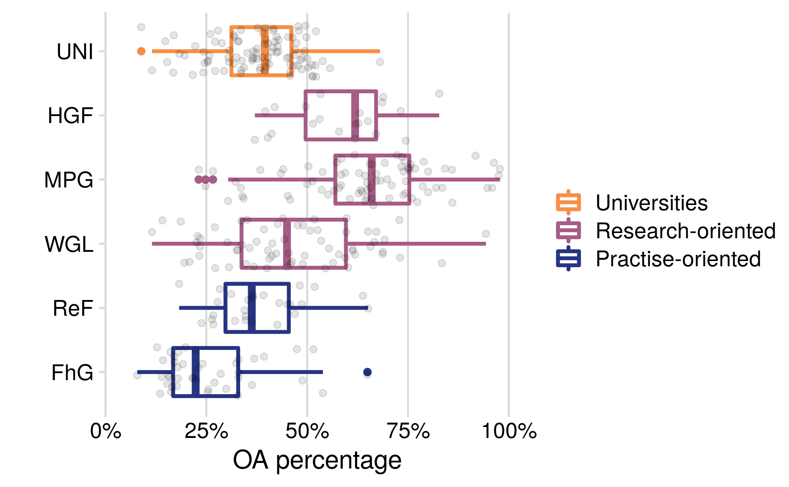

Analysis of German publication output
================
Anne Hobert
3/6/2020

## Data

In this document we describe the analysis of our sample of publications
from German research institutions. We work with the dataset `pubs_cat`
generated in [data\_gathering.Rmd](data_gathering.Rmd).

## Investigation of research questions

The goal is to answer the three research questions

1)  Has the OA fraction of the publication output of German universities
    and research institutions increased constantly over time?
2)  Can we observe differences between the research sectors of the
    German science system? Are there obvious explanations for this (like
    different missions or subject profiles?
3)  Which OA type is the most prevalent OA approach and can we identify
    different patterns of adoption to OA?

### OA fraction of the German publication output

  - plot of oa numbers on national level (Is OA? plot) over time
  - possibly scatterplot with all insitutions, publication output vs. oa
    share

First, we look at how the overall OA share developed over time. The
following figure displays the number of publications associated with one
of the German research institutions we considered and highlights they
part that is freely accessible online according to Unpaywall over the
considered time period from 2010 until
2018.

As can be seen, the total number of articles, as well as the part that
is OA increases constantly over time. The number of articles that are
not openly available, is quite stable with a slow increase from 54567 in
2010 to 56323 in 2013, and decreasing again continuously from that point
onwards to 52184 publications in 2018. Since the number of OA articles
increases continuously from 28993 publications in 2010 to 55031 in 2018,
the relative proportion of OA articles rises significantly from 34.7 %
in 2010 to 51.33 % in 2018.

| Publication Year | Is OA ? | Number of Articles |
| ---------------: | :------ | -----------------: |
|             2010 | OA      |              28993 |
|             2010 | Not OA  |              54567 |
|             2011 | OA      |              32399 |
|             2011 | Not OA  |              55647 |
|             2012 | OA      |              35964 |
|             2012 | Not OA  |              55871 |
|             2013 | OA      |              39440 |
|             2013 | Not OA  |              56323 |
|             2014 | OA      |              41344 |
|             2014 | Not OA  |              55458 |
|             2015 | OA      |              45034 |
|             2015 | Not OA  |              54775 |
|             2016 | OA      |              50915 |
|             2016 | Not OA  |              52798 |
|             2017 | OA      |              53777 |
|             2017 | Not OA  |              52509 |
|             2018 | OA      |              55031 |
|             2018 | Not OA  |              52184 |

Number of articles that are openly accessible (OA) or not (Not OA) per
year.

### Differences between sectors

In order to investigate what role the different sectors play in OA
publishing in Germany and how they contribute to the OA
development/overall OA shares, we distplay the development over time of
the number of OA articles for each sector in the following figure. Note
that scales for the `y-axes` are not the same, since the total
publication output varies significantly among
sectors.

some text to the second figure here.

In order to investigate the variability of OA publishing within the
sectors, we now go one level deeper and examine OA shares of individual
institutions, grouped by the sector they belong to. To this end, we
first calculate the individual OA shares.

The following figure displays scatterplots where the OA share of an
institution over the whole time period is shown with respect to its
publication
output.

The most striking observations from this figure are the high OA shares
of most of the Max-Planck-institutes and the very low OA fractions of
almost all of the state and federal institutes as well as the ones from
the Fraunhofer Society. Universities and Leibniz-Society have many
institutes with OA shares close to one half. We can further see very
well that the universities have by far the largest publication volumes,
followed by the Helmholtz-Society.

The following box plot quantifies the observations regarding the
variability of OA shares within sectors made
before.

### Prevalences of OA categories

  - oa categories on the national level (relative numbers); faceted /
    dodged / lines ?
  - oa vs. green (or other type): scatterplots
      - 1 point per sector (size of point according to pub output?)
      - faceted with all institutions per sector (facet grid? -\> per
        sector and oa\_category)

As mentioned in the previous chapters, there are several ways of
providing open access to scientific journal articles. In this section,
we want to investigate the prevalence of the most widespread OA routes:
Green OA and Gold OA. We further distinguish these two main categories
as described in the methodology section (see Table 1) according to
whether the journal is fully OA (Gold OA), and into deposition on
disciplinary, institutional, or OpenDOAR-listed repositories (Green OA).
First, we visualise the number of articles per category on the national
level, that is, not differentiated by sector. Note that, as mentioned
before, the OA categories are not exclusive, that is, an article might
be counted for several categories and numbers not necessarily sum up to
the total number of articles
published.

Observations:

  - drop in disciplinary repos, maybe because of green embargoes /
    post-publish self-archiving
  - drop in other oa journal -\> Delayed OA
  - apart from this: all OA categories increase, not oa decreases
  - most prevalent category: other repo, i.e. not further specified
    green OA, followed closely by disciplinary

Or as
barplot?

Faceted?

Again, we go one step further and look at insitution specific OA
proportions. In a first step, we calculate the category-specific OA
shares of each
institution.

facet this per sector? plot oa\_cat\_shares for single sector, order by
total oa\_share (state in facet titles); similar to above bar/line plots
faceted by sector (with/without yearly development)

Institution
specific:

### Discussion

  - Upset plot of overlapping evidence categories to show influence of
    semantic scholar, webscraping.

In order to demonstrate the prevalence of evidence categories in
Unpaywall, we load the original, non-categorized Unpaywall data:

We now determine the evidence combinations for all matched DOIs and then
calculate the frequency of each combination found.

    #> # A tibble: 3,809 x 2
    #>    evidence                                                               n
    #>    <chr>                                                              <int>
    #>  1 oa repository (via OAI-PMH doi match)                              39400
    #>  2 open (via free pdf)                                                19599
    #>  3 oa journal (via doaj)&oa repository (semantic scholar lookup)&oa … 15732
    #>  4 oa repository (via OAI-PMH title and first author match)           15666
    #>  5 oa repository (semantic scholar lookup)                            12377
    #>  6 oa journal (via doaj)&oa repository (via OAI-PMH doi match)&oa re… 11847
    #>  7 oa repository (via OAI-PMH doi match)&oa repository (via pmcid lo… 11019
    #>  8 oa repository (semantic scholar lookup)&oa repository (via OAI-PM… 10892
    #>  9 oa repository (via OAI-PMH doi match)&oa repository (via OAI-PMH … 10556
    #> 10 oa repository (via OAI-PMH doi match)&oa repository (via pmcid lo…  8831
    #> # … with 3,799 more rows

We now prepare the data for plotting with the UpSetR package and
visualise the overlapping evidence
categories.

## Exemplary analytics on national, sectoral and institutional level

### National level

First, we look at the highest aggregation level, namely the national
level. Here, publications of all institutions of the selected sectors
(5+2) are counted per year and category.

#### by host type

The first figure shows the development over time of the total number of
publications per host type, that is, we collate all articles where
access is provided via a publisher based platform as `OA (publisher)`,
all repository based OA is collated as `OA (repository)`, and all
remaining articles are labelled as `Not
OA`.

In comparison to all articles
published:

Looking at
proportions:

As faceted
graph:

#### by OA category

The following figure shows very similar data as the one before - only
that here, all OA categories from the schema are shown individually,
that is, publisher based and repository based OA are further
distinguished into
subgroups.

In comparison to all articles
published:

Looking at proportions, we
get:

As faceted
graph:

### Level of sectors

Next, we go one level down and look at how the separate sectors
developed.

Number of OA articles per sector in comparison to all articles published
within the
sector:

#### by host type

The first figure depicts the number of publications per host type
category over time for each
sector.

Looking at proportions:

Facet
grid:

#### by OA category

Distinguishing all the single OA
categories:

Looking at
proportions:

Facet
grid:

### Institutional level

Lastly, we go down to the institutional level. Since there are more than
400 institutions in the dataset, we do not want to present figures for
individual institutions. Instead, we want to show the variety of open
access shares and strategies. To this end, we first calculate the
individual OA shares.

We now display the variability among institutions per sector with
respect to the total publication
output.

Sectorwise comparison of OA shares

    #> # A tibble: 7 x 11
    #>   sector oa_share_min oa_share_max oa_share_mean oa_share_median
    #>   <chr>         <dbl>        <dbl>         <dbl>           <dbl>
    #> 1 Fraun…         4.55         75            27.1            22.8
    #> 2 Helmh…         0            82.8          55.9            61.9
    #> 3 Hochs…         0           100            34.9            37.5
    #> 4 Leibn…         0           100            39.7            40.1
    #> 5 Max-P…         7.84         97.8          62.6            64.9
    #> 6 Resso…         0           100            33.4            33.3
    #> 7 Resso…         0            50            23.4            22.2
    #> # … with 6 more variables: oa_share_sd <dbl>, n_total_min <int>,
    #> #   n_total_max <int>, n_total_mean <dbl>, n_total_median <dbl>,
    #> #   n_total_sd <dbl>

