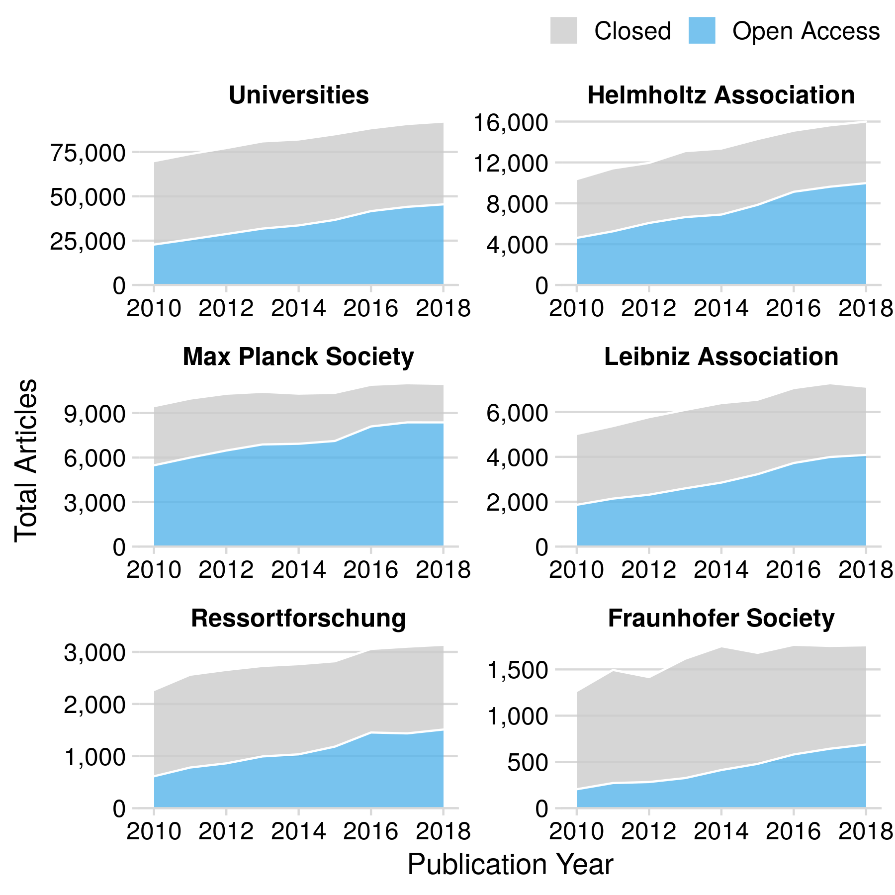
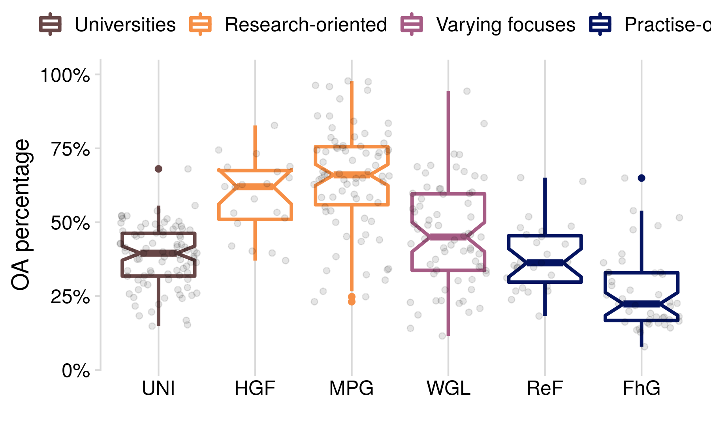
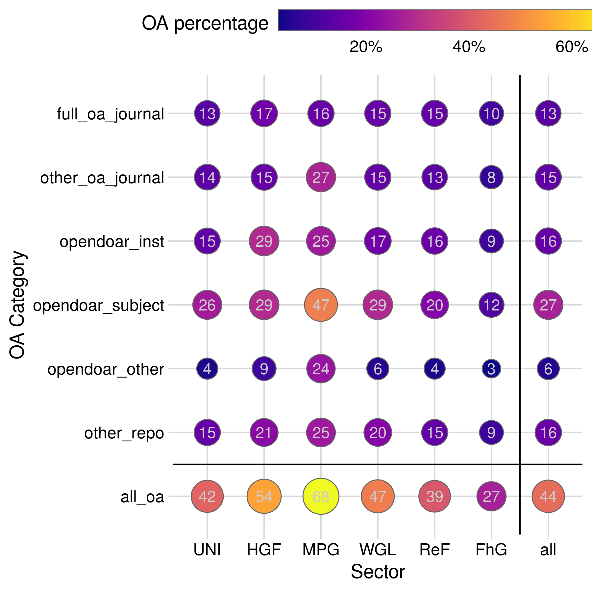
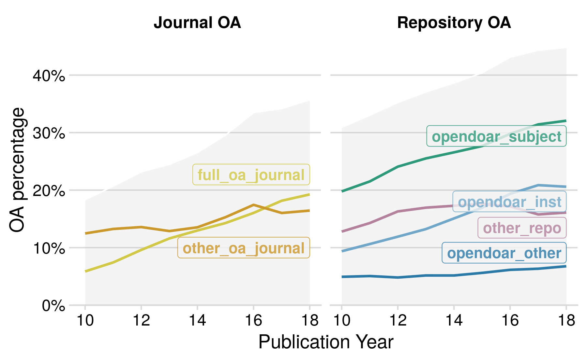

Analysis of German publication output
================
Anne Hobert
3/6/2020

## Data

In this document we describe the analysis of our sample of publications
from German research institutions. We work with the dataset `pubs_cat`
generated in [data\_gathering.Rmd](data_gathering.Rmd).

The goal is to answer the three research questions

1)  Has the OA fraction of the publication output of German universities
    and research institutions increased constantly over time?
2)  Which OA type is the most prevalent OA approach and can we identify
    different patterns of adoption to OA?
3)  Can we observe differences between the research sectors of the
    German science system? Are there obvious explanations for this (like
    different missions or subject profiles?

## National level

First, we look at the highest aggregation level, namely the national
level. Here, publications of all institutions of the selected sectors
(5+2) are counted per year and category.

### by host type

The first figure shows the development over time of the total number of
publications per host type, that is, we collate all articles where
access is provided via a publisher based platform as `OA (publisher)`,
all repository based OA is collated as `OA (repository)`, and all
remaining articles are labelled as `Not
OA`.

In comparison to all articles
published:

Looking at
proportions:

As faceted
graph:

### by OA category

The following figure shows very similar data as the one before - only
that here, all OA categories from the schema are shown individually,
that is, publisher based and repository based OA are further
distinguished into
subgroups.

In comparison to all articles
published:

Looking at proportions, we
get:

As faceted
graph:

## Level of sectors

Next, we go one level down and look at how the separate sectors
developed.

Number of OA articles per sector in comparison to all articles published
within the
sector:

### by host type

The first figure depicts the number of publications per host type
category over time for each
sector.

Looking at proportions:

Facet
grid:

### by OA category

Distinguishing all the single OA
categories:

Looking at
proportions:

Facet
grid:

## Institutional level

Lastly, we go down to the institutional level. Since there are more than
400 institutions in the dataset, we do not want to present figures for
individual institutions. Instead, we want to show the variety of open
access shares and strategies. To this end, we first calculate the
individual OA shares.

We now display the variability among institutions per sector with
respect to the total publication
output.

Sectorwise comparison of OA shares

    #> # A tibble: 7 x 11
    #>   sector oa_share_min oa_share_max oa_share_mean oa_share_median
    #>   <chr>         <dbl>        <dbl>         <dbl>           <dbl>
    #> 1 Fraun…         4.55         75            27.1            22.8
    #> 2 Helmh…         0            82.8          55.9            61.9
    #> 3 Hochs…         0           100            34.9            37.5
    #> 4 Leibn…         0           100            39.7            40.1
    #> 5 Max-P…         7.84         97.8          62.6            64.9
    #> 6 Resso…         0           100            33.4            33.3
    #> 7 Resso…         0            50            23.4            22.2
    #> # … with 6 more variables: oa_share_sd <dbl>, n_total_min <int>,
    #> #   n_total_max <int>, n_total_mean <dbl>, n_total_median <dbl>,
    #> #   n_total_sd <dbl>

