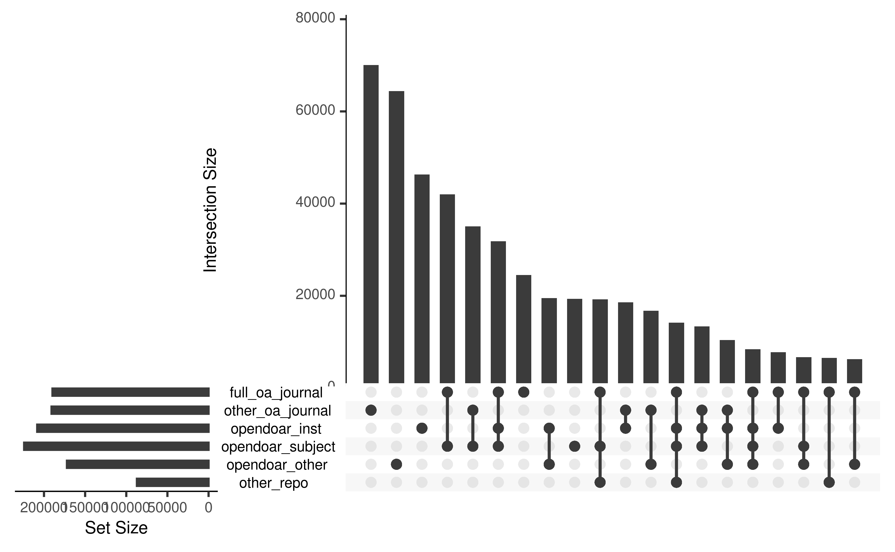

Analysis of German publication output
================
Anne Hobert
3/6/2020

## Data

In this document we describe the analysis of our sample of publications
from German research institutions. We work with the dataset `pubs_cat`
generated in [data\_gathering.Rmd](data_gathering.Rmd).

## Investigation of research questions

The goal is to answer the three research questions

1)  Has the OA fraction of the publication output of German universities
    and research institutions increased constantly over time?
2)  Can we observe differences between the research sectors of the
    German science system? Are there obvious explanations for this (like
    different missions or subject profiles?
3)  Which OA type is the most prevalent OA approach and can we identify
    different patterns of adoption to OA?

### OA fraction of the German publication output

First, we look at how the overall OA share developed over time. The
following figure displays the number of publications associated with one
of the German research institutions we considered and highlights they
part that is freely accessible online according to Unpaywall over the
considered time period from 2010 until
2018.

As can be seen, the total number of articles, as well as the part that
is OA increases constantly over time. The number of articles that are
not openly available, is quite stable with a slow increase from 54567 in
2010 to 56323 in 2013, and decreasing again continuously from that point
onwards to 52184 publications in 2018. Since the number of OA articles
increases continuously from 28993 publications in 2010 to 55031 in 2018,
the relative proportion of OA articles rises significantly from 34.7 %
in 2010 to 51.33 % in 2018.

### Differences between sectors

In order to investigate what role the different sectors play in OA
publishing in Germany and how they contribute to the OA
development/overall OA shares, we distplay the development over time of
the number of OA articles for each sector in the following figure. Note
that scales for the `y-axes` are not the same, since the total
publication output varies significantly among
sectors.

In order to investigate the variability of OA publishing within the
sectors, we now go one level deeper and examine OA shares of individual
institutions, grouped by the sector they belong to. We only include
institututions with a publication output of at least 100 publications in
the observed time period of 9 years. Of the 469 institutions in total,
334 fulfill this condition. This means, that in the following
institution specific analyses, 135 insitutions, or 4649 articles are not
considered. Of the remaining institutions, we first calculate the
individual OA shares.

The following figure displays scatterplots where the OA share of an
institution over the whole time period is shown with respect to its
publication
output.

The most striking observations from this figure are the high OA shares
of most of the Max-Planck and Helmholtz institutes and the very low OA
fractions of almost all of the state and federal institutes as well as
the ones from the Fraunhofer Society. Universities and Leibniz-Society
have many institutes with OA shares close to one half. We can further
see very well that the universities have by far the largest publication
volumes, followed by the Helmholtz-Society. The linear trend of higher
publication volume implying higher OA shares is most distinctive for the
university sector (narrowest confidence bands).

The following box plot quantifies the observations regarding the
variability of OA shares within sectors made
before.

### Prevalences of OA categories

  - oa categories on the national level (relative numbers); faceted /
    dodged / lines ?
  - oa vs. green (or other type): scatterplots
      - 1 point per sector (size of point according to pub output?)
      - faceted with all institutions per sector (facet grid? -\> per
        sector and oa\_category)

As mentioned in the previous chapters, there are several ways of
providing open access to scientific journal articles. In this section,
we want to investigate the prevalence of the most widespread OA routes:
Green OA and Gold OA. We further distinguish these two main categories
as described in the methodology section (see Table 1) according to
whether the journal is fully OA (Gold OA), and into deposition on
disciplinary, institutional, or OpenDOAR-listed repositories (Green OA).
First, we visualise the number of articles per category on the national
level, that is, not differentiated by sector. Note that, as mentioned
before, the OA categories are not exclusive, that is, an article might
be counted for several categories and numbers not necessarily sum up to
the total number of articles
published.

Observations:

  - drop in other oa journal -\> Delayed OA
  - slight drop in other\_repo -\> more sources registered, published
    more in registered sources
  - apart from this: all OA categories increase, not oa decreases
  - most prevalent category: subject-specific repos, registered with
    OpenDOAR

relative numbers?

Or as
barplot?

Faceted?

Again, we go one step further and look at sector specific OA
proportions.

plot oa\_cat\_shares for single sector, order by total oa\_share (state
in facet titles); similar to above bar/line plots faceted by sector
(with/without yearly development)

Lookin at the institutional level, we, again, only consider institutions
with at least 100 publications in the observed time period of 9
years.

### Discussion

  - Upset plot of overlapping evidence categories to show influence of
    semantic scholar, webscraping.

In order to demonstrate the prevalence of evidence categories in
Unpaywall, we load the original, non-categorized Unpaywall data:

We now determine the evidence combinations for all matched DOIs and then
calculate the frequency of each combination found.

    #> # A tibble: 538 x 2
    #>    evidence                                                               n
    #>    <chr>                                                              <int>
    #>  1 oa repository (via OAI-PMH doi match)                              53074
    #>  2 oa journal (via doaj)&oa repository (semantic scholar lookup)&oa … 23061
    #>  3 oa repository (via OAI-PMH title and first author match)           22519
    #>  4 oa journal (via doaj)&oa repository (via OAI-PMH doi match)&oa re… 20293
    #>  5 open (via free pdf)                                                19599
    #>  6 oa repository (semantic scholar lookup)&oa repository (via OAI-PM… 13971
    #>  7 oa repository (via OAI-PMH doi match)&oa repository (via pmcid lo… 12709
    #>  8 oa repository (semantic scholar lookup)                            12377
    #>  9 oa repository (via OAI-PMH doi match)&oa repository (via OAI-PMH … 11312
    #> 10 oa repository (via OAI-PMH doi match)&oa repository (via pmcid lo… 10513
    #> # … with 528 more rows

We now prepare the data for plotting with the UpSetR package and
visualise the overlapping evidence
categories.

